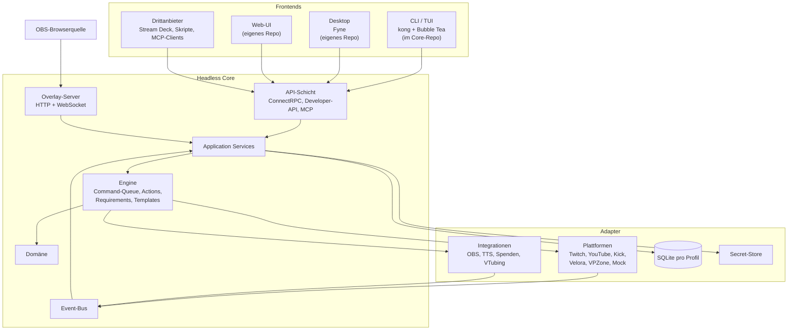
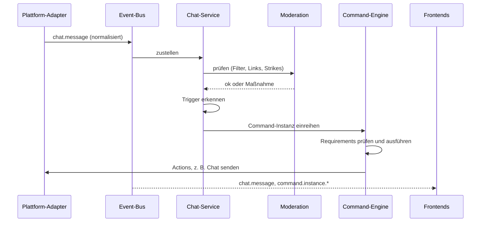

# Plan: Go-Port von Mix It Up

| | |
|---|---|
| **Status** | Kernentscheidungen getroffen (ADR-0001 bis ADR-0011), übrige Punkte im Entwurf |
| **Stand** | 2026-09-30 |
| **Grundlage** | [`starting.md`](starting.md), Audit von `../mixitup` (Mix It Up Desktop v1.8.200, Commit `c5a3497`), Dokumentation unter <https://mixitup.bot/docs> |
| **Begleitdokumente** | [`roadmap.md`](roadmap.md): Phasen, Arbeitspakete, Exit-Kriterien · [`adr/`](adr/README.md): Entscheidungen |
| **Lizenz** | Apache-2.0 ([`LICENSE`](../LICENSE), ADR-0002) |

> **Name:** Das Projekt heißt vorerst **`streamcrew`** (Codename, [ADR-0008](adr/0008-codename-streamcrew.md)): Modulpfad `github.com/ripmav/streamcrew`, Binary `streamcrew`. Der endgültige Name wird vor der Veröffentlichung geprüft (Gate O). Die Arbeitsnamen `mixitup-go` und `mixitup-rebuild` gelangen wegen des Markenrechts (Abschnitt 3) weder in Code noch in Modulpfade.

## Inhalt

1. Zusammenfassung
2. Ausgangslage: das Quellprojekt
3. Lizenz, rechtlicher Rahmen und Vorgehen
4. Vision, Ziele, Nicht-Ziele
5. Funktionsumfang und Priorisierung
6. Zielarchitektur des Cores
7. Frontends
8. Technologie-Stack
9. Repositories und Verzeichnislayout
10. Kompatibilität und Migration
11. Qualität und Entwicklungsprozess
12. ADR-Backlog
13. Risiken
14. Meilensteine und Aufwand
15. Offene Fragen
16. Glossar

Anhang A: Inventar des Originals · Anhang B: Quellen

---

## 1. Zusammenfassung

- **Was entsteht:** Ein headless Core in Go stellt die Kernfunktionen von Mix It Up bereit: Chatbot, Commands und Actions, Event-Reaktionen, Overlays, Währungen und Spiele sowie Integrationen. Mehrere Frontends bedienen ihn: CLI und TUI im Core-Repo, eine Desktop-App mit Fyne und eine Weboberfläche, beide als eigene Projekte.
- **Lizenz und Vorgehen:** Mix It Up steht seit dem 2025-10-22 unter einer Business Source License ohne automatische Umwandlung. Untersagt sind Weitergabe (§3.2), konkurrierende Nutzung (§3.3), das Anbieten ähnlicher Funktionalität als Dienst (§3.1) und der Zugriff auf die Server von Blazing Cacti (§3.5). Ein Port im Wortsinn, also die Übersetzung des C#-Codes, ließe sich nicht veröffentlichen.
  - Das Projekt ist deshalb eine **vollständige Neuimplementierung des dokumentierten Verhaltens** (ADR-0001). Der öffentliche Code dient als Hilfestellung; Code, Texte und Assets werden nicht übernommen, und `*.mixitup.bot` wird nicht genutzt.
  - Der eigene Code steht **von Anfang an unter Apache-2.0** (ADR-0002).
  - Das Projekt bleibt **privat, bis der Projektinhaber es selbst öffentlich schaltet**. Voraussetzung dafür ist Gate O (rechtliche Prüfung, Herkunfts-Review, Namensprüfung).
- **Architektur:** Die Architektur ist hexagonal. Domäne und Engine liegen im Zentrum, Plattformen, Integrationen und Speicher sind Adapter. Die Frontends sprechen über einen einzigen, versionierten API-Vertrag mit dem Core (Empfehlung: ConnectRPC mit Protobuf). Ein Ereignisstrom liefert alle Live-Daten. Ein Typkatalog beschreibt alle konfigurierbaren Typen per Schema, sodass die Editoren generisch bleiben. So müssen 46 Action-, 22 Overlay- und 18 Spieltypen nicht in drei Frontends von Hand nachgebaut werden.
- **Betriebsmodi (ADR-0003):** Der Core läuft **primär auf dem Streaming-PC**, als eigener Prozess, den die Desktop-App mitliefert und automatisch startet ([ADR-0005](adr/0005-core-in-desktop-builds.md)), oder als lokaler Daemon für CLI/TUI. **Zusätzlich** läuft er als Server-Anwendung, auch im Container. Was im Original als Dialog aufpoppt (Logins, Rückfragen), wird zu einer Aufforderung über die API.
- **MVP (Meilenstein M2 „Headless-MVP“, ADR-0004):** Zum Start nur Twitch, mit Streamer- und Bot-Konto; Chat-, Event-, Timer- und Channel-Points-Commands; 16 Actions (plattformneutral plus Twitch); Requirements wie Rolle, Cooldown und Argumente; Nutzer mit Watchtime; Counter; Basis-Moderation; Persistenz mit Backups; API, CLI und TUI.
- **Größenordnung:** Das Original umfasst rund 100.000 Zeilen C#-Logik und rund 65.000 Zeilen WPF (C# und XAML). Grob geschätzt braucht eine Person in Vollzeit 23–31 Personenwochen bis zum MVP und 47–64 bis Core 1.0; weitere Plattformen stehen im Backlog. Die Frontends kommen jeweils dazu (Abschnitt 14). Deshalb wird streng nach P0–P3 priorisiert.

### Getroffene Entscheidungen

| Nr. | Entscheidung (2026-09-27) | ADR |
|---|---|---|
| 1 | Vollständige Neuimplementierung des dokumentierten Verhaltens; der öffentliche Code von Mix It Up dient als Hilfestellung, keine 1:1-Übertragung nach Go | [ADR-0001](adr/0001-neuimplementierung-und-nutzung-des-originals.md) |
| 2 | Privat, bis der Projektinhaber es selbst öffentlich schaltet; danach Open Source; Apache-2.0 ab dem ersten Commit | [ADR-0002](adr/0002-lizenz-des-projekts.md) |
| 3 | Core primär auf dem Streaming-PC (mit der Desktop-App oder als Daemon), zusätzlich als Server-Anwendung | [ADR-0003](adr/0003-betriebsmodi.md) |
| 4 | Start nur mit Twitch; YouTube und Kick nach M2 per Go/No-Go | [ADR-0004](adr/0004-plattformumfang-zum-start.md) |
| 5 | Desktop-Paket liefert den Core mit und startet ihn als eigenen Prozess | [ADR-0005](adr/0005-core-in-desktop-builds.md) |
| 6 | Core zusätzlich als Go-Bibliothek, nur für den Selbststart; ob mitgeliefert (zwei Binaries) oder eingebunden (ein Binary), legt der Build-Prozess fest; kein Betrieb im selben Prozess | [ADR-0006](adr/0006-core-als-bibliothek-fuer-selbststart.md) |
| 7 | Jedes Core-Release enthält Binary und Bibliothek (Go-Modul als Quellarchiv); Desktop-Builds beziehen den Core aus dem Release | [ADR-0007](adr/0007-release-artefakte-des-cores.md) |
| 8 | Codename `streamcrew` für die private Phase; endgültiger Name nach Namensprüfung vor Gate O | [ADR-0008](adr/0008-codename-streamcrew.md) |
| 9 | Drei Repositories (Core, Desktop, Web; optional Relay) auf GitHub, privat bis zur Freigabe durch den Projektinhaber; CI mit GitHub Actions, Releases in GitHub Releases | [ADR-0009](adr/0009-repositories-und-hosting.md) |
| 10 | API zwischen Core und Frontends: ConnectRPC mit Protobuf | [ADR-0010](adr/0010-api-protokoll.md) |
| 11 | Keine Telemetrie; Fehlersuche über lokale Logs und Diagnose-Paket | [ADR-0011](adr/0011-keine-telemetrie.md) |
| 12 | MVP-Umfang (M2) wie geplant bestätigt | Plan §5, Roadmap Phasen 4–6 |
| 13 | Weitere Plattformen (YouTube, Kick, Multiplattform) nicht vor Core 1.0, sondern im Backlog; die übrigen Phasen bleiben in ihrer Reihenfolge und rücken nach (Entscheidung vom 2026-09-30) | Plan §5.1, §14; Roadmap, Backlog |

---

## 2. Ausgangslage: das Quellprojekt

### 2.1 Solution-Überblick

| Projekt | Zweck | Umfang |
|---|---|---|
| `MixItUp.Base` | Fachlogik, Modelle, Plattform- und Dienst-Clients, ViewModels | 879 C#-Dateien, ~190.000 Zeilen (inkl. ~1,2 MB generierter Ressourcen) |
| `MixItUp.WPF` | Windows-Oberfläche und Windows-spezifische Dienste (Audio, Eingabe, OBS, SQLite, Developer-API, MCP-Server, C#-Skripte) | ~32.000 Zeilen C#, ~33.000 Zeilen XAML (332 Dateien) |
| `APIs/MixItUp.API` | Client-Bibliothek der Developer-API | klein |
| `MixItUp.SignalR.Client`, `Installer`, `Uninstaller`, `Reporter` | Infrastruktur | – |

Technik: .NET 8, WPF, Newtonsoft.Json, SQLite, Google-API-Clients, Socket.IO, NAudio, Roslyn, ModelContextProtocol.AspNetCore. Die UI liegt in 14 Ressourcendateien vor (Englisch plus 13 Übersetzungen) und umfasst rund 3.755 Texte.

### 2.2 Umfang nach Fachbereichen

Zeilen C# in `MixItUp.Base` ohne generierte Ressourcen:

| Bereich | Zeilen | Anmerkung |
|---|---:|---|
| Kern-Services (Command, Chat, Event, User, Settings, Overlay, Timer, Moderation …) | 10.870 | `Services/*.cs` |
| Externe Dienste (44 Integrationen) | 18.020 | `Services/External` |
| Twitch (Services und Modelle) | 17.402 | EventSub, Helix |
| YouTube | 5.303 | Google-API, Polling |
| Kick | 2.213 | Webhooks über den MixItUp-Server |
| Velora / VPZone | 5.479 / 4.822 | neuere Plattformen |
| Actions (46 aktive Typen) | 7.691 | |
| Commands inkl. 18 Spiele | 6.618 | davon Spiele 3.523 |
| Requirements (8 Typen) | 1.358 | |
| Overlay-Modelle und Overlay-Ressourcen | 7.479 + 5.676 | HTML/CSS/JS |
| Währung / Nutzer / Settings | 2.034 / 2.169 / 2.038 | |
| ViewModels (UI-Logik) | 45.320 | enthalten teils Fachlogik |
| Util / Web | 5.640 / 2.693 | |
| Veraltet (`Deprecated/`) | 7.171 | bleibt unberücksichtigt |

### 2.3 Architekturbefund

- **Globaler Zustand:** `ServiceManager` ist ein statischer Service Locator (Dictionary Typ → Instanz), `ChannelSession` hält Settings, Nutzer und Sitzungszustand statisch. Abhängigkeiten sind dadurch implizit und schwer testbar.
- **Monolithische Einstellungen:** `SettingsV3Model` bündelt 271 serialisierte Felder in einer JSON-Datei (`.miu3`, Schemaversion 8). Dazu kommt eine SQLite-Datei (`.db3`) mit den Tabellen `Users`, `Commands`, `Quotes`, `Statistics` und `ImportedUsers`, deren Nutzdaten als JSON in `Data`-Spalten liegen. Backups sind ZIP-Archive (`.miubackup`).
- **Polymorphie über .NET-Typnamen:** Newtonsoft `TypeNameHandling.Objects` schreibt `$type`-Felder mit vollqualifizierten .NET-Typen in die Daten.
- **UI im Core:** `DialogHelper.ShowMessage` und `ShowConfirmation` werden mitten in der Sitzungsinitialisierung aufgerufen, etwa bei fehlgeschlagenen Logins oder als Backup-Erinnerung. Die rund 45.000 Zeilen ViewModels enthalten teilweise Fachlogik.
- **Sitzungsstart:** Zuerst verbinden sich die Plattformen (automatisch, bei Fehlern interaktiv). Danach starten Chat-, Event-, Command-, Timer-, Moderations- und Statistikdienste sowie rund 40 externe Dienste. Eine Hintergrundschleife läuft alle 60 s (Token-Refresh, Stream-Details) und speichert alle 5 min.
- **Command-Engine:** Die Warteschlange kennt fünf Sperrmodi (`PerCommandType`, `PerActionType`, `VisualAudioActions`, `Singular`, `None`), Pause und Fortsetzen sowie eine eigene Pause für Entrance-Commands. Requirements haben Fehler-Cooldowns, Runner-Parameter gelten pro Nutzer, Overlay-Actions werden gebündelt.
- **Template-Engine („Special Identifiers“):** Platzhalter beginnen mit `$`. Ersetzt wird per case-insensitivem String-Replace in fester Reihenfolge, unter anderem absteigend nach Schlüssel. Dynamische Muster wie `$arg1text`, `$randomnumber1:100` oder `$top10…` kommen hinzu. Eingesetzte Werte, auch Zuschauertext, können von späteren Ersetzungen erneut erfasst werden.
- **Plattformen:** Twitch nutzt EventSub-WebSocket und Helix. YouTube pollt `liveChatMessages.list` alle 5–10 s. Kick-Webhooks kommen beim MixItUp-Server an, der sie per WebSocket weiterreicht. Velora und VPZone haben eigene WebSockets. Mixer, Trovo, Glimesh und Facebook sind obsolet.
- **Serverabhängigkeiten:**
  - `desktop.api.mixitup.bot`: Community Commands, Webhook-Hub, Benachrichtigungen, Session-Tracking, Edge-/TikTok-TTS-Proxy, Twitch-Clip-URLs, VPZone-Webhook-Secret
  - `files.mixitup.bot`: Updates
  - `mixitup.bot/oauthredirect`: OAuth-Redirect
  - der Velora-OAuth-Callback läuft ebenfalls über den MixItUp-Server
- **Windows-Bindung:** WPF, NAudio, System.Speech, Roslyn für C#-Skripte sowie Windows-spezifische Eingabe- und Hotkey-Dienste. Developer-API (Port 8911), MCP-Server (Port 8912) und Overlay-Server (Port 8111) laufen auf ASP.NET Core/Kestrel.

### 2.4 Übernehmen oder bewusst anders machen

Übernommen wird **Verhalten** (Konzepte, Abläufe, Funktionsumfang), nicht Implementierung. Details dazu stehen in Abschnitt 3.4.

| Aspekt | Original | Go-Port |
|---|---|---|
| Abhängigkeiten | statischer Service Locator, statische `ChannelSession` | Composition Root, Konstruktor-Injektion, keine globalen Zustände |
| Einstellungen | ein Objekt mit 271 Feldern (JSON) + SQLite | eine SQLite-Datei pro Profil, typisierte und versionierte Sektionen |
| Polymorphie | `$type` mit .NET-Typnamen | stabile Typ-IDs (z. B. `web_request`) + `schemaVersion`, Registry ([Code-ADR-0013](adr/code/0013-typ-registry.md)) |
| UI-Kopplung | Dialoge im Core, Logik in ViewModels | Aufforderungen und Ereignisse über die API, Logik nur im Core |
| Nebenläufigkeit | `async void`, Fire-and-forget, feste Wartezeiten | Goroutines mit Besitzer, Abbruch per `context`, Supervisor mit Backoff |
| Template-Engine | kaskadierendes String-Replace, eifrige Auswertung | Tokenizer, bedarfsgesteuerte Resolver, keine erneute Auswertung eingesetzter Werte |
| Ranglisten | alle Nutzer in den Speicher laden | SQL mit Indizes |
| Kick-Events und Webhooks | Weiterleitung über den MixItUp-Server | Server-Modus, eigener Relay oder Tunnel |
| YouTube-Chat | Polling alle 5–10 s | `liveChatMessages.streamList` (gRPC-Streaming) |
| Skripte | C# via Roslyn, Python extern | eingebettetes JavaScript (goja), extern nur mit Capability |
| Audio | NAudio (Windows) | Overlay als Standardausgabe, lokale Ausgabe mit Geräteauswahl (P1) |
| Telemetrie | Telemetriedienst, Session-Tracking am Server | keine |
| Zielsysteme | Windows | Linux, Windows, macOS; amd64 und arm64 |

---

## 3. Lizenz, rechtlicher Rahmen und Vorgehen

> **Hinweis:** Dieser Abschnitt ist eine technische Einordnung und **keine Rechtsberatung**. Eine rechtliche Prüfung ist spätestens vor der Veröffentlichung nötig (Gate O), besser schon früher.

### 3.1 Befund

- **Lizenz:** `LICENSE.md` ist die „Mix It Up Business Source License (no automatic conversion)“, Version 1.0.1, gültig ab 2025-10-22, Copyright Blazing Cacti LLC.
- **Erlaubt (§2):** lesen und auditieren, lokal bauen und für eigene interne Zwecke betreiben, private Änderungen für interne Zwecke, nicht-kommerzielle Evaluation, Forschung und Lehre.
- **Untersagt ohne schriftliche Lizenz:**
  - §3.1 die Covered Software **oder im Wesentlichen ähnliche Funktionalität** als Dienst für Dritte anbieten
  - §3.2 Code oder Änderungen weitergeben, als Quelltext oder Binary
  - §3.3 die Covered Software nutzen, um eine konkurrierende Plattform zu bauen oder zu betreiben; ausdrücklich genannt sind Creator-Automatisierung, Overlays, Bot-/Command-Systeme, Alerts und Integrations-Hubs
  - §3.4 Marken wie „Mix It Up“, „Blazing Cacti“ und „Mixie“ verwenden
  - §3.5 auf Serverdienste von Blazing Cacti außerhalb der offiziellen Clients zugreifen
- **EULA (`legal/EULA.md`):** verbietet Reverse Engineering und Dekompilieren, soweit das Gesetz es nicht erlaubt, sowie Time-Sharing-Dienste.
- **MIT-Altbestand:** Laut Präambel bleiben die MIT-Rechte an Releases vor dem Stichtag unberührt. Die Git-Historie des vorliegenden Repos beginnt jedoch erst am 2025-10-19 mit dem Commit „Initial: Revised repo licensing post 1.3.0.5 release“. Das frühere öffentliche Repo ist nicht mehr erreichbar (GitHub 404, geprüft am 2026-09-27). Der einzige gefundene MIT-Fork (`rspeight/mixer-mixitup`) stammt von 2018 und ist für einen modernen Port wertlos.
- **Unklare Einzeldatei:** `MixItUp.Base/LICENSE.txt` enthält noch einen MIT-Text („Copyright (c) 2017-2022 Matthew Olivo“). Ob er wegen der Vorrangregel in §3.2 gilt, ist offen, denn die Regel spricht von abweichenden Bedingungen „from Blazing Cacti LLC“. Darauf sollte man sich nicht verlassen.

### 3.2 Konsequenzen für dieses Projekt

- Ein Port im Wortsinn, also übersetzter Code, wäre eine Bearbeitung der Covered Software. Veröffentlichung (§3.2) und konkurrierende Nutzung (§3.3) wären damit ausgeschlossen. Deshalb entsteht keine Übersetzung, sondern eine Neuimplementierung (3.3).
- **Nicht übernehmen:**
  - Quellcode, auch nicht übersetzt
  - die 3.755 UI-Texte samt 13 Übersetzungen (`Resources*.resx`)
  - Texte der offiziellen Dokumentation (<https://mixitup.bot/docs>, „All rights reserved“); sie wird gelesen, aber nicht zitiert
  - Overlay-HTML/CSS/JS (`OverlayResources/`)
  - Bilder und Icons
  - die Community-Wortliste
  - Namen und Branding
- **Keine Nutzung von `*.mixitup.bot`-Diensten (§3.5):** eigene Lösungen oder Verzicht (Abschnitt 5.8).
- **Name und Aufmachung:** Der Name enthält weder „Mix It Up“, „MixItUp“ noch „Mixie“, und die Aufmachung ist nicht verwechslungsfähig.
- **Hosting für Dritte:** ist nicht geplant (§4.3). Soll es später doch kommen, gehört §3.1 in die rechtliche Prüfung vor Gate O.

### 3.3 Optionen und Entscheidung

| Option | Beschreibung | Veröffentlichung | Bewertung |
|---|---|---|---|
| A: Strenger Clean Room | Spezifikation nur aus öffentlichen Quellen, Implementierung ohne jeden Blick in den Code | voraussichtlich ja | rechtlich am saubersten, aber langsamer und bei undokumentierten Randfällen blind |
| **A′: Neuimplementierung mit Code als Hilfestellung** | Neuimplementierung des dokumentierten Verhaltens; der öffentliche Code hilft beim Verständnis, wird aber nicht übertragen | ja, nach Gate O | **gewählt (ADR-0001)** |
| B: Codenaher Port | Übersetzung des C#-Codes nach Go | nein | ausgeschlossen |
| C: MIT-Stand als Basis | letzter MIT-Release (≤ 1.3.0.5) als Referenz | ja, mit MIT-Hinweis | nicht mehr verfügbar, fachlich veraltet |
| D: Erlaubnis | schriftliche Lizenz von Blazing Cacti einholen | je nach Vereinbarung | als Ergänzung zu A′ möglich |

### 3.4 Regeln für die Neuimplementierung (ADR-0001)

- **Quellen in dieser Reihenfolge:**
  1. offizielle Dokumentation (<https://mixitup.bot/docs>)
  2. beobachtetes Verhalten der App bei normaler Nutzung
  3. der öffentliche Quellcode als Hilfestellung für Randfälle, Abläufe und Datenformate
- **Spezifikation zuerst:** Pro Fachgebiet entsteht in `docs/spec/` eine Beschreibung des Verhaltens in eigenen Worten, also das Was, nicht das Wie. Sie nennt ihre Quellen (Doku-Link, Beobachtung, Pfad und Version im Original), zitiert aber keinen Code.
- **Zwei Schritte:** Erst lesen und spezifizieren, dann aus der Spezifikation implementieren. Dabei ist der Originalcode nicht daneben geöffnet.
- **Nicht übernommen werden:** Code (auch nicht übersetzt), Klassen- und Dateistruktur, Kommentare, UI-Texte, Dokumentationstexte und Assets (Abschnitt 3.2).
- **Interop-Ausnahmen:** Importformate, die Namen der `$`-Identifier und die Bedeutung von Event- und Rollentypen, vorbehaltlich ADR-0021.
- **KI-gestützte Arbeit:** Eingabe ist die Spezifikation, nicht der C#-Code. Übersetzungsaufträge („übersetze diese Datei nach Go“) sind ausgeschlossen.
- **Plattform-APIs** (Twitch, YouTube, Kick, OBS usw.) werden ausschließlich nach ihrer offiziellen Dokumentation implementiert.
- **Keine Übergriffe:** nicht dekompilieren (EULA §1), keine Blazing-Cacti-Dienste, keine Marken.
- **Inventar:** Der Befund in Abschnitt 2 und das Inventar in Anhang A stammen aus einem Audit des Quellcodes (Lesen und Auditieren erlaubt §2(a)). Sie dienen als Referenz und werden in den Spezifikationen mit der Dokumentation abgeglichen.

### 3.5 Restrisiko und Absicherung

Auch mit diesen Regeln bleibt ein Restrisiko. Die Nutzung des Codes als Hilfestellung könnte als Nutzung zum Bau eines konkurrierenden Produkts (§3.3) gelten, einzelne Teile könnten als abgeleitetes Werk angesehen werden. Absicherung:

- Das Projekt bleibt privat, bis der Projektinhaber es selbst öffentlich schaltet. Gate O (Roadmap: „Gate O: Open-Sourcing“) ist die Voraussetzung dafür.
- Jedes Arbeitspaket hat einen Herkunftsnachweis; vor der Veröffentlichung findet ein Herkunfts-Review statt, der Stichproben des Go-Codes mit dem Original vergleicht.
- Eine rechtliche Prüfung ist Pflicht vor Gate O, besser schon früher.
- Optional wird Blazing Cacti um Erlaubnis gebeten (Option D).
- Apache-2.0 (ADR-0002) lizenziert nur eigenständigen Code. Die Herkunftsdisziplin schützt also auch die spätere Open-Source-Lizenz.

---

## 4. Vision, Ziele, Nicht-Ziele

### 4.1 Vision

Ein schlanker, headless Streaming-Bot- und Automatisierungs-Core in Go. Er läuft vor allem auf dem Streaming-PC, bei Bedarf auch als Server-Anwendung auf einem Homeserver oder VPS. Bedienen lässt er sich per CLI/TUI, Desktop-App und Weboberfläche, wobei alle Frontends denselben API-Vertrag nutzen.

### 4.2 Ziele

| ID | Ziel | Prüfbares Kriterium |
|---|---|---|
| Z1 | Headless | `streamcrew serve` ist auf einem Server ohne Display voll funktionsfähig; auch Logins und Rückfragen laufen über die API |
| Z2 | API-first | Jede Frontend-Funktion ist über die öffentliche API erreichbar; die TUI nutzt ausschließlich den generierten API-Client |
| Z3 | Plattformneutral | Eine neue Plattform erfordert keine Änderung an Engine oder Domäne |
| Z4 | Portabel | Linux, Windows und macOS auf amd64 und arm64; der Core ist ein CGO-freies Einzelbinary |
| Z5 | Robust | automatische Reconnects mit Backoff, kein Datenverlust bei Absturz (SQLite WAL, Transaktionen), Deduplizierung von Ereignissen |
| Z6 | Sicher per Default | API nur auf Loopback, Token-Authentifizierung, verschlüsselte Secrets, gefährliche Actions nur nach Freigabe |
| Z7 | Privatsphäre | keine Telemetrie, kein Cloud-Zwang (ADR-0011) |
| Z8 | Wartbar | keine globalen Zustände, Konstruktor-Injektion, ≥ 80 % Testabdeckung in Engine, Template und Requirements, ADRs für alle Entscheidungen |
| Z9 | Ohne GUI bedienbar | Commands als Code (YAML/JSON mit JSON-Schema), Import und Export |
| Z10 | Migrationspfad | optionaler Import bestehender Mix-It-Up-Daten, vorbehaltlich ADR-0021 |
| Z11 | Offen lizenziert | Apache-2.0 ab dem ersten Commit, SPDX-Kennung in jeder Quelldatei, nur lizenzkompatible Abhängigkeiten (ADR-0002) |

### 4.3 Nicht-Ziele

- Ein pixelgenauer Nachbau der WPF-Oberfläche.
- Ausführen von C#-Skripten (Roslyn). Ersatz ist eingebettetes JavaScript (ADR-0017).
- Funktionen, die Blazing-Cacti-Server brauchen (Abschnitt 5.8).
- Obsolete Plattformen und Funktionen: Mixer, Trovo, Glimesh, Facebook, Twitter, Übersetzung, OvrStream, InfiniteAlbum sowie Overlay v1/v2 (`Deprecated/`).
- Inoffizielle oder AGB-kritische Schnittstellen, etwa inoffizielle TTS-Endpunkte oder den Pusher-WebSocket von Kick.
- Mandantenfähigkeit und SaaS-Betrieb für Dritte (siehe §3.1 der BSL und ADR-0001).

---

## 5. Funktionsumfang und Priorisierung

**Prioritäten:**

- **P0:** Pflicht für den MVP (M2)
- **P1:** Pflicht für Core 1.0 (M7)
- **P2:** nach 1.0, für Parität
- **P3:** nur bei Bedarf
- **Backlog:** zurückgestellt; die Priorität wird festgelegt, wenn die Aufgabe wieder eingeplant wird (Roadmap, Abschnitt „Backlog“)
- **–:** nicht geplant

Eine Aufgabe darf früher umgesetzt werden, als ihre Priorität verlangt, wenn es sich anbietet.

### 5.1 Plattformen

| Plattform | Prio | Anbindung im Go-Port | Anmerkungen |
|---|---|---|---|
| Twitch | P0 | Device Code Flow, EventSub-WebSocket, Helix | einzige Plattform zum Start (ADR-0004) |
| Mock | P0 | simuliert | für Tests, Demos und Entwicklung ohne Live-Kanal |
| YouTube | Backlog | OAuth (Loopback + PKCE), `liveChatMessages.streamList` (gRPC), Data API v3 | seit 2026-09-30 im Backlog der Roadmap; Priorität und Go/No-Go, wenn sie wieder eingeplant wird; Quota, Google-Verifizierung |
| Kick | Backlog | OAuth 2.1 + PKCE, Webhooks, REST | seit 2026-09-30 im Backlog der Roadmap; Priorität und Go/No-Go, wenn sie wieder eingeplant wird; braucht eine öffentliche Webhook-URL |
| Velora | P3 | laut Original OAuth + WebSocket/Socket.IO | Doku prüfen, nur bei Bedarf |
| VPZone | P3 | laut Original OAuth + WebSocket | wie Velora |
| Mixer, Trovo, Glimesh, Facebook | – | – | im Original obsolet |

### 5.2 Command-Typen

| Typ | Prio | Bemerkung |
|---|---|---|
| Chat (`!`-Präfix, Wildcards, mehrere Trigger) | P0 | |
| Event | P0 | plattformspezifische und generische Events |
| Timer (mit Gruppen) | P0 | |
| Action-Gruppe | P0 | wiederverwendbare Action-Listen |
| Custom (intern) | P0 | z. B. für Rang-Wechsel und Hotkeys |
| Vorgefertigte Chat-Commands (22) | P0/P1 | Teilmenge im MVP, Rest in Phase 8 |
| Twitch Channel Points | P0 | |
| Twitch Bits | P1 | |
| Nutzerspezifische Chat-Commands | P1 | |
| Webhook (eingehend) | P1 | |
| Kick Channel Points, Kick Kicks | P1 | |
| Spiele (18) | P1/P2 | Welle 1 P1, Welle 2 P2 |
| Twitch Custom Power-Ups | P2 | |
| Streamloots-Karte, Crowd-Control-Effekt | P2 | |
| Velora-/VPZone-Channel-Points | P3 | |
| Remote, Trovo Spell | – | obsolet |

### 5.3 Actions (46 aktive Typen)

| Prio | Actions |
|---|---|
| **P0** (16, plattformneutral oder Twitch) | Chat, Wait, Conditional, Random, Group, Repeat, Command, Counter, SpecialIdentifier, WebRequest, Moderation, PlatformMessage, UserLookup, Twitch (Kernfunktionen), File (sandboxed, nur mit Freigabe), ExternalProgram (nur mit Freigabe) |
| **P1** | Consumables, Overlay, Sound, TextToSpeech, StreamingSoftware (OBS), GameQueue, Script (JavaScript), Discord, YouTube, Kick |
| **P2** | Input (über den Agent), Serial, VTubeStudio, Voicemod, SAMMI, LumiaStream, PixelChat, IFTTT, Streamlabs, MeldStudio |
| **P3** | PolyPop, TITS, VTSPog, MtionStudio, Veadotube, VConnect, RahiTuber, MusicPlayer, Velora, VPZone |
| **–** | Translation, Twitter, OvrStream, Trovo, InfiniteAlbum (im Original obsolet) |

### 5.4 Requirements (8 Typen)

| Prio | Requirements |
|---|---|
| P0 | Rolle, Cooldown (pro Nutzer, global, Gruppe), Argumente, Einstellungen (z. B. Auslösenachricht löschen) |
| P1 | Threshold (Mindestanzahl Nutzer im Zeitfenster), Währung, Rang, Inventar |

### 5.5 Weitere Fachfunktionen

| Funktion | Prio | Bemerkung |
|---|---|---|
| Nutzer: plattformübergreifende Identität, Rollen, Watchtime, Statistiken, Titel, Notizen | P0 | |
| Kontoverknüpfung und Zusammenführen von Nutzern | P1 | |
| Counter | P0 | |
| Timer | P0 | Intervall, Mindestanzahl Chatnachrichten, nur live |
| Moderation, Basis: Wortfilter, Links, Großbuchstaben/Satzzeichen/Emotes, Strikes | P0 | |
| Moderation, Teilnahmeregeln (Follow-Dauer, Watchtime, Rolle) | P1 | |
| Command-Verlauf mit Abbrechen und Wiederholen | P0 | |
| Event-Feed (im Original „Alerts“) und Session-Statistik | P0/P1 | |
| Profile und Backups (manuell und geplant) | P0 | |
| Commands als Code (YAML/JSON) | P0 | neu |
| Quotes | P1 | |
| Währungen und Ränge | P1 | |
| Inventar und Shop | P1 | |
| Giveaways, Game Queue | P1 | |
| Emotes (Twitch, BetterTTV, FrankerFaceZ; 7TV neu) | P1/P2 | |
| Developer-API (REST), MCP-Server | P1 | |
| Eingehende Webhooks | P1 | braucht den Server-Modus oder einen Relay |
| Command-Bundles teilen (Datei/URL) | P1 | Ersatz für den Community-Commands-Katalog |
| Stream Pass, Redemption Store | P2 | |
| Globale Hotkeys, Tastatur-/Mausaktionen | P2 | über den Agent |
| Import aus Mix It Up | P2 | ADR-0021 |
| Musik-Player, Pronomen (Alejo) | P3 | |

### 5.6 Overlay-Typen (22)

| Prio | Typen |
|---|---|
| P1 | Text, Bild, Video, Ton, HTML, YouTube, Twitch-Clip, Timer, Label, Ziel (Goal), Event-Liste, Chat |
| P2 | Persistenter Timer, Stream Boss, Abspann (End Credits), Rangliste, Glücksrad, Umfrage, Emote-Effekt, Persistenter Emote-Effekt, Game Queue |
| P3 | Discord Reactive Voice |

### 5.7 Integrationen (rund 48 Dienste)

| Kategorie | P1 | P2 | P3 |
|---|---|---|---|
| Streaming-Software | OBS Studio | Streamlabs Desktop, Meld Studio | XSplit |
| Spenden und Monetarisierung | Streamlabs, StreamElements, Ko-fi | Tiltify, Patreon, Fourthwall, Throne, TipeeeStream | DonorDrive, JustGiving, TreatStream, Rainmaker, Pally |
| Interaktion und Alerts | – | Streamloots, Crowd Control, PixelChat, SAMMI, Lumia Stream, IFTTT | PolyPop |
| VTubing und Avatar | – | VTube Studio | VTS Pog, T.I.T.S., Veadotube, VConnect, RahiTuber, Mtion Studio |
| Stimme und TTS | Google Cloud TTS, Azure Speech, lokal Piper (neu), Browser-TTS im Overlay | Voicemod, Amazon Polly, ElevenLabs | TTS Monster, Uberduck, ResponsiveVoice |
| Chat-Erweiterungen | BetterTTV, FrankerFaceZ | 7TV (neu) | Alejo Pronouns |
| Kommunikation | Discord | – | – |
| Hardware und Sonstiges | – | Serielle Geräte, Pulsoid, Stream Deck u. ä. über die Developer-API | – |

### 5.8 Ersetzte oder entfallende Funktionen (Serverabhängigkeiten)

| Funktion im Original | Abhängigkeit | Go-Port |
|---|---|---|
| Community Commands (Katalog, Bewertungen) | `desktop.api.mixitup.bot` | Command-Bundles als Datei oder URL (P1), kein zentraler Katalog |
| Webhook-Hub (Kick, Ko-fi, Fourthwall, Throne, generische Webhooks) | MixItUp-Server | eigener Webhook-Eingang im Server-Modus, optionaler Relay, Tunnel |
| Updates | `files.mixitup.bot` | Releases (z. B. GitHub), optionaler Update-Hinweis |
| Edge-TTS, TikTok-TTS | Server-Proxy | nicht geplant (inoffizielle Schnittstellen) |
| Auflösung von Twitch-Clip-URLs | Server | offizielle Twitch-API bzw. Embed |
| Benachrichtigungen, Ausfallstatus, Patreon-Shoutouts, Session-Tracking | Server | entfällt |
| OAuth-Redirect, Velora-Callback | Server | Loopback-Redirect bzw. eigene Callback-URL im Server-Modus |

---

## 6. Zielarchitektur des Cores

### 6.1 Leitprinzipien

- **Hexagonal:** Domäne und Engine kennen weder Plattform- noch UI-Details, sondern nur Ports, also Interfaces beim Konsumenten.
- **Explizite Abhängigkeiten:** Alles wird in einer Composition Root (`internal/app`) verdrahtet. Es gibt keinen Service Locator, kein `init()` und keine veränderlichen Paketvariablen.
- **Ereignisgetrieben:** Ein typisierter In-Process-Bus verbindet die Komponenten. Derselbe Strom geht gefiltert an die Frontends.
- **API-first und schema-getrieben:** Frontends nutzen nur die API. Der Typkatalog liefert Formular-Schemata für Actions, Requirements, Overlays, Spiele und Integrationen.
- **Jede Goroutine hat einen Besitzer:** Ein Supervisor startet sie, ein `context` bricht sie ab, und beim Shutdown wird auf sie gewartet.
- **Sicher per Default:** Host-gebundene Funktionen brauchen eine Capability, die der Betriebsmodus freigibt.

### 6.2 Komponentenübersicht



### 6.3 Schichten und Pakete

| Schicht | Pakete (Auszug) | Verantwortung | Darf abhängen von |
|---|---|---|---|
| Einstieg | `cmd/streamcrew` (nur `main.go`), `internal/cli` | `main.go`: Signale, Umgebung, kong-Initialisierung, Parsen, Exit; `internal/cli`: Definition der Kommandozeile und Unterkommandos | `internal/app`, `internal/tui` |
| Composition Root | `internal/app`, `internal/config` | Verdrahtung, Lebenszyklus, Supervisor | allen internen Paketen |
| API | `internal/api` | ConnectRPC-Handler, Developer-API, MCP, Authentifizierung | Application Services |
| Application Services | `internal/chat`, `internal/user`, `internal/economy`, `internal/timer`, `internal/moderation`, … | Anwendungsfälle, Transaktionen, Ereignisse | Domäne, Engine, Ports |
| Engine | `internal/engine`, `internal/action`, `internal/requirement`, `internal/template`, `internal/expr` | Commands ausführen, Templates rendern | Domäne, Ports |
| Domäne | `internal/domain/...` | Entitäten, Wertobjekte, Regeln | stdlib |
| Adapter | `internal/connector/*`, `internal/integration/*`, `internal/store`, `internal/secret`, `internal/overlay`, `internal/media` | Außenwelt | Ports, Domäne |

### 6.4 Funktionale Entsprechungen (Original → Go-Port)

Die Tabelle ist eine Landkarte der Zuständigkeiten, keine Code-Übernahme.

| Original | Go-Port |
|---|---|
| `ChannelSession`, `ServiceManager` | `internal/app` (Composition Root, Lebenszyklus) |
| `SettingsV3Model`, `SettingsService` | `internal/store` + typisierte Settings-Sektionen |
| `CommandService`, `CommandInstanceModel` | `internal/engine` |
| `ActionModelBase` + 46 Actions | `internal/action` (Registry) + `internal/action/<typ>` |
| `RequirementsSetModel` + 8 Requirements | `internal/requirement` |
| `SpecialIdentifierStringBuilder` | `internal/template` (+ `internal/expr` statt Jace) |
| `EventService` | `internal/event` (Katalog, Bus, Deduplizierung) |
| `ChatService`, `ChatSlashCommandProcessor` | `internal/chat` |
| `UserService`, `UserV2Model` | `internal/user`, `internal/domain/user` |
| `TimerService`, `ModerationService`, `GiveawayService`, `GameQueueService`, `StatisticsService`, `AlertsService` | gleichnamige Pakete |
| Currency/Inventory/StreamPass/RedemptionStore | `internal/economy` |
| Spiele (18) | `internal/games` |
| `OverlayV3Service` + `OverlayResources` | `internal/overlay` + neu geschriebene Overlay-Runtime |
| Twitch/YouTube/Kick/Velora/VPZone/Mock | `internal/connector/<name>` |
| `Services/External/*` | `internal/integration/<name>` |
| `Windows*Service` (WPF) | Adapter in `internal/media`, `internal/store` usw. bzw. Agent-Capabilities |
| Developer-API, MCP (WPF) | `internal/api/devapi`, `internal/api/mcp` |
| `MixItUpService` | ersetzt bzw. entfällt (Abschnitt 5.8) |
| `DialogHelper` | Prompts über den Ereignisstrom (`internal/prompt`) |
| `Logger` | `log/slog` |
| `Resources.resx` | `internal/i18n` mit neuen Texten |

### 6.5 Betriebsmodi (ADR-0003)

Der Core läuft **primär auf dem Streaming-PC** und **sekundär als Server-Anwendung**. Die Standardwerte sind für den Streaming-PC ausgelegt; den Server-Modus wählt man ausdrücklich.

| Modus | Rang | Typischer Einsatz | Core-Prozess | API | Host-Capabilities |
|---|---|---|---|---|---|
| **Desktop** | primär | Streaming-PC mit Desktop-App | eigener Prozess, von der Desktop-App gestartet; je nach Build-Variante mitgeliefertes Binary ([ADR-0005](adr/0005-core-in-desktop-builds.md)) oder Selbststart ([ADR-0006](adr/0006-core-als-bibliothek-fuer-selbststart.md)) | Unix-Socket bzw. Loopback mit Token | erlaubt, konfigurierbar |
| **Lokaler Daemon** | primär | Streaming-PC mit CLI/TUI | `streamcrew serve` | Loopback | erlaubt, konfigurierbar |
| **Server** | sekundär | Homeserver, VPS, Container | `streamcrew serve --mode server` | hinter Reverse Proxy mit TLS, Authentifizierung Pflicht | standardmäßig aus; über den Agent (6.19) |

### 6.6 Laufzeitmodell und Lebenszyklus

- **Start:** `main` → kong-Parsing → `app.New(cfg)` baut den Objektgraphen → `app.Run(ctx)`. `signal.NotifyContext` beendet bei SIGINT/SIGTERM.
- **Supervisor:** Jede Verbindung (Plattform, Integration, Overlay-Server) ist ein Runnable mit Restart-Policy (exponentieller Backoff mit Jitter, Obergrenze). Den Status meldet es auf dem Bus. Umsetzung mit `sync.WaitGroup.Go` (ab Go 1.25) bzw. `golang.org/x/sync/errgroup`.
- **Startreihenfolge (deterministisch, ohne blockierende Dialoge):**
  1. Profil laden
  2. Migrationen ausführen
  3. Secrets entschlüsseln
  4. Dienste initialisieren
  5. Plattformen parallel verbinden; ein Fehler setzt den Status „Anmeldung erforderlich“
  6. Integrationen verbinden
  7. Scheduler starten (Währungszuwachs, Timer, Backups, Token-Refresh)
  8. Ereignis `app.started`
- **Shutdown:** Ereignis `app.stopping` → Application-Exit-Commands mit Zeitlimit (statt fester 3 s) → Integrationen stoppen → Plattformen trennen → Datenbank schließen.
- **Hintergrundaufgaben:** Tokens werden nach ihrer Ablaufzeit erneuert statt per festem 60-s-Polling. Stream-Status wird periodisch abgefragt. Ein periodisches Speichern entfällt, weil jede Änderung sofort in einer Transaktion landet.

### 6.7 Event-Bus und Datenfluss

- **Umschlag:** ID (UUIDv7), Zeitstempel, Quelle (Plattform, Integration, System), Typ als stabiler String (z. B. `twitch.channel.follow`, `chat.message`) und typisierte Nutzlast.
- **Konsumenten:** Event-Service (löst Event-Commands aus), Chat, Nutzer, Statistik, Overlay-Widgets (Event-Liste, Ziele) sowie Abonnenten des API-Streams.
- **Gegendruck:** Jeder Abonnent hat einen eigenen Puffer. Langsame API-Abonnenten verlieren Ereignisse und bekommen einen Lag-Hinweis; die Engine blockiert nie.
- **Deduplizierung:** Plattform-Nachrichten-IDs (z. B. Twitch `message_id`, Kick-Event-ID) werden mit TTL zwischengespeichert. Einmal-Events pro Nutzer (erster Join, erste Nachricht) werden wie im Original unterdrückt.



### 6.8 Command-Engine

- **Begriffe:** Ein *Command* ist eine Definition, eine *Instanz* eine konkrete Ausführung. *Parameter* sind Nutzer, Plattform, Argumente, Identifier-Werte und Ziel-Nutzer. Pro berechtigtem Nutzer gibt es *Runner-Parameter* (relevant für Threshold-Requirements).
- **Zustände:** Pending → Running → Completed / Failed / Canceled.

Die Sperrmodi entsprechen fachlich dem Original. Commands mit dem Flag „unlocked“ umgehen die Warteschlange.

| Modus | Verhalten |
|---|---|
| `per_command_type` | je Command-Art eine serielle Warteschlange; verschiedene Arten laufen parallel |
| `per_action_type` | ein Command startet nur, wenn keiner seiner Action-Typen belegt ist |
| `visual_audio` | Commands mit Bild- oder Ton-Actions laufen seriell, alle anderen sofort |
| `singular` | alle Commands strikt nacheinander |
| `none` | alles sofort parallel |

- **Steuerung:** Pause und Fortsetzen global, getrennte Pause für Entrance-Commands, Abbrechen über `context`, Wiederholen (Replay), Verlauf als Ringpuffer mit Ereignissen `command.instance.*`.
- **Schutzmechanismen:** Zyklenerkennung für Command→Command, maximale Rekursionstiefe, Zeitlimits je Action, Obergrenze für Repeat.
- **Fehler:** Actions geben Fehler zurück, und die Fehlerpolitik ist je Command wählbar (fortsetzen oder abbrechen). Fehler-Cooldowns für Requirement-Meldungen gibt es global, pro Command oder gar nicht.
- **Tests:** Zeitverhalten (Cooldowns, Queues, Timeouts) wird mit `testing/synctest` geprüft, Nebenläufigkeit mit `-race`.

### 6.9 Actions, Requirements und Typkatalog

- **Registry:** Jeder Action-Typ registriert einen Descriptor. Er enthält eine stabile Typ-ID, eine Schemaversion, eine Kategorie, i18n-Schlüssel, ein JSON-Schema der Konfiguration, UI-Hinweise (etwa Textfeld, Template, Nutzer, Dauer, Farbe, Datei, Command-Referenz) und die benötigten Capabilities. Einzelheiten, die Typ-IDs der P0-Actions und der Anschluss an die Engine stehen in [Code-ADR-0013](adr/code/0013-typ-registry.md).
- **Speicherung:** Commands sind JSON-Dokumente mit `type`-Diskriminator und `schemaVersion`. Migrationen laufen pro Typversion (Code-ADR-0010). Die Kodierung nutzt `encoding/json/v2` mit strengem Lesen und deterministischem Schreiben ([Code-ADR-0018](adr/code/0018-json-v2.md)).
- **Typkatalog über die API:** `ListActionTypes` und Co. liefern Descriptors samt Schema. Frontends rendern daraus generische Editoren. Spezialeditoren gibt es nur, wo es sich lohnt, etwa für Conditional und für Overlay-Positionen.
- **Requirements** folgen demselben Muster (Validieren, Ausführen bzw. Kosten abbuchen, Fehlermeldung).

```go
// Performer is an action the engine can run (internal/engine).
type Performer interface {
	command.Action
	// Enabled reports the switch "active"; inactive actions are skipped.
	Enabled() bool
	// Perform runs the action and must honor cancellation of ctx.
	Perform(ctx context.Context, run *engine.Run) error
}

// Descriptor describes an action type for the registry, the type catalog
// of the API and generic editors (internal/action, Code-ADR-0013).
type Descriptor struct {
	Type         string                  // stable type ID, e.g. "web_request"
	Version      int                     // current schema version, from 1
	Category     Category                // e.g. CategoryNetwork
	Capabilities []capability.Capability // needed to run; empty for none
	VisualAudio  bool                    // shares the lock "visual_audio"
	Schema       *schema.Schema          // configuration, with UI hints
	New          func() command.Action   // a new action with the defaults for creating one
	Decode       func(data []byte, opts json.Options) (command.Action, error)
	Migrations   []polydoc.Migration
}
```

**Commands als Code**, ein Beispiel für das neue Austauschformat:

```yaml
# commands/hug.yaml
apiVersion: streamcrew/v1alpha1
kind: ChatCommand
metadata:
  name: hug
  group: Spaß
spec:
  triggers: [hug, umarmen]
  requirements:
    role: follower
    cooldown: { scope: per_user, duration: 30s }
    arguments: { min: 1 }
  actions:
    - type: chat
      message: "$userdisplayname umarmt $targetuserdisplayname!"
```

### 6.10 Template-Engine (`$`-Identifier)

- **Tokenizer statt kaskadierendem Replace:** Die Engine sucht Tokens der Form `$` gefolgt von `[a-z0-9:]`. Innerhalb eines Tokens greift der **längste bekannte Präfix**, und der Rest bleibt Text. Aus `$usernames` wird also der Nutzername plus „s“, wie im Original.
- **Auflösungsreihenfolge:**
  1. Werte aus Parametern und Events
  2. globale Werte (gesetzt per SpecialIdentifier-Action)
  3. dynamische Namen (Counter, Währungen, Inventare)
  4. eingebaute Identifier und Muster (`arg{n}text`, `randomnumber{min}:{max}`, `top{n}{währung}`, `unicode{code}`)
- **Bedarfsgesteuert:** Resolver bekommen einen `context.Context` und laufen nur, wenn ihr Token vorkommt. Ergebnisse werden pro Rendervorgang zwischengespeichert. Teure Abfragen wie Follow-Alter per API entstehen so nur, wenn sie gebraucht werden.
- **Sicherheit:** Eingesetzte Werte werden nicht erneut ausgewertet, das verhindert Template-Injection durch Zuschauertext. Dies ist eine bewusste Abweichung vom Original. Es gibt Kodierungsmodi für Text, URL (WebRequest), HTML (Overlays) und JSON.
- **Kompatibilität:** Die Identifier-Namen folgen dem Original, sofern ADR-0021 zustimmt, damit importierte Commands funktionieren. Abweichungen werden dokumentiert. Golden-Tests und Fuzzing sichern das ab.
- **Ausdrücke:** `expr-lang/expr` übernimmt Rechnen und Bedingungen und ersetzt Jace.
- **Lokalisierung:** Datum und Zeit werden in der Profil-Zeitzone und -Locale formatiert, nicht in der des Hosts.

### 6.11 Plattform-Abstraktion

```go
// Platform is the port every platform adapter implements (internal/connector).
type Platform interface {
	// Name returns the name of the platform, e.g. "twitch".
	Name() platform.Name
	// Status reports which accounts are connected: streamer and bot.
	Status() Status
	// Chat returns the chat of the channel: send, delete.
	Chat() Chat
	// Moderation returns the moderation of the channel.
	Moderation() Moderation
	// Users returns the lookup of accounts by login name or ID.
	Users() Users
	// Channel returns the current information about the channel and its stream.
	Channel(ctx context.Context) (ChannelInfo, error)
}

// Replier and Whisperer are optional capabilities of Chat, discovered via
// type assertion.
type Whisperer interface {
	Whisper(ctx context.Context, to user.Identity, m Message) error
}

// ChannelPoints is an optional capability of a platform (phase 4).
type ChannelPoints interface {
	Rewards(ctx context.Context) ([]Reward, error)
	CompleteRedemption(ctx context.Context, rewardID, redemptionID string) error
	CancelRedemption(ctx context.Context, rewardID, redemptionID string) error
}
```

- **Umsetzung der Ports:** `internal/connector` (seit Roadmap 3.3; der Name betont die Verbindung nach außen und kollidiert nicht mit `internal/domain/platform`, Entscheidung des Projektinhabers) mit den Ports oben, den Fehlern `ErrNotConnected`, `ErrUnknownUser` und `ErrRefused`, dem Fehler eines Vorgangs, der auf einigen Plattformen scheiterte (`OpError`), der Menge der Plattformen eines Profils (`Set`) und der Suche eines Kontos erst unter den bekannten Nutzern, dann über die Plattform (`FindAccount`). Die Adapter liegen darunter, etwa `internal/connector/mock` (3.6) und `internal/connector/twitch` (Phase 4); Verbinden, Empfangen und erneutes Verbinden laufen je Adapter als Runnable des Supervisors ([Code-ADR-0004](adr/code/0004-nebenlaeufigkeit-und-supervisor.md)). Fakes für Tests in `internal/connector/connectortest`.

- **Optionale Capabilities:** Kanalpunkte, Umfragen, Vorhersagen, Clips, Raids, Shoutouts, Werbung und Marker werden per Type Assertion erkannt. Das Typsystem bildet ab, dass Plattformen verschieden viel können.
- **Konten:** pro Plattform ein Streamer-Konto und optional ein Bot-Konto. Nachrichten gehen über den Bot, wenn er verbunden ist.
- **Normalisiertes Chat-Modell:** Fragmente (Text, Emote, Erwähnung, Cheermote), Badges, Rollen, Antwortbezug und Shared-Chat-Quelle. Nutzer werden plattformübergreifenden Identitäten zugeordnet.
- **Grenzen:** Rate-Limits je Plattform (`golang.org/x/time/rate`) und Aufteilung zu langer Nachrichten nach der plattformspezifischen Maximallänge.
- **Störungen:** Anfragen an die APIs der Plattformen laufen durch einen Circuit Breaker je API (Code-ADR-0007). Ist ein Dienst gestört, scheitern Aufrufe sofort mit `ErrUnavailable`, statt die Command-Engine aufzuhalten.

| Plattform | Authentifizierung | Empfang | Senden | Besonderheiten |
|---|---|---|---|---|
| Twitch | Device Code Flow; öffentlicher Client ohne Secret; Refresh-Token verfällt nach 30 Tagen Inaktivität | EventSub-WebSocket, 43 Subscription-Typen inkl. `channel.chat.*` (Anhang A.2) | Helix „Send Chat Message“ | Subscription-Limits pro Verbindung; Mock-EventSub der Twitch CLI für Tests |
| YouTube | OAuth 2.0 für Desktop-Apps (Loopback + PKCE) | `liveChatMessages.streamList` (gRPC-Streaming), Polling nur als Fallback | `liveChatMessages.insert` | Quota (Standard 10.000 Einheiten/Tag); im Google-„Testing“-Modus verfallen Refresh-Tokens nach 7 Tagen |
| Kick | OAuth 2.1 + PKCE (App mit Client-ID und Secret) | ausschließlich Webhooks an eine öffentliche HTTPS-URL; bei wiederholten Fehlern kündigt Kick das Abo | REST | Server-Modus, Relay oder Tunnel nötig (ADR-0015) |
| Velora, VPZone | OAuth | WebSocket (Velora teils Socket.IO) | REST | kleine Plattformen, P3 |
| Mock | – | synthetisch (CLI, TUI, API) | Log/Bus | Tests, Demos, Entwicklung |

### 6.12 Authentifizierung, Tokens und Secrets

- **Frontend-unabhängige OAuth-Flows:** Der Core startet den Flow und sendet das Ereignis `auth.action_required` mit URL, Nutzercode und Ablaufzeit. Das Frontend zeigt es an (TUI: Code und URL; Desktop: Browser öffnen; Web: Link). Danach pollt der Core bzw. empfängt den Callback.
- **Flows:**
  - Device Code für Twitch
  - Authorization Code + PKCE mit Loopback-Redirect `http://127.0.0.1:<port>/callback`, lokal
  - Callback-URL des Servers im Server-Modus
  - manuelles Einfügen des Codes als Fallback

Woher die App-Credentials kommen:

| Plattform | Credentials |
|---|---|
| Twitch | eigene öffentliche Client-ID des Projekts; Device Code Flow braucht kein Secret |
| YouTube, Kick | standardmäßig *Bring Your Own*: eigenes Google-Cloud-Projekt bzw. eigene Kick-App. Eine gemeinsame App kommt nur infrage, wenn sich die Google-Verifizierung lohnt. Client-Secrets gehören nicht ins Binary. |
| Integrationen | API-Key oder OAuth je Dienst, immer vom Nutzer |

- **Token-Speicher:** Tokens liegen AES-256-GCM-verschlüsselt in SQLite. Der Schlüssel kommt aus dem OS-Keyring (`zalando/go-keyring`), auf Servern aus einer Key-Datei (0600) oder Umgebungsvariable. Schlüsselrotation ist vorgesehen. Refresh erfolgt nach Ablaufzeit; ein Scope-Abgleich erkennt fehlende Rechte, dann wechselt der Status auf „Anmeldung erforderlich“ statt einen modalen Dialog zu öffnen.

### 6.13 Persistenz

- **SQLite:** eine Datei pro Profil (`<datadir>/profiles/<name>.db`), WAL-Modus, `foreign_keys=ON`, Busy-Timeout. Treiber ist `modernc.org/sqlite` (CGO-frei), Alternative `ncruces/go-sqlite3`. Typisierte Queries erzeugt `sqlc`, Migrationen macht `goose`, eingebettet per `go:embed`.
- **Schema-Skizze:**
  - `meta`, `settings` (typisierte Sektionen als JSON mit Version)
  - `accounts` (Plattform, Rolle Streamer/Bot, IDs, Scopes, Token-Referenz), `secrets`
  - `users`, `user_identities` (eindeutig pro Plattform + Plattform-User-ID), `user_stats`
  - `commands` (ID, Art, Name, Gruppe, aktiv, Trigger, Requirements und Actions als JSON, `schema_version`), `command_groups`
  - `counters`, `quotes`
  - `currencies`, `ranks`, `user_balances` (Index auf Währung + Betrag absteigend für Ranglisten), `inventories`, `inventory_items`, `user_items`, `stream_passes`, `user_stream_pass`, `store_products`, `store_purchases`
  - `moderation_terms`, `timers`, `hotkeys`
  - `overlay_endpoints`, `overlay_widgets`
  - `integrations` (Konfiguration + Secret-Referenz), `webhooks`
  - `event_log` (Statistik und Verlauf mit Aufbewahrungsfrist), `api_tokens`
- **Ranglisten und `$top…`:** laufen per SQL, statt alle Nutzer zu laden.
- **Backups:** konsistente Snapshots per `VACUUM INTO`, verpackt als ZIP mit Manifest (App- und Schemaversion). Es gibt einen Zeitplan (täglich, wöchentlich, monatlich) mit Aufbewahrungsregeln. Beim Restore wird die Version geprüft, ein neueres Schema wird abgelehnt.
- **Profile:** Es kann mehrere Profile geben, genau eines ist aktiv. Gewechselt wird über die API, und eine Sperrdatei verhindert einen Doppelstart.

### 6.14 API für Frontends

- **Entschieden ([ADR-0010](adr/0010-api-protokoll.md)): ConnectRPC** (`connectrpc.com/connect`). Protobuf ist die einzige Quelle des Vertrags (`api/proto/streamcrew/v1alpha1/*.proto`), `buf` übernimmt Lint, Breaking-Checks und Codegenerierung.
  - generierte Go-Clients für TUI und Desktop, ein TypeScript-Client für das Web (`@connectrpc/connect-web`)
  - Server-Streaming für alle Live-Daten; es funktioniert über HTTP/1.1 und im Browser ohne Proxy
  - optional REST-Transcoding (vanguard) für die Developer-API
- **Verworfen:** REST/OpenAPI 3.1 plus SSE oder WebSocket. Das ist verbreiteter und curl-freundlicher, braucht aber zwei Mechanismen und ist im Streaming-Teil schwächer typisiert.

Die Services von `v1alpha1`:

| Service | Zweck (Auszug) |
|---|---|
| `SystemService` | Status, Version, Profile, Betriebsmodus, Herunterfahren |
| `AuthService` | Konten je Plattform, Login-Flows starten und abbrechen, Abmelden |
| `StreamService` | `Subscribe` (Server-Streaming: Chat, Events, Command-Instanzen, Verbindungsstatus, Logs, Prompts), Prompts beantworten |
| `ChatService` | senden, löschen, leeren, Verlauf |
| `CommandService` | CRUD, ausführen, Queue (pausieren, abbrechen, wiederholen), Verlauf, Typkatalog, Import/Export |
| `UserService` | suchen, Details, bearbeiten, verknüpfen, Ranglisten |
| `EconomyService` | Währungen, Ränge, Inventare, Shop, Stream Pass |
| `CounterService`, `QuoteService` | Verwaltung |
| `OverlayService` | Endpunkte, Widgets, Testausgaben |
| `IntegrationService` | Liste, Konfiguration nach Schema, verbinden/trennen, Status |
| `SettingsService`, `BackupService` | Einstellungs-Sektionen; Backups erstellen, auflisten, wiederherstellen |
| `AgentService` (P2) | Agent registrieren, Aufgabenstrom für host-gebundene Actions |

- **Versionierung:** Bis Core 1.0 gilt `v1alpha1`, danach `v1`, abgesichert durch `buf breaking`.
- **Prompts statt Dialoge:** Prompts (Information, Bestätigung, Eingabe) laufen über den Stream und werden per RPC beantwortet. Sie ersetzen `DialogHelper`.
- **Desktop-Modus ([ADR-0005](adr/0005-core-in-desktop-builds.md)):** Die App startet den Core losgelöst als eigenen Prozess oder verbindet sich mit einem laufenden Core. Unter Windows und Linux liegt dafür ein separates Core-Binary im Paket, unter macOS startet sich das App-Binary selbst als Core-Prozess (ADR-0006). Kommuniziert wird wie im Remote-Modus über den generierten Client: lokal per Unix-Socket bzw. Loopback, mit dem Token aus dem Datenverzeichnis und einem Versions-Handshake.
- **Core als Bibliothek ([ADR-0006](adr/0006-core-als-bibliothek-fuer-selbststart.md)):** Das öffentliche Paket `streamcrew/core` bietet nur eine schmale Start-API (`Run(ctx, Options)`); `streamcrew serve` nutzt dieselbe Funktion. Einziger Zweck ist der Selbststart als eigener Core-Prozess. Einen Betrieb im selben Prozess gibt es nicht.
- **Build-Varianten der Desktop-App (ADR-0006):** Ob der Core als separates Binary mitgeliefert oder als Bibliothek eingebunden wird, legt der Build-Prozess fest (Build-Tag, Build-Konfiguration je Zielplattform). Zur Laufzeit verhalten sich beide Varianten gleich. Beide Artefakte, Binary und Bibliothek, stammen aus dem Core-Release der Version, die in `go.mod` festgelegt ist ([ADR-0007](adr/0007-release-artefakte-des-cores.md)).

### 6.15 Sicherheitsmodell

| Capability | Betrifft | Desktop/Daemon | Server |
|---|---|---|---|
| `host:fs` | File-Action, lokale Overlay-Dateien (nur unter freigegebenen Wurzeln via `os.Root`) | an | aus |
| `host:process` | ExternalProgram, Python | an | aus |
| `host:input` | Tastatur/Maus, globale Hotkeys | über den Agent | über den Agent |
| `host:audio` | lokale Tonausgabe | an | aus (Overlay oder Agent) |
| `net:outbound` | WebRequest-Action | an | an, mit SSRF-Schutz (keine privaten Netze) |
| `script` | JavaScript-Action | an (Sandbox) | an (Sandbox), abschaltbar |

- **API:** zufällige Tokens mit Scopes (`read`, `control`, `admin`, `overlay`) und Rate-Limit auf Anmeldeversuche. `http.CrossOriginProtection` (ab Go 1.25) schützt vor CSRF, eine CORS-Allowlist gilt für die Web-UI.
- **Overlay-Endpunkte:** nur lesend, optional mit URL-Token. Eigenes HTML läuft in sandboxed iframes.
- **Secrets:** tauchen nie in Logs auf. Paketmitschnitte gibt es nur im Debug-Modus und maskiert.
- **Lieferkette:** `govulncheck` in CI, wenige Abhängigkeiten, automatisierte Updates.

### 6.16 Overlays

- **Eigener Overlay-Server im Core:** HTTP + WebSocket, konfigurierbarer Port, mehrere Endpunkte (je Browserquelle eine URL), Wiederverbinden der Clients.
- **Neu geschriebene Overlay-Runtime** in TypeScript, gebündelt mit der Go-API von esbuild (`github.com/evanw/esbuild/pkg/api`) per `go generate`, sodass kein Node.js nötig ist. Das Bündel wird eingecheckt und per `go:embed` ausgeliefert. Assets von Mix It Up werden nicht übernommen.
- **Protokoll (ADR-0019):** JSON-Pakete `{type, data}`. Es gibt Items (einmalige Ausgaben: Text, Bild, Video, Ton, HTML, YouTube, Clip) und Widgets (persistente Elemente mit Zustand: Label, Ziel, Timer, Event-Liste, Chat, Rangliste, Glücksrad, Umfrage, Emote-Effekte usw.). Dazu kommen Positionierung, Ebenen, CSS-Animationen und Batching aufeinanderfolgender Overlay-Actions.
- **Dateien:** nur aus freigegebenen Verzeichnissen (`os.Root`), mit Range-Requests (`http.ServeContent`) für Videos.

### 6.17 Medien: Audio und TTS

- **Audio-Sinks (ADR-0020):**
  - `overlay`: Die Browserquelle spielt ab. Das ist der Standard, denn es funktioniert headless und remote.
  - `local` (P1, weil der Streaming-PC der Hauptbetriebsort ist, ADR-0003): Ausgabe auf ein wählbares Gerät via `ebitengine/oto/v3` mit Decodern. Sie liegt hinter einem Build-Tag, weil unter Linux eventuell CGO nötig ist (zu verifizieren). Server-Builds lassen sie weg.
  - `agent`: Die Desktop-App spielt ab (P2).
- **TTS-Provider:**
  - Cloud: Google Cloud TTS, Azure Speech, Amazon Polly, ElevenLabs
  - lokal: Piper als externer Prozess
  - Browser: Web Speech API im Overlay
- **Reihenfolge:** Ton- und TTS-Ausgaben folgen den Sperrmodi der Engine (`visual_audio`).

### 6.18 Integrationen und eingehende Webhooks

- **Einheitliches Interface:** ID, Descriptor mit Konfigurationsschema, `Run(ctx)` und Status. Eine Integration kann Actions, Events und Identifier beisteuern.
- **Transporte:**
  - ausgehende WebSockets (OBS, VTube Studio, SAMMI, Lumia, Veadotube …)
  - Socket.IO (z. B. Streamlabs; Kandidat `zishang520/socket.io`, Spike nötig)
  - eingehende Webhooks (Ko-fi, Fourthwall, Throne, Patreon …)
  - REST-Polling (DonorDrive, JustGiving)
  - OAuth-APIs (Discord, Patreon, Streamlabs)
- **Eingehende Webhooks brauchen eine öffentliche HTTPS-URL.** Ein Desktop-PC hinter NAT hat keine. Das Original löst das über den eigenen Webhook-Hub, der nicht nutzbar ist. Lösungen (ADR-0015):
  1. Core im Server-Modus mit öffentlicher URL hinter einem Reverse Proxy
  2. ein eigener, selbst hostbarer **Relay**: ein kleines, zustandsloses Go-Binary, das Webhooks annimmt, Signaturen prüft und per WebSocket an registrierte Cores weiterleitet
  3. ein dokumentierter Tunnel (Cloudflare Tunnel, Tailscale Funnel, ngrok)

  Empfehlung: zuerst 1 und 3, den Relay als optionales Zusatzprojekt.

### 6.19 Agent-Konzept

Läuft der Core auf einem Server, fehlen ihm Fähigkeiten des Streaming-PCs: Tastatur- und Mausaktionen, globale Hotkeys, lokaler Ton und lokale Programme. Ein Agent schließt diese Lücke. Das ist die Desktop-App oder `streamcrew agent`: Er registriert sich über die API mit seinen Capabilities, und der Core delegiert host-gebundene Actions an ihn. Auch auf dem Streaming-PC übernimmt die Desktop-App die Agent-Rolle, weil der Core dort als eigener Prozess läuft ([ADR-0005](adr/0005-core-in-desktop-builds.md)). Globale Hotkeys und Tastatur-/Mausaktionen brauchen deshalb auch im Desktop-Betrieb das Agent-Protokoll. OBS erreicht der Core auch direkt übers Netz (obs-websocket mit Passwort). Die Umsetzung hat P2, die Schnittstelle wird aber schon beim API-Entwurf (Phase 6) berücksichtigt.

### 6.20 Scripting und Ausdrücke

- **Ersatz für C#-Skripte:** eingebettetes JavaScript mit `dop251/goja` (ADR-0017). Die Sandbox hat keinen Datei- oder Netzzugriff außer über freigegebene Funktionen; ein Zeitlimit greift per Interrupt, die API umfasst Parameter, Identifier und Chat. Alternativen: Lua (`gopher-lua`), Starlark, `yaegi` (Go-Interpreter).
- **Python und andere Sprachen** laufen über die ExternalProgram-Action und nur mit `host:process`.
- **Import:** C#-Skripte werden markiert und deaktiviert.
- **Ausdrücke:** `expr-lang/expr` wertet Conditional-Actions, Berechnungen und Mengenangaben aus.

### 6.21 Konfiguration, Logging, Beobachtbarkeit

- **Startkonfiguration:** per `kong` (Flags, Umgebungsvariablen `STREAMCREW_*`, optionale YAML-Konfigurationsdatei; Code-ADR-0005). Laufzeiteinstellungen liegen in der Profildatenbank und sind über die API änderbar.
- **Datenverzeichnis:** `os.UserConfigDir()` bzw. XDG, alternativ `--data-dir` oder ein portabler Modus.
- **Logging mit `log/slog`:** Text oder JSON, Attribute wie `component`, `platform` und `command_id`. `slog.NewMultiHandler` (in der installierten Toolchain vorhanden) verteilt auf Konsole, Datei mit Rotation und den Log-Stream der API.
- **Betrieb:** `/healthz` und `/readyz`. Prometheus- oder OpenTelemetry-Export ist optional und standardmäßig aus; nichts wird nach Hause gemeldet ([ADR-0011](adr/0011-keine-telemetrie.md)).
- **Debug:** Paketmitschnitte pro Plattform nur nach Freigabe und maskiert.

### 6.22 Internationalisierung und Zeit

- **Texte:** Alle Texte werden neu geschrieben, Englisch als Quellsprache plus Deutsch. Bibliothek per ADR-0022, Kandidaten sind `nicksnyder/go-i18n/v2` und `golang.org/x/text`.
- **Aufteilung:** Der Core liefert Schlüssel mit Parametern, die Frontends lokalisieren selbst. Chat-Ausgaben des Bots, etwa Requirement-Meldungen, erscheinen in der Profilsprache und sind anpassbar.
- **Zeit:** Jedes Profil hat eine IANA-Zeitzone. `time/tzdata` wird eingebettet, damit Zeitzonen auch in minimalen Containern funktionieren.

---

## 7. Frontends

### 7.1 Gemeinsame Prinzipien

- **Nur die öffentliche API:** Auch die Desktop-App spricht mit ihrem mitgelieferten Core ausschließlich über die API, lokal per Socket ([ADR-0005](adr/0005-core-in-desktop-builds.md)).
- **Generische Editoren:** Formulare entstehen aus dem Typkatalog, Spezialeditoren nur dort, wo sie echten Mehrwert bringen.
- **Ein Ereignisstrom:** Er ist die einzige Quelle für Live-Daten; es gibt kein Polling einzelner Ressourcen.
- **Gemeinsame Sprache:** Begriffe und i18n-Schlüssel sind in allen Frontends gleich.

### 7.2 CLI (im Core, kong)

```text
streamcrew
├── serve                                  # Headless-Core starten
├── tui                                    # Bubble-Tea-Oberfläche (lokaler oder entfernter Core)
├── agent                                  # Host-Agent für einen entfernten Core (P2)
├── auth      login|logout|status <plattform> [--bot]
├── profile   list|create|use|rename|delete
├── command   list|show|create|edit|delete|enable|disable|run|import|export|validate
├── chat      send|tail
├── event     tail|simulate                # simulate nur im Mock-/Dev-Modus
├── user      show|list|set|link|merge
├── counter   list|get|set|add|reset
├── quote     list|add|delete              # P1
├── currency  …, inventory …               # P1
├── overlay   endpoints|url|test
├── integration list|connect|disconnect|status
├── token     create|list|revoke           # API-Tokens
├── backup    create|list|restore
├── import    mixitup <pfad>               # P2, ADR-0021
├── schema    export                       # JSON-Schemas für Commands als Code
├── config    show|path|validate
├── doctor                                 # Ports, Tokens, Rechte, Verbindungen prüfen
├── diag      bundle                       # Diagnose-Paket für Fehlerberichte (ADR-0011)
└── version
```

- **Ausgabe:** menschenlesbar oder per `--output json` für Skripte.
- **Remote:** Verbindung zu einem entfernten Core mit `--server` und `--token` oder den entsprechenden Umgebungsvariablen.

### 7.3 TUI (Bubble Tea v2)

- **Ansichten:**
  - Dashboard: Verbindungen, Stream-Status, Zuschauer, Uptime
  - Chat: mehrere Plattformen, senden, moderieren per Tastenkürzel
  - Event-Feed
  - Command-Queue: pausieren, abbrechen, wiederholen
  - Commands: Liste, Suche, Ausführen, An/Aus, Bearbeiten als YAML im `$EDITOR`
  - Nutzer, Logs, Login-Flows mit Anzeige des Device-Codes
- **Umsetzung:** `charm.land/bubbletea/v2` (seit v2 mit neuem Importpfad) plus Bubbles und Lip Gloss v2. Die TUI spricht nur über den generierten API-Client.

```text
┌ Status ────────────────────────┐┌ Chat (Twitch, YouTube) ───────────────────┐
│ Twitch   ● live  1:23:45  128  ││ [TW] alice: !hug bob                      │
│ YouTube  ○ offline             ││ [BOT] alice umarmt bob!                   │
│ OBS      ● verbunden           ││ [YT] carol: hallo zusammen                │
├ Queue ─────────────────────────┤│                                           │
│ ▶ !hug (alice)       läuft     ││                                           │
│ ‖ Raid-Alert         wartet    │├───────────────────────────────────────────┤
├ Events ────────────────────────┤│ > Nachricht …                    [Enter]  │
│ Follow: dave · Cheer 100: erin │└───────────────────────────────────────────┘
└────────────────────────────────┘ q Beenden · c Commands · u Nutzer · l Logs · ? Hilfe
```

### 7.4 Desktop (Fyne, eigenes Repo)

- **Modi:**
  - lokal: Die App startet den Core automatisch als eigenen Prozess, der auch bei geschlossener App weiterläuft ([ADR-0005](adr/0005-core-in-desktop-builds.md)). Je nach Build-Variante liegt dafür ein separates Core-Binary im Paket, oder die App startet sich selbst als Core-Prozess ([ADR-0006](adr/0006-core-als-bibliothek-fuer-selbststart.md)).
  - remote: Core auf einem anderen Rechner
  - zusätzlich die Agent-Rolle für Hotkeys und Eingabe
- **Technik:** Fyne v2.8 (Juli 2026). Gebaut und paketiert wird mit `fyne package` bzw. `fyne-cross` (Docker-basiert, Windows/macOS/Linux). Der Build wählt je Zielplattform die Variante: „mitgeliefert“ mit zwei Binaries (beide signiert) oder „eingebunden“ mit einem Binary. Letzteres ist unter macOS attraktiv, weil dann nur ein Binary signiert und notarisiert werden muss. Die Standardvariante je Plattform ergibt sich aus dem Paketierungs-Spike in D0.
- **Kernansichten:** wie die TUI, dazu visuelle Editoren (Command- und Action-Editor mit Umordnen per Drag-and-drop, Overlay-Positionierung), Systemtray, Benachrichtigungen und Autostart.
- **Risiko:** Komplexe Baum- und Drag-and-drop-Editoren und das Fehlen einer eingebauten Web-Ansicht für die Overlay-Vorschau. Deshalb gibt es in D0 einen frühen Machbarkeits-Spike.

### 7.5 Web (eigenes Repo)

- **Rolle:** Bedienung eines Cores im Server-Modus oder im LAN. Denkbar ist auch ein Moderations-Panel mit eingeschränkten Token-Scopes (P2).
- **Technik (ADR-0018):**
  - **Empfehlung:** eine TypeScript-SPA (z. B. Svelte 5 oder React) mit `@connectrpc/connect-web`, statisch ausgeliefert, entweder vom Core unter `/ui` oder separat hinter einem Reverse Proxy
  - Alternative Go + templ + htmx: Go-zentriert, aber schwächer bei Drag-and-drop-Editoren
  - Alternative Go-WASM: Erfahrung aus `n8n-go` vorhanden, aber Bündelgröße und DOM-Ergonomie sprechen dagegen
- **Stärke:** Die Overlay-Vorschau ist im Browser trivial, per iframe mit derselben Runtime.

### 7.6 Reihenfolge

Wie in `starting.md`: Core mit CLI/TUI, dann Desktop, dann Web. Weil der Streaming-PC der Hauptbetriebsort ist (ADR-0003), bleibt diese Reihenfolge bestätigt. Beide GUI-Tracks können nach M2 parallel starten, weil sie nur die API brauchen. Das Web wird vor allem für den Server-Modus gebraucht.

---

## 8. Technologie-Stack

Gesetzt heißt: durch `starting.md` oder die globalen Regeln vorgegeben. Kandidat heißt: Entscheidung per ADR. Jede Drittabhängigkeit trägt eine Begründung.

| Belang | Wahl | Status | Begründung / Hinweis |
|---|---|---|---|
| Lizenz | Apache-2.0, SPDX-Kennung je Datei | gesetzt | ADR-0002 |
| Sprache | Go 1.27.1 (`go 1.27.1` in `go.mod`), `go`-Direktive stets aktuell | gesetzt | Regel „immer neueste stabile Version“; Code-ADR-0001 |
| Linting | `golangci-lint` v2 (installiert: 2.14.0, inkl. `goheader` für SPDX-Header), `go vet`, `go fix`, `govulncheck` | gesetzt | Pre-Commit-Checkliste; Linter-Auswahl in Code-ADR-0001 |
| Lizenzprüfung | `github.com/google/go-licenses` in der CI, Allowlist Apache-2.0-kompatibler Lizenzen | gesetzt | Kompatibilität der Abhängigkeiten mit Apache-2.0 (ADR-0002, Code-ADR-0001) |
| Abhängigkeits-Updates | Renovate (GitHub-App), wöchentlich, ein Pull Request je Ökosystem; kein Dependabot | gesetzt | Vorgabe des Projektinhabers für Go-Projekte, Konfiguration nach Vorbild von `recipe-reader`; Code-ADR-0001, ADR-0009 |
| Hosting, CI, Releases | GitHub (privat), GitHub Actions, GitHub Releases | gesetzt | ADR-0009 |
| CLI | `alecthomas/kong` | gesetzt | `starting.md` |
| TUI | `charm.land/bubbletea/v2` + Bubbles/Lip Gloss v2 | gesetzt | `starting.md`; v2 hat neuen Importpfad |
| Desktop | `fyne.io/fyne/v2` (v2.8), `fyne-cross` | gesetzt | `starting.md` |
| Web | TypeScript-SPA + `@connectrpc/connect-web` | Kandidat | ADR-0018 |
| API | ConnectRPC + Protobuf + `buf` | gesetzt | ein Vertrag, Go- und TS-Clients, Streaming (ADR-0010) |
| HTTP-Server | `net/http` mit dem Routing der Standardbibliothek | Kandidat | stdlib first, kein Router nötig |
| WebSocket | `github.com/coder/websocket` | Kandidat | kontextfähig, gepflegt, auch in `n8n-go` genutzt |
| SQLite | `modernc.org/sqlite` | gesetzt | CGO-frei; zwei Pools (Schreiben, Lesen); Code-ADR-0008 |
| SQL/Migrationen | `sqlc` (per `go run` gepinnt), `pressly/goose/v3` | gesetzt | typisiert, eingebettet; bewährt in `n8n-go`; Code-ADR-0008 |
| JSON | `encoding/json/v2` und `encoding/json/jsontext` | gesetzt | stdlib; strenges Lesen, deterministisches Schreiben, polymorphe Dokumente über `internal/polydoc` ([Code-ADR-0018](adr/code/0018-json-v2.md)) |
| JSON-Schema | eigener Schema-Typ in `internal/action/schema`; in Tests `github.com/santhosh-tekuri/jsonschema/v6` | gesetzt | als einzige geprüfte Go-Bibliothek besteht sie den Pflichtteil der offiziellen Test-Suite ganz; nicht im Binary ([Code-ADR-0013](adr/code/0013-typ-registry.md)) |
| YAML | `go.yaml.in/yaml/v3` | gesetzt | Konfigurationsdatei und Commands als Code; offizieller Nachfolger von `gopkg.in/yaml.v3` (Code-ADR-0005) |
| OAuth | `golang.org/x/oauth2` | Kandidat | Device Flow und PKCE eingebaut |
| Rate-Limits, Nebenläufigkeit | `golang.org/x/time/rate`, `golang.org/x/sync/errgroup` | Kandidat | `x/`-Pakete |
| Circuit Breaker | `github.com/sony/gobreaker/v2` | gesetzt | Anfragen an externe Dienste, ein Breaker je API (Code-ADR-0007) |
| IDs | UUIDv7 aus dem Standardpaket `uuid` (Go 1.27) | gesetzt | keine Abhängigkeit; Code-ADR-0009 |
| Logging | `log/slog`; eigene Rotation nach Größe (Code-ADR-0003) | gesetzt | stdlib |
| Secrets | `crypto/aes` + `crypto/cipher`, `zalando/go-keyring` | gesetzt | stdlib-Krypto; Keyring plattformübergreifend, Fallback Umgebungsvariable oder Datei (ADR-0012) |
| Ausdrücke | `expr-lang/expr` | gesetzt | sicher, schnell, ersetzt Jace; Werte als Variablen, Größe und Speicher begrenzt (Code-ADR-0012) |
| Scripting | `dop251/goja` | Kandidat | reines Go, sandboxfähig (ADR-0017) |
| YouTube | `google.golang.org/api/youtube/v3`, `google.golang.org/grpc` für `streamList` | Kandidat | offizielle Clients bzw. Proto |
| OBS | `andreykaipov/goobs` | Kandidat | obs-websocket v5 |
| Socket.IO | `zishang520/socket.io` (v4-Client) | Kandidat | Spike nötig |
| MCP | `github.com/modelcontextprotocol/go-sdk` | Kandidat | offizielles SDK, v1.x |
| Seriell | `go.bug.st/serial` | Kandidat | P2 |
| Audio | `ebitengine/oto/v3` + Decoder | Kandidat | lokale Ausgabe (P1), per Build-Tag, nicht in Server-Builds |
| Tabellenimport | `encoding/csv`, `xuri/excelize/v2` | Kandidat | Nutzerimport (P2) |
| i18n | `nicksnyder/go-i18n/v2` oder `golang.org/x/text` | Kandidat | ADR-0022 |
| Overlay-Bundling | `github.com/evanw/esbuild/pkg/api` | Kandidat | kein Node.js im Build |
| Tests | `testing` mit `github.com/stretchr/testify` (`assert`, `require`), `testing/synctest`, `testing/fstest`, `net/http/httptest`, Fuzzing, Twitch CLI, Playwright (Web) | gesetzt (Go), Kandidat (Web) | Code-ADR-0006 |
| Release | `goreleaser`, Docker, `fyne-cross` | Kandidat | ADR-0023 |

**Moderne Go-Features, die genutzt werden sollen** (in go1.27.1 geprüft):

- `os.Root` / `os.OpenInRoot` für Dateizugriffe in Sandboxes
- `testing/synctest` für zeitabhängige Tests
- `errors.AsType`
- `sync.WaitGroup.Go`
- `http.CrossOriginProtection`
- `encoding/json/v2` und `encoding/json/jsontext` für alles JSON (Code-ADR-0018)
- `slog.NewMultiHandler`
- Iteratoren (`range over func`) für Repository-Abfragen

---

## 9. Repositories und Verzeichnislayout

### 9.1 Repositories (ADR-0009)

| Repository | Inhalt |
|---|---|
| `streamcrew` | Core, CLI/TUI, API-Vertrag (`api/proto`), generierter Go-Client, Overlay-Runtime |
| `streamcrew-desktop` | Fyne-App; importiert den Go-Client und `streamcrew/core`; startet den Core als eigenen Prozess ([ADR-0005](adr/0005-core-in-desktop-builds.md), [ADR-0006](adr/0006-core-als-bibliothek-fuer-selbststart.md)) |
| `streamcrew-web` | Web-UI; erzeugt den TS-Client aus den Protos (per Git-Tag referenziert) |
| `streamcrew-relay` | optional: Webhook-Relay (ADR-0015) |

Alle Repositories liegen auf GitHub und bleiben privat, bis der Projektinhaber sie selbst öffentlich schaltet ([ADR-0009](adr/0009-repositories-und-hosting.md)). Jedes enthält ab dem ersten Commit die Apache-2.0-`LICENSE` (ADR-0002).

### 9.2 Layout des Core-Repos

```text
streamcrew/
├── cmd/streamcrew/main.go         # Einstieg: Signale, Umgebung, kong-Initialisierung, Parsen, Exit
├── api/
│   ├── proto/streamcrew/v1alpha1/  # Protobuf-Verträge (einzige Quelle)
│   └── gen/                       # generierter Go-Code (Handler-Interfaces + Clients)
├── core/                          # öffentliche Start-API für den Selbststart (ADR-0006)
├── internal/
│   ├── app/                       # Composition Root, Lebenszyklus, Bereitschaft
│   ├── cli/                       # Definition der Kommandozeile: serve, profile, backup, config, …
│   ├── config/                    # kong-Konfiguration, YAML-Datei, Pfade, Betriebsmodi
│   ├── supervisor/                # Runnables, Restart-Policy, Backoff, Shutdown
│   ├── logging/                   # slog-Handler, Rotation, Maskierung
│   ├── httpserver/                # HTTP-Server, /healthz, /readyz, pprof
│   ├── doctor/  buildinfo/        # Selbstprüfung, Versionsinformation
│   ├── domain/                    # Entitäten und Wertobjekte; domain/id: UUIDv7 (Code-ADR-0009)
│   ├── polydoc/                   # polymorphe Dokumente mit Typ und Version (Code-ADR-0010)
│   ├── settings/                  # typisierte Settings-Sektionen je Profil
│   ├── engine/                    # Queue, Instanzen, Sperrmodi, Runner
│   ├── action/                    # Registry + Implementierungen (action/chat, action/wait, …)
│   ├── requirement/
│   ├── template/                  # $-Identifier-Engine
│   ├── expr/                      # Ausdrücke (expr-lang)
│   ├── event/                     # Katalog, Bus, Deduplizierung
│   ├── prompt/                    # Aufforderungen an Frontends
│   ├── chat/  user/  timer/  moderation/  counters/  quotes/
│   ├── economy/  games/  giveaway/  gamequeue/  stats/
│   ├── platform/                  # Port + twitch/, youtube/, kick/, velora/, vpzone/, mock/
│   ├── integration/               # obs/, discord/, streamlabs/, kofi/, tts/, …
│   ├── overlay/                   # Server, Protokoll, Widgets
│   │   ├── runtime/               # TypeScript-Quellen der Overlay-Runtime
│   │   └── dist/                  # gebündelt, eingecheckt, go:embed
│   ├── media/                     # Audio-Sinks, TTS-Pipeline
│   ├── script/                    # goja-Sandbox
│   ├── auth/                      # OAuth-Flows, Token-Refresh
│   ├── vault/                     # Verschlüsselung der Secrets, Schlüssel (ADR-0012; Name siehe Roadmap 2.4)
│   ├── store/                     # SQLite, Repositories
│   │   ├── migrations/            # goose-SQL (go:embed)
│   │   ├── queries/               # sqlc-Queries
│   │   └── sqlcgen/               # von sqlc generiert, eingecheckt
│   ├── profile/  lockfile/        # Profile, Sperre des Datenverzeichnisses (ADR-0012)
│   ├── backup/                    # Backups, Aufbewahrung, Zeitplan, Restore
│   ├── api/                       # ConnectRPC-Handler, devapi/, mcp/, Auth-Middleware
│   ├── importer/mixitup/          # optional (ADR-0021)
│   ├── i18n/
│   └── tui/                       # Bubble-Tea-Frontend (nur über api/gen-Client)
├── schemas/                       # generierte JSON-Schemas (Commands als Code)
├── docs/
│   ├── starting.md  plan.md  roadmap.md
│   ├── adr/                       # 0001-<titel>.md …
│   │   └── code/                  # 0001-<titel>.md …
│   └── spec/                      # Verhaltensspezifikationen mit Quellennachweis (ADR-0001)
├── testdata/                      # Fixtures, Golden Files
├── scripts/                       # check.sh (Pre-Commit-Checkliste), fuzz.sh (kurze Fuzz-Läufe)
├── .github/                       # Workflows (CI, Docs, Claude-Review)
├── LICENSE                        # Apache-2.0 (ADR-0002); NOTICE folgt zu Gate O
├── Dockerfile  .goreleaser.yaml  .golangci.yml  renovate.json  buf.yaml  buf.gen.yaml  sqlc.yaml
└── go.mod
```

Hinweise:

- `go:embed` kann keine Elternverzeichnisse referenzieren. Deshalb liegen Migrationen, Queries und das Overlay-Bündel unterhalb der Pakete, die sie einbetten.
- Es gibt kein `pkg/`. Öffentlich sind nur `api/gen` (Go-Client für Desktop und TUI) und `core` (schmale Start-API für den Selbststart, ADR-0006).

---

## 10. Kompatibilität und Migration

- **`$`-Identifier:** gleiche Namen wie im Original (Interop, vorbehaltlich ADR-0021). Abweichungen sind dokumentiert, vor allem die fehlende erneute Auswertung eingesetzter Werte.
- **Import aus Mix It Up (P2):** liest `.miubackup` (ZIP), `.miu3` (JSON, Schemaversion bis 8) und `.db3` (SQLite mit JSON-`Data`-Spalten).
  - Eine Zuordnungstabelle übersetzt die `$type`-Werte (.NET-Typnamen) in eigene Typ-IDs und die numerischen Event-IDs in Event-Strings.
  - Übernommen werden Commands samt Actions und Requirements, Nutzer mit Plattform-IDs, Währungen und Salden, Inventare, Quotes, Counter sowie Overlays, soweit abbildbar.
  - **Nicht übernommen** werden C#-Skripte (markiert und deaktiviert), Tokens (Neuanmeldung nötig) und Funktionen ohne Entsprechung. Ein Importbericht listet alles auf.
  - Testdaten entstehen aus einer eigenen Testinstallation, nicht aus fremden Beständen.
- **Kompatibilitätsfassade für die Developer-API (P3):** Pfade `/api/v2/…` für bestehende Stream-Deck-Plugins; rechtlich zu prüfen.
- **Kein Lock-in:** Vollständiger Export als JSON und Commands als YAML sind jederzeit möglich.

---

## 11. Qualität und Entwicklungsprozess

### 11.1 Konventionen

Aus den globalen Regeln, verbindlich für alle Repos:

- **Branches:** Jede Session hat einen eigenen Branch nach dem Muster `<präfix>/<kurzbeschreibung>` (Conventional-Commit-Präfixe). Niemals direkt auf `main`. Nach dem Merge löscht GitHub den Branch automatisch.
- **Vor jedem Commit**, in dieser Reihenfolge:
  1. `go fix ./...`
  2. `gofmt -w .`
  3. `go vet ./...`
  4. `golangci-lint run ./...`
  5. `govulncheck ./...`
  6. `go test ./...`

  `scripts/check.sh` führt die Schritte in dieser Reihenfolge aus. Findings werden nicht unterdrückt (kein `//nolint` ohne Freigabe; `nolintlint` verlangt dann Linter und Begründung).
- **Attribution:** Commit- und PR-Footer `Assisted-by: <Modell> (<Effort>) via <Tool>`.
- **Lizenz-Header:** Jede Quelldatei beginnt mit `// SPDX-License-Identifier: Apache-2.0` (bzw. dem Kommentarformat der Sprache); der Linter `goheader` setzt das durch (ADR-0002).
- **Herkunft (ADR-0001):**
  - Jedes fachliche Arbeitspaket beginnt mit einer Spezifikation in `docs/spec/` mit Quellennachweis.
  - Aus `../mixitup` wird kein Code übernommen.
  - KI-Assistenten bekommen die Spezifikation als Eingabe, keinen C#-Code und keine Übersetzungsaufträge.
- **Entscheidungen** landen als ADR in `docs/adr/` (Architektur) bzw. `docs/adr/code/` (Code), fortlaufend nummeriert ab 0001.
- **Dokumentation** (README, `docs/`, Code-Kommentare) wird mit jeder Änderung aktualisiert. Erledigte Roadmap-Aufgaben werden sofort abgehakt.
- **Dockerfiles** werden vor jedem Commit gebaut und getestet; Basis-Images sind aktuell.
- **Go-Idiome:**
  - Interfaces beim Konsumenten; konkrete Typen zurückgeben
  - Fehler mit `%w` wrappen, prüfen mit `errors.Is` bzw. `errors.AsType`
  - `context.Context` als erster Parameter, nie in Structs speichern
  - kein `init()`, keine globalen Variablen, kein `panic` zur Steuerung
  - Doc-Kommentare für alle exportierten Bezeichner
  - `With…`-Benennung für Varianten und Optionen (z. B. `ConnectWithTimeout`, `WithLogger`)
  - keine magischen Werte: benannte Ausgänge statt Sonderwerten, ausdrücklich gesetzte Standardwerte, Fehler nur für Fehler ([Code-ADR-0017](adr/code/0017-klare-signale-statt-magischer-werte.md), vorgeschlagen)

### 11.2 Teststrategie

| Ebene | Werkzeuge | Ziel |
|---|---|---|
| Unit | `testing` mit testify, tabellengetrieben | Engine, Template, Requirements, Domäne; ≥ 80 % Abdeckung in `engine`, `template`, `requirement` |
| Golden Files | `testdata/*.golden` | Template-Ausgaben, Overlay-Pakete, Import-Mapping |
| Fuzzing | native Go-Fuzz-Tests | Template-Tokenizer, Trigger-Parser, Importer; kurze Läufe in CI |
| Zeitverhalten | `testing/synctest` | Cooldowns, Timer, Backoff, Queues |
| Integration | echte SQLite in temporären Verzeichnissen | Repositories, Migrationen, Backups |
| Adapter-Contracts | aufgezeichnete Payloads, `httptest`, WebSocket-Fakes, Mock-EventSub der Twitch CLI | Plattform- und Integrationsadapter |
| End-to-End | Mock-Plattform + API gegen laufenden Core | Chat → Command → Ausgabe |
| TUI | Test-Harness für Bubble Tea v2 (teatest bzw. Nachfolger prüfen) | Ansichten, Tastaturbedienung |
| Desktop | `fyne.io/fyne/v2/test` | Widgets, Abläufe |
| Web | Playwright | kritische Nutzerpfade |
| Nebenläufigkeit | `go test -race` in CI | |
| Last | Mock-Plattform mit Chat-Generator | z. B. 100 Nachrichten/s, 100.000 Nutzer |

### 11.3 CI/CD

- **Plattform:** GitHub Actions; Releases in GitHub Releases (ADR-0009).
- **KI-Review** (`.github/workflows/claude.yml`):
  - **Auslöser:** Claude Code (GitHub-App) reagiert nur, wenn `@claude` in einem Pull Request erwähnt wird: als Kommentar, Review-Kommentar oder Review. Auslösen dürfen nur Owner, Mitglieder und Collaborators. Es gibt kein automatisches Review bei jedem Push und keine Reaktion auf Issues.
  - **Prompt:** Das Review folgt einem eigenen Prompt, keinem Plugin-Befehl. Jede Anfrage wird vollständig geprüft, auch wiederholte Anfragen im selben PR.
    - Prompt und Ausgabe-Schema liegen in `.github/claude/` (`review-prompt.md`, `review-schema.json`).
    - Der Workflow liest beide aus dem Commit, aus dem er selbst stammt (`github.workflow_sha`), nie aus dem PR-Checkout. Ein PR kann so die Anweisungen für sein eigenes Review nicht ändern.
    - Geprüft wird auf Fehler und Sicherheitsprobleme sowie auf die Projektregeln (§11.1, §11.4, ADRs, Herkunftsregeln aus ADR-0001).
    - Was Linter und CI schon prüfen, wird nicht gemeldet.
    - Jeder Befund wird vor dem Melden am Code verifiziert.
  - **Nur lesend:**
    - Der Workflow sammelt PR-Daten, Diff und vorhandene Inline-Kommentare vorab.
    - Claude bekommt nur Lese-Werkzeuge und das Werkzeug für Inline-Kommentare, keine Shell. Andere Werkzeuge bietet Claude Code gar nicht erst an (`--tools`), sonst versucht das Modell sie und die Aufrufe werden verweigert.
    - Build, Lint und Tests kommen aus der CI des PRs: Der Workflow legt deren Stand als `checks.json` in den Kontext; dafür hat der Job die Leserechte `checks` und `statuses`. Lässt sich der Stand nicht lesen, steht das in der Datei und als Warnung im Log.
    - Inhalte des PRs gelten als Prüfmaterial, nie als Anweisung.
  - **Rückmeldung:**
    - Jede Anfrage bekommt sofort einen Fortschrittskommentar. Er wird durch das Ergebnis ersetzt: Zusammenfassung auf Deutsch und Befundliste mit Schweregrad (hoch, mittel, niedrig).
    - Jeder Befund steht zusätzlich als Inline-Kommentar im Code. Bereits kommentierte Befunde werden nicht doppelt gepostet.
    - Weitere Zustände: „unvollständig“, wenn Werkzeugaufrufe verweigert wurden; „fehlgeschlagen“ bzw. „ohne Ergebnis“.
    - Fehlt ein gemeldeter Inline-Kommentar, weist der Ergebniskommentar darauf hin.
    - Das Log zeigt Laufdaten sowie benutzte und verweigerte Werkzeuge.
- **Prüfungen** (`.github/workflows/ci.yml`, Code-ADR-0001):
  - `go fix -diff`, `go vet`, Lint inkl. SPDX-Header
  - Tests mit `-race`, kurze Fuzz-Läufe (`scripts/fuzz.sh`)
  - wöchentlich und auf Anforderung: Tests nativ unter Windows und macOS (Code-ADR-0006)
  - `govulncheck`, zusätzlich wöchentlich per Zeitplan
  - Lizenzprüfung der Abhängigkeiten (`go-licenses`, Allowlist)
  - später `buf lint`/`buf breaking` und `sqlc diff`
- **Dokumentation:** `.github/workflows/docs.yml` prüft mit `lychee` offline alle internen Links und Überschriften-Anker in Markdown-Dateien.
- **Builds:** Cross-Build über linux/windows/darwin und amd64/arm64 in einem Job auf ubuntu, um Actions-Minuten zu sparen; im selben Job Docker-Build mit Smoke-Test (`scripts/docker-smoke.sh`).
- **Absicherung und Updates:** Fremd-Actions sind auf Commit-SHAs gepinnt. Renovate (GitHub-App, kein Dependabot, `renovate.json` nach Vorbild von `recipe-reader`) öffnet montags vor 6 Uhr je Ökosystem einen Pull Request:
  - Go-Module samt `go`-Direktive
  - Actions samt Werkzeugversionen in Workflows (golangci-lint, `go-licenses`)
  - später Docker-Images

  Major-Updates kommen als eigener Pull Request. Sicherheitsupdates kommen sofort und einzeln.
- **Releases:** `goreleaser` für den Core (Binaries, Checksummen, SBOM, Container-Images). Dazu kommt das Go-Modul als Quellarchiv als zweites Artefakt am selben Release ([ADR-0007](adr/0007-release-artefakte-des-cores.md)). `fyne-cross` baut die Desktop-App, die den Core aus diesem Release bezieht.
- **Versionierung:** SemVer; der API-Vertrag ist über sein Protobuf-Paket separat versioniert.

### 11.4 Definition of Done je Arbeitspaket

- Code, Tests und Doku (inkl. README/`docs/`) sind aktualisiert; bei Bedarf gibt es ein ADR.
- Die zugehörige Spezifikation nennt ihre Quellen; neue Dateien tragen den SPDX-Header.
- Die Pre-Commit-Checkliste ist grün, ohne neue Lint-Unterdrückungen.
- API-Änderungen haben den `buf breaking`-Check bestanden (ab `v1` verpflichtend).
- Die Checkbox in der Roadmap ist abgehakt.

---

## 12. ADR-Backlog

Es existieren ADR-0001 bis ADR-0013. Alle höheren Nummern in Plan und Roadmap sind **vorläufige Backlog-Nummern** noch nicht geschriebener ADRs.

- Nummern werden in Entstehungsreihenfolge vergeben. Ein neues ADR bekommt deshalb die nächste freie Nummer, und die Verweise in Plan und Roadmap werden angepasst.
- Die ADR-Dateien selbst nennen geplante ADRs nur beim Thema, nie mit Nummer (Konvention in [`adr/README.md`](adr/README.md)).
- Die Dateinamen folgen `starting.md`.

### 12.1 Architektur (`docs/adr/`)

| Nr. | Datei | Thema | Phase | Status / Empfehlung |
|---|---|---|---|---|
| 0001 | `0001-neuimplementierung-und-nutzung-des-originals.md` | Vorgehen, Umgang mit der BSL, Regeln | 0 | **akzeptiert**: Neuimplementierung, Code als Hilfestellung |
| 0002 | `0002-lizenz-des-projekts.md` | Lizenz des eigenen Codes | 0 | **akzeptiert**: Apache-2.0 |
| 0003 | `0003-betriebsmodi.md` | Streaming-PC und Server | 0 | **akzeptiert**: Streaming-PC primär, Server sekundär |
| 0004 | `0004-plattformumfang-zum-start.md` | Plattformen im MVP | 0 | **akzeptiert**: Twitch |
| 0005 | `0005-core-in-desktop-builds.md` | Core in Desktop-Builds | 0 | **akzeptiert**: mitgeliefert, als eigener Prozess gestartet |
| 0006 | `0006-core-als-bibliothek-fuer-selbststart.md` | Core als Go-Bibliothek | 0 | **akzeptiert**: schmale Start-API nur für den Selbststart; Auslieferungsart per Build |
| 0007 | `0007-release-artefakte-des-cores.md` | Release-Artefakte des Cores | 0 | **akzeptiert**: Binary und Go-Modul-Quellarchiv je Release |
| 0008 | `0008-codename-streamcrew.md` | Name für die private Phase | 0 | **akzeptiert**: `streamcrew` |
| 0009 | `0009-repositories-und-hosting.md` | Repositories, Hosting, CI | 0 | **akzeptiert**: 3 Repos auf GitHub (privat), Actions, Releases |
| 0010 | `0010-api-protokoll.md` | Vertrag Core ↔ Frontends; lokaler Transport | 0 | **akzeptiert**: ConnectRPC + Protobuf |
| 0011 | `0011-keine-telemetrie.md` | Telemetrie, Datenhaltung | 0 | **akzeptiert**: keine Telemetrie, Diagnose-Paket |
| 0012 | `0012-persistenz.md` | Speicherung, Profile, Sperre, Backups, Secrets im Ruhezustand | 2 | **akzeptiert**: SQLite je Profil, `VACUUM INTO`-Backups, AES-256-GCM mit Schlüssel aus Umgebung, Schlüsselbund oder Datei |
| 0013 | `0013-sicherheitsmodell.md` | Capabilities, API-Auth, Modi | 2 (Entwurf), 11 (final) | **akzeptiert** (Entwurf): Default-Deny im Server-Modus, Rechte nur lokal erweiterbar |
| 0014 | `0014-oauth-und-app-credentials.md` | Flows, BYO-Credentials, Token-Speicher | 4 | DCF (Twitch), PKCE + Loopback, BYO |
| 0015 | `0015-eingehende-webhooks-und-relay.md` | Dienste mit Webhooks, später Kick | 9 | Server-Modus + Tunnel; Relay optional |
| 0016 | `0016-youtube-chat-streaming.md` | `streamList` vs. Polling | Backlog | `streamList` mit Polling-Fallback |
| 0017 | `0017-scripting.md` | Ersatz für C#-Skripte | 9 | goja (JavaScript) |
| 0018 | `0018-web-frontend-technologie.md` | Web-Stack | W0 | TS-SPA + connect-web |
| 0019 | `0019-overlay-architektur.md` | Server, Runtime, Protokoll | 7 | eigene Runtime, JSON über WebSocket |
| 0020 | `0020-audio-ausgabe.md` | Audio-Sinks | 7 | Overlay als Standard, lokale Ausgabe P1 |
| 0021 | `0021-import-von-mixitup-daten.md` | Interop-Import, `$`-Namen | 0 (Recht), 10 (Umsetzung) | nach rechtlicher Prüfung |
| 0022 | `0022-internationalisierung.md` | i18n-Bibliothek, Sprachen | 3 | EN + DE |
| 0023 | `0023-release-und-distribution.md` | goreleaser, Docker, Updates | 6 | GitHub-Releases, kein eigener Update-Server; Artefakte nach ADR-0007; Desktop-Pakete nach ADR-0005/0006 |
| 0024 | `0024-endgueltiger-name-und-branding.md` | endgültiger Name nach Marken- und Domainprüfung | Gate O | `streamcrew` bestätigen oder umbenennen |

### 12.2 Code (`docs/adr/code/`)

| Nr. | Datei | Thema | Phase |
|---|---|---|---|
| 0001 | `0001-go-toolchain-und-linting.md` | Go-Version-Policy, golangci-lint-v2-Konfiguration, CI, Renovate; **akzeptiert** | 1 |
| 0002 | `0002-dependency-injection.md` | Composition Root, kein `init()`, keine Globals; **akzeptiert** | 1 |
| 0003 | `0003-fehler-und-logging.md` | Fehlertypen, Wrapping, slog-Konventionen, Rotation; **akzeptiert** | 1 |
| 0004 | `0004-nebenlaeufigkeit-und-supervisor.md` | Goroutine-Besitz, Backoff, Shutdown; **akzeptiert** | 1 |
| 0005 | `0005-konfiguration.md` | kong, Env, YAML-Datei, Pfade; YAML-Bibliothek für das ganze Projekt; **akzeptiert** | 1 |
| 0006 | `0006-teststrategie.md` | testify, Fixtures, Golden Files, Fakes, Fuzzing, native Tests; **akzeptiert** (vorläufig 0014) | 1 |
| 0007 | `0007-circuit-breaker.md` | `sony/gobreaker/v2` für Anfragen an externe Dienste, ein Breaker je API; **akzeptiert** | 4 |
| 0008 | `0008-datenbankzugriff.md` | modernc/sqlite, sqlc, goose; **akzeptiert** | 2 |
| 0009 | `0009-ids-und-zeit.md` | UUIDv7, Uhren, `synctest`; **akzeptiert** | 2 |
| 0010 | `0010-polymorphe-serialisierung.md` | Diskriminator, Versionen, JSON-Bibliothek; **akzeptiert** | 2 |
| 0011 | `0011-event-bus.md` | Typisierung, Puffer, Lag; **akzeptiert** | 2 |
| 0012 | `0012-template-engine.md` | Tokenizer, Präfixregel, Kodierung, Ausdrücke mit `expr-lang/expr`; **akzeptiert** | 3 |
| 0013 | `0013-typ-registry.md` | Descriptors, Schemas, Capabilities; Typ-IDs, Kind-Actions, Anschluss an die Engine; **akzeptiert** | 3 |
| 0014 | `0014-http-client.md` | Retry, Rate-Limits, Fehlerklassen; Einbau des Circuit Breakers (Code-ADR-0007) | 4 |
| 0015 | `0015-websocket-bibliothek.md` | Auswahl und Reconnect-Muster | 4 |
| 0016 | `0016-codegenerierung.md` | buf, esbuild in `go generate`; die sqlc-Konventionen stehen in Code-ADR-0008 | 6 |
| 0017 | `0017-klare-signale-statt-magischer-werte.md` | Werte ohne Doppelbedeutung, benannte Ausgänge, Fehler nur für Fehler; **vorgeschlagen** | 3 |
| 0018 | `0018-json-v2.md` | `encoding/json/v2` für alles JSON, strenges Lesen, reproduzierbares Schreiben; ergänzt Code-ADR-0010; **akzeptiert** | 3 |
| 0019 | `0019-host-rechte-in-der-startkonfiguration.md` | Capabilities je Betriebsmodus mit `grant` und `revoke`, freigegebene Wurzeln, Allowlist für Netzziele ohne Neustart änderbar, Umgebung für Programme; ergänzt Code-ADR-0005; **vorgeschlagen** | 3 |

---

## 13. Risiken

W = Wahrscheinlichkeit, A = Auswirkung (niedrig/mittel/hoch).

| ID | Risiko | W | A | Maßnahme |
|---|---|---|---|---|
| R1 | Die Nutzung des Originalcodes als Hilfestellung wird als Verstoß gegen die BSL (§3.3) oder als abgeleitetes Werk gewertet und verhindert die Veröffentlichung | mittel | hoch | Regeln aus ADR-0001, Herkunftsnachweis, privat bis zur Freigabe durch den Projektinhaber (Gate O als Voraussetzung), rechtliche Prüfung, optional Erlaubnis von Blazing Cacti |
| R2 | Markenkonflikt („Mix It Up“, „Mixie“) | mittel | mittel | neuer Name mit Markenrecherche, kein Branding übernehmen |
| R3 | Umfang (~100k Zeilen Logik, 46 Actions, ~48 Integrationen) sprengt die Kapazität | hoch | hoch | strikte Priorisierung, MVP zuerst, Tiers, generische UI |
| R4 | Plattform-APIs ändern sich, fallen aus oder werden abgekündigt | hoch | mittel | isolierte Adapter, Contract-Tests, Changelogs beobachten; Circuit Breaker je API (Code-ADR-0007) |
| R5 | Kick (im Backlog) braucht eine öffentliche Webhook-URL und kündigt Abos bei Fehlern automatisch | hoch | mittel | Server-Modus, Tunnel, optionaler Relay, automatisches Neuabonnieren |
| R6 | YouTube (im Backlog): Quota, Google-Verifizierung, 7-Tage-Tokens im „Testing“-Modus | hoch | mittel | `streamList`, BYO-Credentials, Verifizierung nur bei Bedarf |
| R7 | Dreifacher UI-Aufwand (TUI, Desktop, Web) | hoch | hoch | Typkatalog und generische Editoren; GUI-Tracks bewusst takten |
| R8 | Grenzen von Fyne bei komplexen Editoren und fehlender Web-Ansicht | mittel | mittel | Spike in D0, Overlay-Vorschau im externen Browser |
| R9 | Randfälle der Template-Kompatibilität | mittel | mittel | Golden- und Fuzz-Tests, dokumentierte Abweichungen |
| R10 | Sicherheit im Remote-/Server-Betrieb (RCE über ExternalProgram/Script/File, SSRF über WebRequest) | mittel | hoch | Capabilities, Default-Deny, Auth-Pflicht, Security-Review in Phase 11 |
| R11 | Kein Keyring auf Headless-Servern | mittel | mittel | Key-Datei oder Umgebungsvariable, Dateirechte, Dokumentation |
| R12 | CGO (Audio, Eingabe, Fyne) erschwert Cross-Builds | mittel | niedrig | Core CGO-frei, CGO nur in Desktop und Agent, fyne-cross |
| R13 | Kleine Plattformen (Velora, VPZone) mit knapper oder instabiler Doku | mittel | niedrig | P3, Go/No-Go-Entscheidung |
| R14 | Schwach gepflegte Drittbibliotheken (Socket.IO, einzelne Dienst-Clients) | mittel | mittel | dünne eigene Wrapper, notfalls Minimal-Clients selbst schreiben |
| R15 | Solo-Entwicklung: Bus-Faktor, Motivation, lange Durststrecken | hoch | hoch | Meilensteine mit nutzbarem Ergebnis, ADRs, gute Doku |
| R16 | AGB-Verstöße bei Diensten (inoffizielle Endpunkte) | mittel | mittel | nur offizielle APIs |
| R17 | Performance bei großen Kanälen (Nutzerzahl, Chat-Spitzen) | mittel | mittel | SQL-Ranglisten, Indizes, Lasttests, pprof |
| R18 | KI-Assistenz reproduziert Originalcode, etwa wenn C#-Code als Kontext dient | mittel | hoch | Spezifikation statt C#-Code als Eingabe, keine Übersetzungsaufträge, Herkunfts-Review vor Gate O |

---

## 14. Meilensteine und Aufwand

Die Aufwände sind **grobe Schätzungen in Personenwochen (PW) für eine Person in Vollzeit**, ohne Puffer. Sie sollen die Größenordnung zeigen und werden nach M1 anhand der tatsächlichen Geschwindigkeit neu kalibriert.

| Meilenstein | Umfang | Exit-Kriterium (Kurzform) | Aufwand | kumuliert |
|---|---|---|---:|---:|
| **M0** Projektstart | Phasen 0–1 | ADR-0001 bis -0008 akzeptiert, privates Repo mit `LICENSE`, CI grün, `serve` startet und stoppt sauber | 2–3 | 2–3 |
| **M1** Engine mit Mock | Phasen 2–3 | Commands aus YAML reagieren auf simulierte Events; Persistenz und Backups | 8–11 | 10–14 |
| **M2** Headless-MVP (Twitch) | Phasen 4–6 | echter Twitch-Kanal ohne GUI betreibbar; API `v1alpha1`, CLI, TUI, Releases | 13–17 | 23–31 |
| **M3** Overlays und Medien | Phase 7 | Alerts mit Bild, Ton und TTS in OBS; Szenenwechsel per Command | 5–7 | 28–38 |
| **M4** Economy und Community | Phase 8 (P1) | Währung, Ränge, 5 Spiele, Giveaways, Queue, Quotes | 8–11 | 36–49 |
| **M5** Integrationen Tier 1 | Phase 9 (P1) | Spenden (Streamlabs, StreamElements, Ko-fi), Discord, Scripting, gemeinsamer Webhook-Eingang | 5–7 | 41–56 |
| **M6** Offen und erweiterbar | Phase 10 (P1) | Developer-API, MCP, eingehende Webhooks, Bundles | 3–4 | 44–60 |
| **M7** Core 1.0 | Phase 11 | alle P1 erledigt; Security-, Last- und Chaos-Tests bestanden; API `v1` | 3–4 | **47–64** |

Weitere Plattformen standen bis zum 2026-09-30 als Phase 9 mit dem Meilenstein „M5 Multiplattform“ (8–11 PW) im Plan. Sie liegen jetzt im Backlog der Roadmap; die übrigen Phasen und Meilensteine rücken in derselben Reihenfolge nach. Der gemeinsame Webhook-Eingang aus der früheren Phase 9 ist in die Integrationen gewandert, weil Dienste und Webhook-Commands ihn brauchen.

**Weitere Tracks:**

| Track | Umfang | Aufwand |
|---|---|---:|
| Core P2/P3 nach 1.0 | weitere Overlay-Widgets, Spiele Welle 2, Stream Pass/Store, Integrationen Tier 2/3, Agent, Import, Velora/VPZone | 27–42 |
| Weitere Plattformen (Backlog) | YouTube, Kick, Multiplattform-Betrieb; Priorität und Zeitpunkt offen | 7–10 |
| Desktop D0–D7 | ab M2 möglich | 16–26 |
| Web W0–W7 | ab M2 möglich | 16–20 |
| Relay R0–R2 | optional | 2–3 |
| Gate O: Open-Sourcing | frühestens nach M2; Zeitpunkt entscheidet der Projektinhaber | 1–2, dazu externe Rechtsprüfung |

**Gesamt bis zur weitgehenden Parität: rund 115–165 PW.** Das sind bei einer Person mehrere Jahre. Die Priorisierung ist deshalb kein Detail, sondern die zentrale Steuerungsgröße.

---

## 15. Offene Fragen

**Beantwortet am 2026-09-27 und 2026-09-28:**

| Frage | Antwort | ADR |
|---|---|---|
| Vorgehen und Umgang mit dem Original | vollständige Neuimplementierung des dokumentierten Verhaltens; der öffentliche Code dient als Hilfestellung, keine 1:1-Kopie | ADR-0001 |
| Privat oder Open Source? | privat, bis der Projektinhaber es selbst öffentlich schaltet; danach Open Source | ADR-0001, ADR-0002 |
| Zeitpunkt des Open-Sourcing | entscheidet der Projektinhaber selbst, frühestens nach bestandenem Gate O; kein fester Termin | ADR-0001 |
| Lizenz des Projekts | Apache-2.0, ab dem ersten Commit | ADR-0002 |
| Hauptbetriebsmodus | Streaming-PC; zusätzlich als Server-Anwendung | ADR-0003 |
| Plattformen zum Start | nur Twitch | ADR-0004 |
| Core in Desktop-Builds: einbinden oder mitliefern? | mitliefern und als eigenen Prozess automatisch starten | ADR-0005 |
| Core zusätzlich als Bibliothek? | ja, nur für den Selbststart; mitgeliefert oder eingebunden legt der Build-Prozess fest; kein Betrieb im selben Prozess | ADR-0006 |
| Was liefert der Core-Build? | Binary und Bibliothek, beide als Artefakte am Release; die Bibliothek ist das Go-Modul als Quellarchiv | ADR-0007 |
| Projektname | Codename `streamcrew` (englisch, beschreibend); endgültiger Name nach Prüfung vor Gate O | ADR-0008 |
| Hosting und CI | GitHub (privat), GitHub Actions, GitHub Releases | ADR-0009 |
| Aufteilung auf Repositories | drei Repositories: Core, Desktop, Web; Relay optional | ADR-0009 |
| API-Protokoll | ConnectRPC mit Protobuf | ADR-0010 |
| Telemetrie | keine; lokale Logs und Diagnose-Paket | ADR-0011 |
| MVP-Umfang | wie geplant (Plan §5, Meilenstein M2) | – |

**Noch offen**, vor der jeweiligen Phase zu klären. Beim Abschluss von Phase 0 (2026-09-29) wurden die Fragen den Stellen in der Roadmap zugeordnet, an denen sie fällig werden:

1. **Weitere Plattformen:** beantwortet am 2026-09-30: Für Core 1.0 wird außer Twitch keine gebraucht. YouTube, Kick und der Multiplattform-Betrieb stehen im Backlog der Roadmap; das Go/No-Go je Plattform (ADR-0004) fällt, wenn sie wieder eingeplant werden.
2. **Import:** Wie wichtig ist die Übernahme bestehender Mix-It-Up-Daten? Gibt es einen eigenen Datenbestand? Zu klären vor ADR-0021 (Umsetzung), Roadmap 10.2.
3. **Zielsysteme der Desktop-App:** Windows, macOS, Linux? Sind Code-Signierung und Notarisierung nötig? Zu klären in Desktop D0.
4. **Kapazität:** Wie viel Zeit steht pro Woche zur Verfügung? Ohne diese Angabe lassen sich die Aufwände nicht in Termine übersetzen. Spätestens zur Kalibrierung nach M1.
5. **Web-Frontend:** Gibt es eine Präferenz für einen Stack (TS-SPA, templ/htmx, Go-WASM)? Zu klären in Web W0 (ADR-0018).

---

## 16. Glossar

| Begriff | Bedeutung |
|---|---|
| Action | einzelner Ausführungsschritt eines Commands, z. B. „Chatnachricht senden“ |
| Agent | Prozess auf dem Streaming-PC, der host-gebundene Actions für einen entfernten Core ausführt |
| Betriebsmodus | `desktop` (mitgelieferter Core, von der Desktop-App gestartet), Daemon (lokal) oder `server` |
| Capability | Freigabe für host- oder netzgebundene Funktionen, z. B. `host:fs` |
| Command | benannte Folge von Actions mit Auslöser und Requirements |
| Instanz | eine konkrete Ausführung eines Commands |
| Event | normalisiertes Ereignis einer Plattform, eines Dienstes oder des Systems |
| Identifier | `$`-Platzhalter in Texten (im Original „Special Identifier“) |
| Overlay-Endpunkt | URL für eine OBS-Browserquelle |
| Widget | persistentes Overlay-Element mit Zustand |
| Profil | getrennter Datenbestand, eine SQLite-Datei |
| Requirement | Bedingung oder Kosten vor der Ausführung (Rolle, Cooldown, Währung …) |
| Streamer-/Bot-Konto | Konto des Kanals bzw. separates Bot-Konto je Plattform |
| Typkatalog | maschinenlesbare Beschreibung aller konfigurierbaren Typen inkl. Schema |
| BYO-Credentials | eigene OAuth-App des Nutzers („Bring Your Own“) |
| PW | Personenwoche |

---

## Anhang A: Inventar des Originals

Erhoben per Audit von Mix It Up v1.8.200; zum Status siehe Abschnitt 3.4.

### A.1 Event-Typen

155 aktive und 21 obsolete Typen:

| Gruppe | Anzahl | Beispiele |
|---|---:|---|
| Plattformneutral: Kanal | 10 | Stream Start/Stop, Follow, Raid, Abo, Resub, Abo-Geschenk, Massengeschenk |
| Plattformneutral: Chat | 11 | erster Join, erste Nachricht, Nachricht, Join, Leave, gelöscht, Timeout, Bann, Purge, Whisper, Entrance-Command |
| Anwendung | 2 | Start, Beenden |
| Twitch | 39 | Stream, Update, Follow, Raid (ein-/ausgehend), Abos, Watch Streak, Shoutout, Modiversary, hervorgehobene Nachricht, Power-ups, Ziele, Werbung, Bits, Channel Points, Charity, Hype Train, Warnungen, verdächtige Nutzer, Shield Mode, Unban-Anfragen |
| YouTube | 8 | Stream, neues Mitglied, Meilenstein, Geschenk-Mitgliedschaften, Super Chat, Jewels |
| Kick | 10 | Stream, Update, Follow, Abos, Channel Points, Kicks |
| Velora | 11 | Stream, Update, Follow, Abos, Raid, Channel Points, Cheers |
| VPZone | 13 | wie Velora, dazu Clips und Shoutouts |
| OBS Studio | 10 | Stream/Aufnahme Start/Stopp, Szenenwechsel, Sichtbarkeit von Quellen/Filtern, Übergänge, Replay Buffer |
| Dienste und Spenden | 41 | Streamlabs, Tiltify, DonorDrive, TipeeeStream, TreatStream, Patreon, Rainmaker, JustGiving, Streamloots, StreamElements, Crowd Control, Pulsoid, Throne, Fourthwall, Ko-fi, Pally, Veadotube, VConnect, generische Spende |

### A.2 Twitch-EventSub-Subscriptions (43)

- `stream.online`, `stream.offline`
- `channel.update` (v2), `channel.follow` (v2), `channel.raid`
- `channel.poll.begin`, `channel.poll.progress`, `channel.poll.end`
- `channel.prediction.begin`, `channel.prediction.progress`, `channel.prediction.lock`, `channel.prediction.end`
- `channel.ad_break.begin`
- `channel.hype_train.begin`, `channel.hype_train.progress`, `channel.hype_train.end` (je v2)
- `channel.charity_campaign.donate`
- `user.whisper.message`
- `channel.channel_points_automatic_reward_redemption.add`, `channel.channel_points_custom_reward_redemption.add`, `channel.custom_power_up_redemption.add`
- `channel.chat.message`, `channel.chat.message_delete`, `channel.chat.notification`, `channel.chat.user_message_hold`, `channel.chat.user_message_update`, `channel.chat.clear`, `channel.chat.clear_user_messages`
- `channel.shared_chat.begin`, `channel.shared_chat.update`, `channel.shared_chat.end`
- `channel.cheer`, `channel.moderate` (v2)
- `channel.unban_request.create`, `channel.unban_request.resolve`
- `channel.shoutout.receive`
- `channel.suspicious_user.message`, `channel.suspicious_user.update`
- `channel.shield_mode.begin`, `channel.shield_mode.end`
- `channel.goal.begin`, `channel.goal.progress`, `channel.goal.end`

Abo-Ereignisse kommen im Original über `channel.chat.notification`; die separaten `channel.subscribe*`-Subscriptions sind dort auskommentiert.

### A.3 Vorgefertigte Chat-Commands (22)

Commands, Games, Game, Title, Uptime, FollowAge, SubscribeAge, StreamerAge, Quote, LastQuote, AddQuote, DeleteQuote, XboxGame, SteamGame, SetTitle, SetGame, SetUserTitle, AddCommand, UpdateCommand, DisableCommand, StartGiveaway, LinkAccount. Die Branding-Commands des Originals werden nicht nachgebaut.

### A.4 Spiele (18)

Bet, Bid, Coin Pusher, Duel, Hangman, Heist, Hitman, Hot Potato, Lock Box, Roulette, Russian Roulette, Slot Machine, Spin, Steal, Treasure Defense, Trivia, Volcano, Word Scramble.

### A.5 Overlay-Typen (22)

Text, Image, Video, YouTube, HTML, Timer, TwitchClip, Sound, PersistentTimer, Label, StreamBoss, Goal, Chat, EndCredits, GameQueue, EventList, Leaderboard, Wheel, EmoteEffect, PersistentEmoteEffect, Poll, DiscordReactiveVoice.

### A.6 Identifier-Familien

| Familie | Beispiele |
|---|---|
| Nutzer | `$user…`, `$target…`, `$streamer…`, `$bot…`, `$arg{n}…` mit Suffixen wie `name`, `displayname`, `roles`, `followage`, `subage`, `hours`, `title`, `totalchatmessagessent` sowie Werten je Währung und Rang |
| Argumente | `$arg{n}text`, `$allargs`, `$argcount`, `$argdelimited…` |
| Datum und Zeit | `$date`, `$time`, `$datetime`, `$dayoftheweek`, `$datemonthname` … |
| Stream | Titel, Kategorie, Uptime, Startzeit |
| Zufall | `$randomnumber{min}:{max}`, zufällige Nutzer/Follower/Abonnenten/Regulars |
| Ranglisten | `$top{n}time`, `$top{n}<währung>`, `$top{n}bitscheered`, `$top{n}kicksgifted`, `$top{n}subscribers` … |
| Letzte Ereignisse | letzter Follower, Abonnent, Raid, Bits-Cheer, Spende, Super Chat |
| Dynamisch | Counter (`$<name>`, `$<name>display`), Währungen, Inventare |
| Sonstiges | `$linebreak`, `$unicode{code}`, `$commandname`, `$streamingplatform`, Game Queue, Quotes, Spenden, Integrationen (z. B. aktuelle OBS-Szene, Voicemod-Stimme, Pulsoid) |

### A.7 Rollenhierarchie im Original

Aufsteigend:

1. Banned
2. User
3. Twitch Affiliate/Partner
4. Follower bzw. YouTube-Abonnent
5. Regular
6. VIP (Twitch, Kick, Velora), Kick OG, VPZone Plus/Founder/Ambassador
7. Subscriber bzw. YouTube-Mitglied
8. Twitch Global Mod/Staff
9. Moderator
10. Channel Editor
11. Streamer

Requirements prüfen „erfüllt Mindestrolle“.

### A.8 Offene Schnittstellen des Originals

- **Developer-API** (Port 8911, v1 und v2): Chat, Commands, Counter, Währung, Inventar, Ranglisten, Status, Nutzer.
- **MCP-Server** (Port 8912, Streamable HTTP): rund 40 Tools in den Gruppen Status, Chat, Counter, Quotes, Ranglisten, Commands, Währung, Inventar, Nutzer.
- **Overlay-Server:** Standardport 8111.

---

## Anhang B: Quellen

- Mix It Up: `../mixitup/LICENSE.md`, `../mixitup/legal/EULA.md`, `../mixitup/MixItUp.Base/LICENSE.txt` (lokal, Stand v1.8.200)
- Mix It Up, offizielle Dokumentation und Primärquelle für das Verhalten (ADR-0001): <https://mixitup.bot/docs>
- Apache License 2.0: <https://www.apache.org/licenses/LICENSE-2.0>
- Twitch OAuth (Device Code Flow, öffentliche Clients): <https://dev.twitch.tv/docs/authentication/getting-tokens-oauth/>
- Twitch EventSub WebSocket: <https://dev.twitch.tv/docs/eventsub/handling-websocket-events>
- Twitch Chat per EventSub: <https://dev.twitch.tv/docs/chat/authenticating/>
- YouTube `liveChatMessages.streamList`: <https://developers.google.com/youtube/v3/live/docs/liveChatMessages/streamList>
- YouTube Streaming Live Chat: <https://developers.google.com/youtube/v3/live/streaming-live-chat>
- Kick Developer Docs: <https://github.com/KickEngineering/KickDevDocs>
- Kick: WebSocket statt Webhooks (Feature-Wunsch): <https://github.com/KickEngineering/KickDevDocs/issues/64>
- Fyne v2.8: <https://fyne.io/blog/2026/07/13/fyne-v2.8-released/>
- fyne-cross: <https://github.com/fyne-io/fyne-cross>
- Bubble Tea v2: <https://github.com/charmbracelet/bubbletea/releases/tag/v2.0.0>, <https://pkg.go.dev/charm.land/bubbletea/v2>
- MCP Go SDK: <https://github.com/modelcontextprotocol/go-sdk>
- goobs (obs-websocket v5): <https://github.com/andreykaipov/goobs>
- Socket.IO für Go: <https://github.com/zishang520/socket.io>
