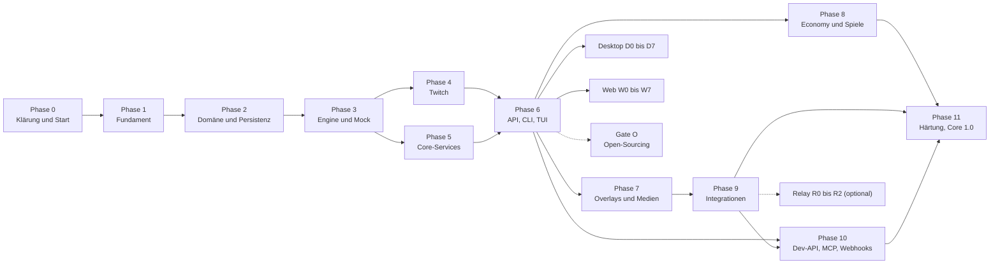

# Roadmap: Go-Port von Mix It Up

| | |
|---|---|
| **Status** | Phase 0 abgeschlossen (Gate bestanden am 2026-09-29); Phase 1 abgeschlossen, M0 erreicht (PR #12); Phase 2 abgeschlossen (PR #36) |
| **Stand** | 2026-10-01 |
| **Grundlage** | [`plan.md`](plan.md) (Architektur, Prioritäten, Risiken), [`starting.md`](starting.md), [`adr/`](adr/README.md) |
| **Aktuelle Phase** | Phase 3: Engine, Templates, Actions, Mock (in Arbeit) |

> **Name:** Das Projekt heißt vorerst `streamcrew` (Codename, [ADR-0008](adr/0008-codename-streamcrew.md)); Binary `streamcrew`. Der endgültige Name wird vor Gate O geprüft.

## Legende und Pflege

- **Checkboxen:** `[ ]` offen, `[x]` erledigt. Eine Aufgabe wird **sofort nach Abschluss abgehakt**; größere Änderungen an der Roadmap kommen in die Änderungshistorie am Ende.
- **Prioritäten:** wie in Plan §5.
  - P0: MVP (M2)
  - P1: Core 1.0 (M7)
  - P2: nach 1.0
  - P3: nur bei Bedarf

  Aufgaben ohne Kennzeichnung gehören zur Priorität ihrer Phase bzw. ihres Meilensteins.
- **Größen:**
  - S: bis 2 Tage
  - M: bis 1 Woche
  - L: bis 2 Wochen
  - XL: mehr als 2 Wochen, vor Beginn aufteilen
- **Aufwand je Phase:** Personenwochen (PW) für eine Person in Vollzeit. Das ist eine grobe Schätzung, die nach M1 neu kalibriert wird.
- **Gate:** Eine Phase mit Gate muss abgeschlossen sein, bevor die Folgephasen beginnen.
- **Neuimplementierung (ADR-0001):** Jedes fachliche Arbeitspaket beginnt mit einer Spezifikation in `docs/spec/`, die das Verhalten in eigenen Worten beschreibt und ihre Quellen nennt. Quellen sind die Doku, beobachtetes Verhalten und der Originalcode als Hilfestellung.
  - Implementiert wird aus der Spezifikation, nicht aus dem C#-Code.
  - KI-Assistenten bekommen keinen C#-Code und keine Übersetzungsaufträge.
- **Lizenz (ADR-0002):** Jede neue Quelldatei trägt `// SPDX-License-Identifier: Apache-2.0`.
- **ADR-Nummern:** ADR-0001 bis ADR-0013 existieren (siehe [`adr/`](adr/README.md)). Höhere Nummern sind vorläufige Backlog-Nummern aus Plan §12.1. Wer ein geplantes ADR anlegt, vergibt die nächste freie Nummer und passt die Verweise hier und im Plan an.
- **Pre-Commit-Checkliste:** gilt für jede Aufgabe mit Code (Plan §11.1); `scripts/check.sh` führt sie aus:
  1. `go fix ./...`
  2. `gofmt -w .`
  3. `go vet ./...`
  4. `golangci-lint run ./...`
  5. `govulncheck ./...`
  6. `go test ./...`

---

## Überblick

### Abhängigkeiten der Phasen

Gate O kann frühestens nach M2 stattfinden. Es schafft nur die Voraussetzungen: Öffentlich wird das Projekt erst, wenn der Projektinhaber die Repositories selbst umschaltet. Bis dahin bleibt alles privat.

### Meilensteine

| Meilenstein | Phasen | Exit-Kriterium | Aufwand (PW) | kumuliert |
|---|---|---|---:|---:|
| **M0** Projektstart | 0–1 | ADR-0001 bis -0008 akzeptiert; privates Repo mit `LICENSE`; CI und Docker-Image grün; `serve` startet und stoppt sauber | 2–3 | 2–3 |
| **M1** Engine mit Mock | 2–3 | Commands aus YAML reagieren auf simulierte Chat-Nachrichten und Events; Persistenz und Backups funktionieren | 8–11 | 10–14 |
| **M2** Headless-MVP (Twitch) | 4–6 | echter Twitch-Kanal ohne GUI betreibbar; API `v1alpha1`, CLI, TUI; Releases und Container-Image | 13–17 | 23–31 |
| **M3** Overlays und Medien | 7 | Alerts mit Bild, Ton und TTS in OBS; Widgets live; OBS-Steuerung | 5–7 | 28–38 |
| **M4** Economy und Community | 8 (P1) | Währung, Ränge, Inventar, 5 Spiele, Giveaways, Queue, Quotes | 8–11 | 36–49 |
| **M5** Integrationen Tier 1 | 9 (P1) | Spenden von Streamlabs, StreamElements und Ko-fi; Discord; Scripting; gemeinsamer Webhook-Eingang | 5–7 | 41–56 |
| **M6** Offen und erweiterbar | 10 (P1) | Developer-API, MCP-Server, eingehende Webhooks, Command-Bundles | 3–4 | 44–60 |
| **M7** Core 1.0 | 11 | alle P1-Aufgaben erledigt; Security-, Last- und Chaos-Tests bestanden; API `v1` eingefroren | 3–4 | **47–64** |

Weitere Plattformen (YouTube, Kick, Multiplattform) stehen seit dem 2026-09-30 im [Backlog](#backlog-später-oder-nicht-geplant) (Entscheidung des Projektinhabers); ihr früherer Meilenstein „M5 Multiplattform“ entfällt, die folgenden Meilensteine rücken nach.

### Statusübersicht

| Track / Phase | Status |
|---|---|
| Phase 0: Klärung und Projektstart | abgeschlossen 2026-09-29 (Gate bestanden; offene Punkte übertragen, siehe 0.5) |
| Phase 1: Fundament | abgeschlossen 2026-09-29, M0 erreicht (PR #12, CI grün); der Cache wurde in Phase 2 neu bewertet |
| Phase 2: Domäne und Persistenz | abgeschlossen 2026-09-29, alle Exit-Kriterien erfüllt; übertragen: weitere Settings-Sektionen (3.2), Zuordnung zu den numerischen Ereignis-IDs (10.2) |
| Phase 3: Engine, Templates, Actions, Mock | in Arbeit: 3.1 Template-Engine abgeschlossen (Kern, Identifier-Familien, Ausdrücke); 3.2 Command-Engine abgeschlossen (Settings-Sektion „commands“, Warteschlange, Ausführung, Auslösen, Aufrufe); 3.3 Action-Framework und P0-Actions abgeschlossen (Typ-Registry, Rechte je Betriebsmodus, alle 15 P0-Actions); 3.4 in Arbeit (ADR-0022 mit `internal/i18n`, Requirement-Service mit Rolle und Cooldowns) |
| Phase 4: Twitch | offen |
| Phase 5: Core-Services | offen |
| Phase 6: API, CLI, TUI | offen |
| Phase 7: Overlays und Medien | offen |
| Phase 8: Economy, Community, Spiele | offen |
| Phase 9: Integrationen, Scripting, Agent | offen |
| Phase 10: Developer-API, MCP, Webhooks, Import | offen |
| Phase 11: Härtung und Core 1.0 | offen |
| Desktop-Track D0–D7 | offen (ab M2) |
| Web-Track W0–W7 | offen (ab M2) |
| Relay-Track R0–R2 (optional) | offen |
| Gate O: Open-Sourcing | offen (frühestens nach M2) |

---

## Phase 0: Klärung und Projektstart (Gate)

| | |
|---|---|
| **Ziel** | Vorgehen, Lizenz und Organisation klären, bevor Code entsteht |
| **Voraussetzungen** | keine |
| **Aufwand** | ~1 PW |
| **ADRs** | 0001–0011 (akzeptiert); 0021 (rechtlicher Teil) übertragen nach Gate O |

### 0.1 Vorgehen und Recht

- [x] ADR-0001 „Neuimplementierung und Nutzung des Originals“ schreiben und entscheiden (S), erledigt 2026-09-27
- [x] Festlegen, ob `../mixitup` weiter gelesen werden darf: ja, als Hilfestellung nach den Regeln aus ADR-0001, erledigt 2026-09-27
- [x] Regeln aus ADR-0001 in [`docs/spec/README.md`](spec/README.md) übernommen, mit Vorlage [`docs/spec/TEMPLATE.md`](spec/TEMPLATE.md) für Spezifikationen mit Quellenangabe (S), erledigt 2026-09-28

### 0.2 Lizenz, Name, Marke

- [x] ADR-0002 Lizenz des Projekts: Apache-2.0 (S), erledigt 2026-09-27
- [x] `LICENSE` mit dem offiziellen Apache-2.0-Text im Projektwurzelverzeichnis anlegen (S), erledigt 2026-09-27
- [x] [ADR-0008](adr/0008-codename-streamcrew.md) Codename `streamcrew` (englisch, beschreibend, ohne Anlehnung an Mix It Up), erledigt 2026-09-28
- [x] Platzhalter für Projekt- und Binärnamen in `plan.md`, `roadmap.md` und den ADRs durch `streamcrew` ersetzt (S), erledigt 2026-09-28

### 0.3 Umfang

- [x] Kernfragen beantwortet (Vorgehen, Veröffentlichung, Lizenz, Betriebsmodus, Plattform zum Start), erledigt 2026-09-27
- [x] ADR-0003 Betriebsmodi: Streaming-PC primär, Server-Anwendung sekundär, erledigt 2026-09-27
- [x] ADR-0004 Plattformumfang zum Start: nur Twitch; der MVP-Umfang (M2) ist damit bestätigt, erledigt 2026-09-27
- [x] [ADR-0005](adr/0005-core-in-desktop-builds.md) Core in Desktop-Builds: Die App liefert den Core mit und startet ihn als eigenen Prozess, erledigt 2026-09-27
- [x] [ADR-0006](adr/0006-core-als-bibliothek-fuer-selbststart.md) Core als Bibliothek: schmale Start-API nur für den Selbststart, kein Betrieb im selben Prozess; ob mitgeliefert oder eingebunden, legt der Build-Prozess fest, erledigt 2026-09-27
- [x] [ADR-0007](adr/0007-release-artefakte-des-cores.md) Release-Artefakte: Jedes Core-Release enthält Binary und Bibliothek (Go-Modul als Quellarchiv), erledigt 2026-09-27
- [x] MVP-Umfang (P0, M2) wie geplant bestätigt; P1–P3 werden vor den jeweiligen Phasen überprüft (S), erledigt 2026-09-28

### 0.4 Organisation

- [x] Privates GitHub-Repository `ripmav/streamcrew` angelegt ([ADR-0009](adr/0009-repositories-und-hosting.md)); `LICENSE` im ersten Commit auf `main`, `docs/` per Pull Request (S), erledigt 2026-09-28
- [x] Branch-Konvention festlegen und `main` schützen (S), erledigt 2026-09-29:
  - Branch-Schutz und Rulesets sind für private Repositories im aktuellen GitHub-Plan nicht verfügbar (geprüft 2026-09-28). Bis zur Veröffentlichung oder einem Plan-Upgrade gilt die Regel per Konvention: Arbeit nur auf Branches, Merge per Pull Request.
  - Die Konvention steht in [`CONTRIBUTING.md`](../CONTRIBUTING.md); der optionale lokale Hook `scripts/hooks/pre-push` verhindert Pushes auf `main`.
  - Nach dem Merge löscht GitHub den Branch automatisch (Einstellung aktiv seit 2026-09-28).
  - Den technischen Schutz aktiviert der Projektinhaber nach dem Umschalten auf öffentlich (Gate O, O.3).
- [x] ADR-Infrastruktur anlegen (S), erledigt 2026-09-27:
  - `docs/adr/README.md` (Index)
  - `docs/adr/TEMPLATE.md` (Kontext, Entscheidung, Alternativen, Konsequenzen, Status)
  - `docs/adr/code/README.md`

### 0.5 Übertragene Aufgaben

Diese Aufgaben blockieren Phase 1 nicht und wurden beim Abschluss von Phase 0 (2026-09-29) dorthin verschoben, wo sie fällig werden:

| Aufgabe | jetzt in | fällig |
|---|---|---|
| Rechtliche Einschätzung (extern): BSL, EULA, Code als Hilfestellung, MIT-Datei, Import, `$`-Identifier-Namen | Gate O, O.1 | am Ende, vor Gate O (Entscheidung des Projektinhabers vom 2026-09-30) |
| Rechtlicher Teil von ADR-0021 (Import, Identifier-Namen) | Gate O, O.1 | am Ende, vor Gate O |
| Optional: schriftliche Erlaubnis von Blazing Cacti | Gate O, O.1 | vor Gate O |
| Namensprüfung für den endgültigen Namen | Gate O, O.1 | vor Gate O, möglichst früher |
| Plan §15: Bedeutung des Imports, eigener Datenbestand | Phase 10.2 | vor ADR-0021 (Umsetzung) |
| Plan §15: Zielsysteme der Desktop-App, Signierung und Notarisierung | Desktop-Track D0 | vor dem Paketierungs-Spike |
| Plan §15: Web-Stack | Web-Track W0 (ADR-0018) | vor W0 |
| Plan §15: verfügbare Kapazität pro Woche | Querschnittsaufgaben | spätestens zur Kalibrierung nach M1 |
| Projekt-Board oder Issues mit den Phasen der Roadmap (Entscheidung des Projektinhabers: später) | Gate O, O.2 | vor Gate O |

**Exit-Kriterien** (erfüllt, Gate bestanden am 2026-09-29):

- [x] ADR-0001 bis ADR-0008 haben den Status „akzeptiert“ (dazu ADR-0009 bis ADR-0011).
- [x] Das private Repository existiert, mit `LICENSE` ab dem ersten Commit (`fdbbcbc`).
- [x] Produktivcode entsteht erst, wenn der Name bzw. Codename für den Modulpfad feststeht: `github.com/ripmav/streamcrew` ([ADR-0008](adr/0008-codename-streamcrew.md)).

---

## Phase 1: Fundament (Toolchain, Skelett, CI)

| | |
|---|---|
| **Ziel** | lauffähiges, sauber beendbares Skelett mit vollständiger Qualitäts-Pipeline |
| **Voraussetzungen** | Phase 0 |
| **Aufwand** | 1–2 PW |
| **ADRs** | 0009, 0010, 0011 (bereits akzeptiert); Code-ADRs 0001–0006 |

### 1.1 Toolchain und Qualität

- [x] `go.mod` mit `go 1.27.1` und Modulpfad `github.com/ripmav/streamcrew` anlegen (S), erledigt 2026-09-28
- [x] `.golangci.yml` im v2-Format anlegen (installiert: 2.14.0); die Linter-Auswahl in [Code-ADR-0001](adr/code/0001-go-toolchain-und-linting.md) festhalten (S), erledigt 2026-09-28
- [x] `goheader`-Linter für den SPDX-Header `// SPDX-License-Identifier: Apache-2.0` konfigurieren (ADR-0002) (S), erledigt 2026-09-28
- [x] Pre-Commit-Checkliste als Skript umsetzen: `scripts/check.sh` (S), erledigt 2026-09-28
- [x] CI-Pipeline mit GitHub Actions aufsetzen: `.github/workflows/ci.yml` und `docs.yml` (M), erledigt 2026-09-28
  - `go fix -diff`, `go vet`, Lint, `go test -race`, `govulncheck`
  - Lizenzprüfung der Abhängigkeiten (`github.com/google/go-licenses`) mit einer Allowlist Apache-2.0-kompatibler Lizenzen
  - Linkprüfung für alle Markdown-Dateien mit `lychee` (Dateien und Überschriften-Anker, offline), damit Verweise zwischen Dokumenten und ADRs nicht ins Leere zeigen
  - kurze Fuzz-Läufe über `scripts/fuzz.sh` (findet alle Fuzz-Ziele automatisch)
  - Cross-Build linux/windows/darwin × amd64/arm64 in einem Job auf ubuntu
  - Actions auf Commit-SHAs gepinnt; wöchentlicher `govulncheck`-Lauf per Zeitplan
- [x] Dependency-Updates mit Renovate automatisieren, kein Dependabot (`renovate.json` nach Vorbild von `recipe-reader`: je Ökosystem ein Pull Request, Go-Module samt `go`-Direktive, Actions samt Werkzeugversionen, später Docker-Images; montags, Sicherheitsupdates sofort) (S), erledigt 2026-09-28
- [x] Renovate-GitHub-App für `ripmav/streamcrew` installieren; danach das Dependency Dashboard und die ersten Renovate-PRs prüfen (Projektinhaber) (S), erledigt 2026-09-28: Dependency Dashboard (#10), erster Renovate-PR (#11) gemergt
- [x] Die CI-Läufe des ersten Pull Requests prüfen: Laufzeit, Minutenverbrauch, Cache (S), erledigt 2026-09-28
  - Laufzeit (PR #8): Checks 70 s, Tests 36 s, Cross-Build 55 s, Linkprüfung 7 s; Gesamtdauer der CI 74 s
  - Minuten: pro Push mit Go- und Markdown-Änderungen etwa 5 abgerechnete Minuten, weil jeder Job auf volle Minuten aufgerundet wird
  - Cache: Die drei CI-Jobs teilen sich einen setup-go-Schlüssel. Gespeichert wird nur der Stand des zuerst fertigen Jobs, die anderen melden „Unable to reserve cache“. Ohne Abhängigkeiten ist das unerheblich.
- [x] setup-go-Cache mit den ersten Abhängigkeiten neu bewerten, z. B. Cache nur in einem Job speichern (Phase 2) (S), erledigt 2026-09-29, gemessen an den CI-Läufen dieses Tages:
  - Befund: Mit modernc SQLite kompilierte jeder Job, der den gemeinsamen Cache nicht gespeichert hatte, seine Abhängigkeiten bei jedem Lauf neu: den Race-Build, den Fuzz-Build, sqlc und die sechs Cross-Builds. Gemessen mit gemeinsamem Cache: Checks 54 s, Tests 234 s, Cross-Build 334 s, zusammen 11 abgerechnete Minuten je Push.
  - Nur einen Job speichern zu lassen hätte das nicht gelöst, weil die Jobs verschiedene Build-Ausgaben brauchen. Stattdessen hat jeder Linux-Job einen eigenen `actions/cache`-Eintrag, Schlüssel aus Job und Hash von `go.mod` und `go.sum`, mit Präfix-Rückfall nach Abhängigkeits-Updates. Die nativen Tests behalten den setup-go-Cache, der dort schon je System getrennt ist.
  - Ergebnis mit warmem Cache: Checks 46 s, Tests 101 s, Cross-Build 111 s (davon `go build` 7 s statt 227 s), zusammen 5 abgerechnete Minuten. Der erste Lauf nach einem Abhängigkeits-Update braucht so lange wie vorher. Speicher: rund 850 MB je Cache-Bereich (Branch bzw. Pull Request); das Limit liegt bei 10 GB.
  - Offen als mögliche Verbesserung: Der Docker-Smoke-Test kompiliert im Container ohne Cache (rund 75 s); ein BuildKit-Cache über GitHub Actions bräuchte weitere Actions und wird erst bei Bedarf bewertet.
- [x] Claude-Code-Review nur auf `@claude`-Erwähnung in Pull Requests, mit Fortschritts- und Ergebniskommentar (`.github/workflows/claude.yml`; kein automatisches Review, keine Issues) (S), erledigt 2026-09-28
- [x] Claude-Review so korrigieren, dass das Review tatsächlich läuft (S), erledigt 2026-09-29:
  - Erste Ursache: Das Werkzeug `Skill`, über das Claude Code den Plugin-Befehl ausführt, wurde verweigert. Seit PR #7 ist es gezielt für `code-review:code-review` freigegeben. Im Lauf zu PR #8 wirkt die Freigabe: keine Verweigerung.
  - Zweite Ursache, noch offen: Der Befehl brach in PR #8 nach 12 s in seiner Vorprüfung ab (2 Haiku-Agents, kein eigener Kommentar). Bei einem vollständigen Lauf ohne Befunde hätte er einen Kommentar „No issues found“ gepostet.
  - Wahrscheinlicher Grund: Die Vorprüfung stoppt, wenn Claude den PR schon kommentiert hat. Dafür hält sie vermutlich den vorab geposteten Fortschrittskommentar. Wiederholte `@claude`-Anfragen würden aus demselben Grund übersprungen.
  - Der Ergebniskommentar meldet einen solchen Abbruch fälschlich als „keine Befunde“.
  - Lösung (PR #9):
    - eigener Review-Prompt im Workflow statt des Plugin-Befehls, damit ohne Vorprüfung
    - Claude nur mit Lese-Werkzeugen und Inline-Kommentaren
    - Ergebnis als strukturierte Ausgabe, die den Fortschrittskommentar ersetzt
  - Prompt und Schema liegen in `.github/claude/`. Der Workflow liest sie aus dem Commit, aus dem er selbst stammt, nie aus dem PR-Checkout.
  - Die Workflow-Fassung hängt vom Ereignis ab:
    - `@claude` als PR-Kommentar (`issue_comment`) nutzt die Fassung aus `main`.
    - `@claude` in einem Review oder Inline-Kommentar nutzt die Fassung aus dem Merge-Commit des PRs.
  - Nachweis: Der einzige `@claude`-Lauf zu PR #9 kam als PR-Kommentar kurz vor dem Merge und lief deshalb noch mit der alten Fassung aus `main`. Der Projektinhaber hat die Aufgabe am 2026-09-29 ohne Nachweis in einem echten Lauf als erledigt festgelegt.
- [x] Claude-Review ohne verweigerte Werkzeugaufrufe (S), erledigt 2026-09-29: Das Review zu PR #13 meldete 39 verweigerte Aufrufe, 38 davon Shell-Befehle (`go build`, `go test`, `go vet`, `go doc`, `find`, `git log`, `gh api`, `curl`), einer `WebFetch`; dazu Hintergrund-Subagenten, die bei Abgabe des Ergebnisses noch liefen. `--allowedTools` entscheidet nur, was ohne Nachfrage läuft; erst `--tools "Read,Glob,Grep"` nimmt die übrigen eingebauten Werkzeuge aus dem Angebot (lokal mit Claude Code 2.1.284 geprüft: strukturierte Ausgabe und MCP-Werkzeuge bleiben nutzbar). Der Prompt nennt die Werkzeuge ausdrücklich; den Stand von Build und Tests liest Claude aus `checks.json`. Nachtrag 2026-09-29: In den ersten Läufen war `checks.json` leer, weil dem Job-Token die Leserechte `checks` und `statuses` fehlten (`gh pr checks` meldete „Resource not accessible by integration“); der Job hat sie jetzt, und ein Lesefehler steht als Warnung im Log.
- [x] `anthropics/claude-code-action` in `claude.yml` auf einen Commit-SHA pinnen ([Code-ADR-0001](adr/code/0001-go-toolchain-und-linting.md)) (S), erledigt 2026-09-28 mit dem Renovate-PR #11; `actions/checkout` ist dort seit PR #9 gepinnt. Digest-Updates schlägt Renovate vor.
- [x] `GOPRIVATE=github.com/ripmav/*` einrichten ([ADR-0009](adr/0009-repositories-und-hosting.md)) (S), erledigt 2026-09-29: in `ci.yml` für alle Jobs gesetzt, lokal über `go env -w` (`CONTRIBUTING.md`). Den CI-Token mit Leserechten auf das Core-Repository brauchen laut ADR-0009 nur die abhängigen Repositories; er ist nach D0 und W0 verschoben.

### 1.2 Architekturentscheidungen

- [x] [ADR-0009](adr/0009-repositories-und-hosting.md) Repositories und Hosting: drei Repositories auf GitHub (privat), CI mit Actions, Releases in GitHub Releases; vorgezogen, erledigt 2026-09-28
- [x] [ADR-0010](adr/0010-api-protokoll.md) API-Protokoll: ConnectRPC mit Protobuf, inklusive lokalem Transport zum Core-Prozess; vorgezogen, erledigt 2026-09-28
- [x] [ADR-0011](adr/0011-keine-telemetrie.md) Keine Telemetrie; Fehlersuche über lokale Logs und Diagnose-Paket; vorgezogen, erledigt 2026-09-28
- [x] Code-ADRs schreiben (M), erledigt 2026-09-29, jedes einzeln vom Projektinhaber abgenommen:
  - 0001 Toolchain und Linting: [Code-ADR-0001](adr/code/0001-go-toolchain-und-linting.md), akzeptiert 2026-09-28
  - 0002 Dependency Injection: [Code-ADR-0002](adr/code/0002-dependency-injection.md), akzeptiert 2026-09-29
  - 0003 Fehler und Logging: [Code-ADR-0003](adr/code/0003-fehler-und-logging.md), akzeptiert 2026-09-29
  - 0004 Nebenläufigkeit und Supervisor: [Code-ADR-0004](adr/code/0004-nebenlaeufigkeit-und-supervisor.md), akzeptiert 2026-09-29
  - 0005 Konfiguration: [Code-ADR-0005](adr/code/0005-konfiguration.md), akzeptiert 2026-09-29
  - 0006 Teststrategie: [Code-ADR-0006](adr/code/0006-teststrategie.md), akzeptiert 2026-09-29 (vorläufige Backlog-Nummer 0014; die Backlog-Nummern 0006–0013 sind um eins aufgerückt)

### 1.3 Skelett

- [x] `cmd/streamcrew/main.go` mit kong und den Unterkommandos `serve`, `version`, `config show|path`, `doctor` (S), erledigt 2026-09-29; Exit-Codes 0/1/2, `--output json` für `version`, `config path` und `doctor`
- [x] `internal/config` (M), erledigt 2026-09-29 ([Code-ADR-0005](adr/code/0005-konfiguration.md)):
  - Flags, Umgebungsvariablen (`STREAMCREW_…`), optionale Konfigurationsdatei (YAML); Vorrang Flag > Umgebung > Datei > Standard, unbekannte Schlüssel sind ein Fehler
  - Datenverzeichnis (`os.UserConfigDir`, `--data-dir`, portabler Modus über `streamcrew.portable` neben dem Binary)
  - Betriebsmodus mit abhängigen Standardwerten (Adresse `127.0.0.1:8740` bzw. `:8740`)
- [x] `internal/app` (M), erledigt 2026-09-29 ([Code-ADR-0002](adr/code/0002-dependency-injection.md), [Code-ADR-0004](adr/code/0004-nebenlaeufigkeit-und-supervisor.md)):
  - Composition Root; Bereitschaft aus den Zuständen der Runnables
  - Supervisor (`internal/supervisor`): Runnables mit Restart-Policy und Backoff mit Jitter, Panics abgefangen, kritische Runnables
  - `signal.NotifyContext`, geordneter Shutdown mit Zeitlimit; ein zweites Signal beendet sofort
- [x] Logging mit `log/slog` (S), erledigt 2026-09-29 (`internal/logging`, [Code-ADR-0003](adr/code/0003-fehler-und-logging.md)):
  - Text oder JSON, Level pro Komponente
  - Datei `<data-dir>/logs/streamcrew.log` als JSON Lines mit eigener Rotation nach Größe
  - Maskierung von Secrets über Schlüsselnamen und den Typ `logging.Secret`
- [x] HTTP-Grundserver mit dem stdlib-Routing: `/healthz`, `/readyz`, `pprof` nur im Dev-Modus (S), erledigt 2026-09-29 (`internal/httpserver`)
- [x] `time/tzdata` einbinden (S), erledigt 2026-09-29
- [x] `streamcrew doctor` mit ersten Prüfungen: Datenverzeichnis, Konfigurationsdatei, Adresse, Zeitzonen (`internal/doctor`) (S), erledigt 2026-09-29
- [x] CI-Job für native Tests unter Windows und macOS, wöchentlich und auf Anforderung ([Code-ADR-0006](adr/code/0006-teststrategie.md)) (S), erledigt 2026-09-29

### 1.4 Dokumentation und Container

- [x] `README.md` (Ziel, Status, Build, Lizenzhinweis Apache-2.0) (S), erledigt 2026-09-28
- [x] `README.md` um Bedienung, Konfiguration und Container ergänzt (S), erledigt 2026-09-29
- [x] `CONTRIBUTING.md` (Konventionen, Pre-Commit, ADR-Prozess, Herkunftsregeln aus ADR-0001) (S), erledigt 2026-09-29
- [x] Dockerfile: Multi-Stage, CGO-frei, non-root, minimales Laufzeit-Image, aktuelle Basis-Images (S), erledigt 2026-09-29: `golang:1.27.1-trixie` (per Digest gepinnt) zum Bauen, `scratch` zur Laufzeit mit CA-Zertifikaten, Nutzer 65532; Server-Modus, Daten im Volume `/data`; Image rund 16 MB
- [x] Docker-Smoke-Test: `docker build`, `docker run … version`, `serve` mit Healthcheck (S), erledigt 2026-09-29: `scripts/docker-smoke.sh`, prüft außerdem Nutzer, `config show`, `doctor` im Container und den sauberen Stopp per SIGTERM; läuft in der CI im Build-Job

**Exit-Kriterien (M0):**

- [x] `streamcrew serve` startet, meldet sich gesund und beendet sich auf SIGINT/SIGTERM sauber: `TestServe` in `cmd/streamcrew` und der Docker-Smoke-Test (2026-09-29).
- [x] Die CI ist grün: PR #12 (2026-09-29), alle Jobs einschließlich Docker-Smoke-Test; per `workflow_dispatch` zusätzlich die nativen Tests unter Windows und macOS.
- [x] Das Docker-Image ist gebaut und getestet: lokal mit `scripts/docker-smoke.sh` (2026-09-29), in der CI im Build-Job.

---

## Phase 2: Domäne und Persistenz

| | |
|---|---|
| **Ziel** | Datenmodell, Speicher, Profile, Backups, Event-Bus und Secrets |
| **Voraussetzungen** | Phase 1 |
| **Aufwand** | 3–4 PW |
| **ADRs** | [0012](adr/0012-persistenz.md), [0013](adr/0013-sicherheitsmodell.md) (Entwurf); Code-ADRs [0008](adr/code/0008-datenbankzugriff.md), [0009](adr/code/0009-ids-und-zeit.md), [0010](adr/code/0010-polymorphe-serialisierung.md), [0011](adr/code/0011-event-bus.md) |

### 2.1 Speicher

- [x] [Code-ADR-0008](adr/code/0008-datenbankzugriff.md) Datenbankzugriff: `modernc.org/sqlite`, `sqlc`, `goose`, akzeptiert 2026-09-29. Die Konventionen für sqlc stehen darin; das Code-ADR zur Codegenerierung folgt erst mit `buf` und esbuild in Phase 6 (S)
- [x] [ADR-0012](adr/0012-persistenz.md) Persistenz: SQLite je Profil, Profile, Sperre, Backups, Secrets im Ruhezustand, akzeptiert 2026-09-29 (S)
- [x] `internal/store` (M), erledigt 2026-09-29:
  - Verbindung mit WAL, `foreign_keys` und `busy_timeout`; ein Schreib-Pool mit `BEGIN IMMEDIATE`, ein Lese-Pool mit `query_only`
  - eingebettete goose-Migrationen, vorwärts und rückwärts getestet; Backup vor der Migration einer bestehenden Datenbank
  - Transaktions-Helfer mit Rollback und Fehlerübersetzung (`ErrNotFound`, `ErrConflict`)
  - Repository-Implementierungen für Metadaten, Settings und Vault; die Interfaces liegen beim Konsumenten. Die Repositories des Domänenmodells folgen mit 2.2.
  - sqlc-Code in `internal/store/sqlcgen`, `sqlc diff` in der CI
- [x] Profile: anlegen, auflisten, wechseln, umbenennen, löschen; Sperrdatei gegen Doppelstart (M), erledigt 2026-09-29 (`internal/profile`, `internal/lockfile`, `profile list|create|rename|use|delete`)
- [x] Backups (M), erledigt 2026-09-29 (`internal/backup`):
  - `VACUUM INTO` → ZIP mit Manifest (App- und Schemaversion, Prüfsumme)
  - Zeitplan (täglich) und Aufbewahrung je Tag, Woche und Monat
  - Restore mit Prüfung von Format, Prüfsumme und Schemaversion
  - `backup create|list|restore`; `backup create` geht auch bei laufendem Core

### 2.2 Domänenmodell

- [x] [Code-ADR-0009](adr/code/0009-ids-und-zeit.md) IDs und Zeit: UUIDv7 aus der Standardbibliothek, keine injizierbare Uhr (`testing/synctest`), akzeptiert 2026-09-29 (S)
- [x] Spezifikationen für das Domänenmodell: [`users-and-roles.md`](spec/users-and-roles.md), [`commands.md`](spec/commands.md), [`counters-and-quotes.md`](spec/counters-and-quotes.md), [`events.md`](spec/events.md) (M), vom Projektinhaber geprüft und akzeptiert 2026-09-29; die offenen Fragen darin werden am Original geprüft
- [x] Nutzer: Nutzer, Plattform-Identitäten, Statistiken, Titel, Notizen, Ausschlüsse (M), erledigt 2026-09-29 (`internal/domain/user`, `internal/domain/platform`)
- [x] Rollenmodell: plattformneutrale Rollen mit Rangordnung plus plattformspezifische Rollen; Semantik „erfüllt Mindestrolle“ (Plan Anhang A.7) (M), erledigt 2026-09-29 (`internal/domain/role`; plattformspezifische Rollen zählen auf der Stufe, auf der sie stehen)
- [x] Commands (M), erledigt 2026-09-29 (`internal/domain/command`; Golden Files für alle Anforderungsarten):
  - Arten, Trigger
  - Gruppen inkl. Gruppen-Timer-Intervall
  - aktiv/unlocked
  - Requirements-Set
  - polymorphe Actions
- [x] [Code-ADR-0010](adr/code/0010-polymorphe-serialisierung.md) polymorphe Serialisierung: `type`-Diskriminator, `schemaVersion`, Migrationen je Typversion; vorerst `encoding/json`, weil v2 in go1.27.1 noch experimentell ist; akzeptiert 2026-09-29 (M)
- [x] Datenmodell für Counter und Quotes (S), erledigt 2026-09-29 (`internal/domain/counter`, `internal/domain/quote`; Rücksetzen beim Start)
- [x] Settings-Sektionen, typisiert und versioniert, als polydoc-Dokumente (`internal/settings`): Grundlage sowie „Backups“ und „Zeit“, erledigt 2026-09-29 (M)
- [ ] Weitere Settings-Sektionen mit ihren Funktionen: allgemein, Chat, Commands, Moderation, Overlay, Locale (ab Phase 3) (S); übertragen nach 3.2, weil jede Sektion mit ihrer Funktion entsteht
- [x] Event-Modell, technischer Teil (M), erledigt 2026-09-29 (`internal/event`): Umschlag (ID, Zeit, Quelle, Typ, Nutzlast), Katalog mit typisierter Nutzlast und Namensregel, erste Typen `app.started`, `app.stopping`, `supervisor.status`
- [x] Katalog der fachlichen Event-Typen als stabile Strings, nach Spezifikation (Plan Anhang A.1) (S), erledigt 2026-09-29 (`internal/domain/eventtype`, mit plattformneutraler Entsprechung und Häufigkeit je Typ)
- [ ] Zuordnungstabelle zu den numerischen IDs des Originals für den späteren Import, vorbehaltlich der rechtlichen Einschätzung (Gate O, O.1) (S); übertragen nach 10.2 (Typ-Mapping des Importers)

### 2.3 Event-Bus

- [x] [Code-ADR-0011](adr/code/0011-event-bus.md) Event-Bus, akzeptiert 2026-09-29 (S)
- [x] Typisierter In-Process-Bus mit Abonnements, Filtern, Puffern und Lag-Erkennung für langsame Abonnenten (M), erledigt 2026-09-29; der Supervisor meldet seine Zustände als `supervisor.status`

### 2.4 Secrets und Sicherheit

- [x] Verschlüsselte Secrets (M), erledigt 2026-09-29, als Paket `internal/vault` (die Berechtigungsregeln des Projektinhabers sperren Pfade mit „secret“):
  - AES-256-GCM mit dem Namen des Eintrags als zusätzliche authentifizierte Daten
  - Schlüssel aus `STREAMCREW_SECRET_KEY`, dem Schlüsselbund des Systems oder `<data-dir>/secret.key` (0600)
  - Schlüsselrotation über alle Profile: `secret rotate`
- [x] [ADR-0013](adr/0013-sicherheitsmodell.md) Sicherheitsmodell, Entwurf: Betriebsmodi × Capabilities (Plan §6.15), akzeptiert 2026-09-29 (S)

**Exit-Kriterien:**

- [x] Migrationen sind vorwärts und rückwärts getestet (`TestMigrationsUpDownUp`).
- [x] Die Repositories sind durch Integrationstests gegen eine echte SQLite abgedeckt: Metadaten, Settings, Vault, Nutzer, Commands, Counter und Quotes (`internal/store/*_test.go`).
- [x] Der Backup/Restore-Roundtrip-Test ist grün (`TestBackupRestoreRoundTrip`).
- [x] Ein Test belegt, dass Tokens nie im Klartext in der Datenbank stehen (`TestNoPlaintextAtRest`, auch für WAL und Backup).

---

## Phase 3: Engine (Templates, Commands, Actions, Requirements, Mock)

| | |
|---|---|
| **Ziel** | plattformneutrale Ausführung von Commands, testbar ohne Live-Plattform |
| **Voraussetzungen** | Phase 2; die `$`-Identifier-Namen gelten als rechtlich unbedenklich, bis die Einschätzung am Ende (Gate O, O.1) etwas anderes ergibt |
| **Aufwand** | 5–7 PW |
| **ADRs** | 0022; Code-ADRs 0012, 0013, 0017, 0018, 0019 |

### 3.1 Template-Engine

- [x] Spezifikation [`docs/spec/template.md`](spec/template.md) (S), vom Projektinhaber geprüft und akzeptiert 2026-09-30; Identifier-Namen unter Interop-Vorbehalt (Entscheidung des Projektinhabers):
  - Syntax und Auflösungsreihenfolge
  - Regel „längster Präfix“
  - Kodierung
  - bewusste Abweichungen vom Original
- [x] [Code-ADR-0012](adr/code/0012-template-engine.md) Template-Engine (S), akzeptiert 2026-09-29: Tokenizer mit Präfixbaum, Präfix-Familien, Kodierung je Ausgabeort, Ausdrücke mit `expr-lang/expr`
- [x] Tokenizer und Resolver-Registry (statisch, Muster, dynamische Namen); bedarfsgesteuerte Auflösung mit `context`; Cache pro Rendervorgang (M), erledigt 2026-09-30: `internal/template`
- [x] Kodierungsmodi: Text, URL, HTML, JSON (S)
- [x] Identifier-Familien für das MVP (M), erledigt 2026-09-30:
  - Nutzer, Ziel, Streamer, Bot (Port `template.Users`)
  - Argumente (mit Nachricht)
  - Datum und Zeit in der Profil-Zeitzone
  - Zufall, Stream, Counter, letzte Ereignisse (Ereigniswerte als Werte des Durchlaufs)
  - Command-Name, Plattform
- [x] Ausdrücke mit `expr-lang/expr`: Rechnen, Vergleiche (S), erledigt 2026-09-30: `internal/expr`
- [x] Golden-Tests und Fuzz-Targets (S), erledigt 2026-09-30: Golden Files je Familie, `FuzzRender`, `FuzzExpression`

### 3.2 Command-Engine

- [x] Spezifikation [`docs/spec/command-engine.md`](spec/command-engine.md): Zustände, Sperrmodi, Pause, Verlauf (S), vom Projektinhaber geprüft und akzeptiert 2026-09-30; enthält auch die Settings-Sektion `commands`
- [x] Instanzen mit Zustandsmaschine (Pending → Running → Completed/Failed/Canceled) (S), erledigt 2026-09-30: `internal/engine`
- [x] Warteschlange mit fünf Sperrmodi, Unlocked-Commands, Pause/Fortsetzen, eigene Pause für Entrance-Commands (L), erledigt 2026-09-30
- [x] Abbrechen über `context`, Replay, Verlauf als Ringpuffer, Ereignisse `command.instance.*` (M), erledigt 2026-09-30
- [x] Runner-Parameter pro Nutzer, Auflösung des Ziel-Nutzers, Rekursions- und Zyklenschutz, Zeitlimits je Action (M), erledigt 2026-09-30
- [x] Nebenläufigkeitstests mit `testing/synctest` und `-race` (M), erledigt 2026-09-30: alle Tests der Engine in `synctest`, Lasttest je Sperrmodus
- [x] Settings-Sektionen mit ihren Funktionen, aus 2.2 übertragen: „commands“ (Sperrmodus, Fehler-Cooldowns) hier (S), erledigt 2026-09-30: `internal/settings`, dazu die Fehlerpolitik je Command (Migration 0005). Die übrigen stehen als eigene Punkte bei ihren Phasen: „locale“ mit ADR-0022 in 3.6 (Entscheidung des Projektinhabers vom 2026-09-30), „general“ und „chat“ in 5.1, „moderation“ in 5.5, „overlay“ in 7.1

### 3.3 Action-Framework und P0-Actions

Reihenfolge: erst die Bereinigung nach Code-ADR-0017, dann die Doku als unterster PR eines neuen Stacks (Spezifikation `actions.md` und Code-ADR-0013), danach die Umsetzung nach Features. Die Actions testen gegen Fakes der Ports; die Mock-Plattform (3.6) und Twitch (Phase 4) liefern die echten.

- [x] Vorab: bestehenden Code nach [Code-ADR-0017](adr/code/0017-klare-signale-statt-magischer-werte.md) bereinigen (S), erledigt 2026-09-30:
  - `template.Scope` ohne Sonderwerte: kein leeres Trennzeichen für `|`, keine fehlende Zeitzone für UTC, kein fehlendes Ziel für den auslösenden Nutzer, kein leerer Text nach dem Trigger für „Argumente mit Leerzeichen“; erledigt 2026-09-30
  - Settings-Sektion „time“: `system` statt leerer Zeitzone, als neue Version der Sektion mit Migration (Entscheidung des Projektinhabers vom 2026-09-30); erledigt 2026-09-30, Version 2
- [x] Spezifikation [`docs/spec/actions.md`](spec/actions.md): Verhalten der P0-Actions aus der offiziellen Doku, ohne Code des Originals (M), vom Projektinhaber geprüft und akzeptiert 2026-10-01:
  - je Action Konfiguration, Ablauf, gesetzte Identifier, Fehlerfälle
  - die Grenze für Wiederholungen ([`command-engine.md`](spec/command-engine.md), B74)
  - was mit den Ausgängen eines Aufrufs geschieht (`engine.Run.Call`: abgeschlossen, eingereiht, inaktiv, abgelehnt, wartend)
  - globale Werte der Action `special_identifier`: Lebensdauer und Speicherung, als Quelle der Templates ([`template.md`](spec/template.md), B10)
- [x] [Code-ADR-0013](adr/code/0013-typ-registry.md) Typ-Registry (M), akzeptiert 2026-10-01: Descriptor mit
  - Typ-ID, Version, Kategorie, i18n-Schlüsseln
  - JSON-Schema und UI-Hinweisen
  - benötigten Capabilities
  - Anschluss an die Engine (seit 3.2): Actions setzen `engine.Performer` um, verschachtelte zusätzlich `engine.Container` (B22); die Registry setzt den Port für Bild und Ton (B23) und die Capabilities um; „aktuellen Command beenden“ gibt `engine.ErrStop` zurück, die Command-Action nutzt `engine.Run.Call`
- [x] Action-Framework nach [Code-ADR-0013](adr/code/0013-typ-registry.md), vor den einzelnen Typen (M), erledigt 2026-10-01:
  - `internal/capability`; `internal/action` mit Registry und Feldtypen (`Template`, `Amount`, `ResultName`); `internal/action/schema` mit eigenem Schema-Typ und Bausteinen; Konformitätstest mit `github.com/santhosh-tekuri/jsonschema/v6`, nur in Tests; erledigt 2026-10-01
  - `internal/polydoc`: Kind-Actions als Dokumente derselben Familie, höchstens 16 Ebenen tief; erledigt 2026-10-01 (`polydoc.MaxDepth`, `polydoc.ErrTooDeep`)
  - Engine: Schalter „aktiv“, Kind-Actions über `Run.PerformChild` mit Fehlerpolitik und Pfad im Verlauf, Zeitlimit als anhaltbarer Timer mit `Run.LimitTo`, Port `engine.ActionTypes` statt `engine.WithVisualAudio`; erledigt 2026-10-01, mit `internal/capability`
  - Speichern: Verweise, Namen der Ergebniswerte, Warnungen bei fehlenden Capabilities; erledigt 2026-10-01 (`command.Service.Save` mit `command.Checks`, Ergebnis `command.Saved`)
- [x] Plattform-Ports nach Plan §6.11 in `internal/connector` (S): `Chat` (senden, antworten, flüstern, löschen), `Moderation`, Kanalinformation, Nutzer nachschlagen; die Actions nutzen sie, die Mock-Plattform (3.6) und Twitch (Phase 4) setzen sie um; erledigt 2026-10-01: `connector.Platform` mit `Chat` (Antworten und Flüstern als optionale `Replier` und `Whisperer`), `Moderation`, `Users` und `Channel`, dazu `connector.Set` und `connector.FindAccount`; Fakes in `internal/connector/connectortest`
- [x] [Code-ADR-0019](adr/code/0019-host-rechte-in-der-startkonfiguration.md) Host-Rechte in der Startkonfiguration, vor der Capability-Prüfung und den Actions `file`, `external_program` und `web_request` (S), akzeptiert 2026-10-01: `grant` und `revoke` je Betriebsmodus, freigegebene Wurzeln (`file_root`), Allowlist für Netzziele (`outbound_allow`), alle vier ohne Neustart änderbar; Umgebung für externe Programme
- [x] Capability-Prüfung je Betriebsmodus nach [ADR-0013](adr/0013-sicherheitsmodell.md) und [Code-ADR-0019](adr/code/0019-host-rechte-in-der-startkonfiguration.md): Warnung beim Speichern, Verweigerung bei Ausführung (S), erledigt 2026-10-01: Rechte je Modus mit `--grant` und `--revoke`, Wurzeln, Allowlist und Nachladen ohne Neustart in `internal/config`; die Typ-Registry fragt eine Quelle (`capability.Source`); `doctor` und Start-Log zeigen die Rechte. Die Registry bekommt `App.Rights` mit der Verdrahtung der Engine (3.6)
- [x] `wait`, `random`, `group`, `repeat` mit der Grenze aus B74 (S), erledigt 2026-10-01: `internal/action/flow`
- [x] `conditional`: Vergleiche, Und/Oder, `expr`-Ausdrücke (`internal/expr`), Verzweigungen (M), erledigt 2026-10-01: `internal/action/flow`, Klauseln nach Vergleich aufgeteilt (`schema.Pick`)
- [x] `command`: ausführen mit oder ohne Warten über `engine.Run.Call`, aktivieren/deaktivieren, Gruppe schalten (S), erledigt 2026-10-01: `internal/action/commands`, dazu `command.Service.SwitchCommand`/`SwitchGroup` und `engine.Run.CancelAll`/`Pause`/`Resume`/`StartCooldown`
- [x] `counter`: setzen, addieren, zurücksetzen (S), erledigt 2026-10-01: `internal/action/values`; Überlauf lässt den Wert unverändert, dazu Schritte um die Schrittweite des Counters (beides Entscheidungen des Projektinhabers)
- [x] `special_identifier`: lokale und globale Werte setzen, Ausdrücke; globale Werte als Quelle der Template-Engine (S), erledigt 2026-10-01: `internal/action/values`, Textfunktionen in `internal/textfunc`, globale Werte als `template.Globals`; die Option „Rechnen“ ist die Art `expression`
- [x] `chat`: senden, antworten, flüstern; als Bot oder Streamer, über den Chat-Port (S), erledigt 2026-10-01: `internal/action/chat`; das Flüstern ist die Art `whisper`, die ID der auslösenden Nachricht steht in `engine.Params.MessageID`
- [x] `web_request`: Methode, Header, Body; JSON-Pfade in Identifier; SSRF-Schutz im Server-Modus (M), erledigt 2026-10-02: `internal/action/network`, SSRF-Dialer `netguard.Dialer`
- [x] `moderation`: Timeout, Nachrichten eines Nutzers entfernen, Chat leeren, Bann, Entbannen, Mod, Strikes, Chat stumm schalten ([`actions.md`](spec/actions.md), B80–B86); VIP kommt mit der Twitch-Action (Phase 4), das Löschen der auslösenden Nachricht mit den Anforderungen (3.4) (S), erledigt 2026-10-01: `internal/action/moderation`; Strikes und gesehene Nutzer über Ports des Nutzer-Service (5.2), der stumme Chat über einen Port des Chat-Service (5.1)
- [x] `platform_message`, `user_lookup` (S), erledigt 2026-10-01: `platform_message` in `internal/action/chat`, `user_lookup` in `internal/action/users`; feste Ergebnisnamen über `action.Descriptor.Results` und `action.Registry.Reserved`
- [x] `file`: lesen, schreiben, anhängen, Zeile lesen; nur unter freigegebenen Wurzeln via `os.Root` (S), erledigt 2026-10-02: `internal/action/host`, alle zwölf Arten aus [`actions.md`](spec/actions.md), B101
- [x] `external_program`: nur mit `host:process`; Timeout; Ausgabe in Identifier (S), erledigt 2026-10-02: `internal/action/host`, Arten `start`, `run` und `open`
- [x] Wechsel auf `encoding/json/v2` nach [Code-ADR-0018](adr/code/0018-json-v2.md) (akzeptiert 2026-09-30), vor der Typ-Registry, weil sie auf `internal/polydoc` aufbaut (M), erledigt 2026-09-30

### 3.4 Requirements

Reihenfolge wie in 3.3: erst die Doku (Spezifikation `requirements.md`, ADR-0022), dann die Umsetzung. Die Engine ruft den Requirement-Service über den Port `engine.Requirements` auf (seit 3.2); die Fehler-Cooldowns sitzen in der Engine.

- [x] Spezifikation [`docs/spec/requirements.md`](spec/requirements.md): Prüfung der Anforderungsarten aus der offiziellen Doku, ohne Code des Originals (M), vom Projektinhaber geprüft und akzeptiert 2026-10-01:
  - Reihenfolge der Prüfungen, Kosten und Cooldowns erst, wenn alle erfüllt sind ([`command-engine.md`](spec/command-engine.md), B10)
  - Fehlermeldungen je Art, wann der Nutzer sie erfährt (`Rejection.Tell`), Schwelle als „wartend“
  - Argumente: Typen, Pflicht, Werte als Identifier ([`commands.md`](spec/commands.md), B45)
  - Währung, Rang und Inventar: wie sie bis Phase 8 behandelt werden, das sie liefert
- [x] [ADR-0022](adr/0022-internationalisierung.md) Internationalisierung (S), aus 3.6 vorgezogen, weil die Fehlermeldungen der Anforderungen übersetzt werden; akzeptiert 2026-10-02: ICU MessageFormat v1 im Teilumfang, eigener Parser und Renderer auf `golang.org/x/text`
- [x] `internal/i18n` nach [ADR-0022](adr/0022-internationalisierung.md): Parser und Renderer für den Teilumfang, Kataloge EN und DE, Dauern, Rückfall, Vollständigkeitstests und Fuzz-Test (M), erledigt 2026-10-02: `i18n.Catalog` mit `Load`, `New` und `Render`, Werte `Text`, `Int`, `Decimal`, `Duration`; Schlüssel als Konstanten in `keys.go`. Einen Rückfall auf Englisch braucht es noch nicht, weil `New` vollständige Kataloge verlangt; er kommt mit den anpassbaren Meldungen (P1)
- [x] Settings-Sektion „locale“ mit der Sprache des Profils (`en`, `de`), aus 3.6 vorgezogen ([ADR-0022](adr/0022-internationalisierung.md), Punkt 7) (S), erledigt 2026-10-02: `settings.Locale` (Version 1) mit `language`, Standard `en`; eine Sprache ohne Katalog lehnt das Speichern ab
- [x] Offene Fragen von [`requirements.md`](spec/requirements.md) am Original klären und entscheiden, vor dem Requirement-Service (S), erledigt 2026-10-02: Recherche-Agent wie bei den Actions; Entscheidungen des Projektinhabers in der Änderungshistorie der Spezifikation
- [x] Benannte Cooldown-Gruppen mit einer Dauer je Gruppe, unabhängig von der Gruppe des Commands ([`commands.md`](spec/commands.md), B41; [`requirements.md`](spec/requirements.md), B20, B21) (S), erledigt 2026-10-02: `command.CooldownGroup` mit Migration 0007, Cooldown-Anforderung in Version 2, Prüfung beim Speichern
- [x] Argumenttyp `integer`; ein Nutzer-Argument mit `@` gilt auch für unbekannte Namen ([`requirements.md`](spec/requirements.md), B33) (S), erledigt 2026-10-02: `command.ArgumentInteger` im Datenmodell; die Prüfung der Werte folgt mit dem Requirement-Service
- [x] Fehler-Cooldown: neue Art „keine Meldungen“ ([`command-engine.md`](spec/command-engine.md), B12, B90) (S), erledigt 2026-10-02: `settings.ErrorCooldownSilent`; die Engine sendet dann keine Meldung und loggt die Ablehnung
- [x] Suche nach Nutzern je Durchlauf: ein Fund gilt für Ziel, Anforderungen, Templates, Actions und aufgerufene Commands; Versuche und Zeitgrenze je Versuch in der Settings-Sektion „commands“, Version 4 ([`command-engine.md`](spec/command-engine.md), B17, B90) (S), Entscheidung des Projektinhabers vom 2026-10-03; erledigt 2026-10-03 für Engine, Requirement-Service, Templates und die Actions Chat, Moderation und Nutzersuche
- [x] Vorarbeit der Prüfung zugleich, Entscheiden und Einreihen in der Reihenfolge des Auslösens, und `engine.Engine.Submit` für Auslöser, die nicht warten ([`command-engine.md`](spec/command-engine.md), B16) (S), Entscheidung des Projektinhabers vom 2026-10-03, damit eine langsame Nutzersuche bei großen Raids nicht alles aufhält; erledigt 2026-10-03
- [x] Größe der Warteschlange einstellbar, Standard 1 000 ([`command-engine.md`](spec/command-engine.md), B15, B90) (S), Entscheidung des Projektinhabers vom 2026-10-02, erledigt 2026-10-02: Settings-Sektion „commands“ in Version 3 mit `queueSize` von 1 bis 10 000; `engine.MaxPending` entfällt
- [x] Requirement-Service hinter `engine.Requirements`: Entscheidung (`met`, `waiting`, `rejected`) mit Kosten und Cooldowns, `Notify` mit übersetzter Meldung, `StartCooldown` für die Command-Action ([`actions.md`](spec/actions.md), B37), Set-Validierung beim Speichern (M), begonnen 2026-10-02 in `internal/requirement`, erledigt 2026-10-03; die Kosten kommen mit Phase 8, die Schwelle mit der eigenen Aufgabe darunter:
  - [x] Reihenfolge der Prüfungen, fehlerhafte und unbekannte Anforderungen, Rolle mit dem Streamer für Durchläufe ohne Nutzer, `Notify` als Antwort oder mit `@Name`, erledigt 2026-10-02
  - [x] Cooldowns in allen vier Arten, gespeichert (Migration 0008), Meldung mit zwei Einheiten, `StartCooldown` für die Command-Action; ein Command, der nicht eingereiht wird, hat keinen Cooldown (`engine.Decision.Revert`), erledigt 2026-10-02
  - [x] Argumente: Zuordnung, Typen, Werte als Identifier des Durchlaufs ([`requirements.md`](spec/requirements.md), B30–B35), erledigt 2026-10-03; die Prüfung der Namen (B36) mit der Prüfung beim Speichern
  - [x] Einstellungen: die auslösende Nachricht löschen, auch bei einer Ablehnung, über den Chat-Port aus 3.3 (B60–B62), erledigt 2026-10-03 über `engine.Requirements.Decided`
  - [x] Prüfung beim Speichern (B34, B36, B62, B80, B81), erledigt 2026-10-03 in `command.Service.Save`: Identifier der Argumente gegen eingebaute Identifier, Pflichtargument nach optionalem, Kontextmenü nur bei Chat-Commands; Währung, Rang und Gegenstand als Warnung `unknown_reference`
- [ ] Threshold: Mindestanzahl Nutzer im Zeitfenster, je Nutzer ein Durchlauf ([`command-engine.md`](spec/command-engine.md), B82); solange sie wartet, eine Meldung, wie viele Nutzer fehlen, wofür die Engine bei `waiting` melden können muss ([`requirements.md`](spec/requirements.md), B51) (S) (P1)

### 3.5 Commands als Code und Typkatalog

Zuerst die Änderungen an Datenmodell und Engine aus den geklärten Fragen vom 2026-10-02 (Entscheidungen des Projektinhabers), damit das Format sie schon enthält:

- [x] Chat-Trigger: Schalter „`!` voranstellen“ je Command, Trigger mit Schreibweise, Eindeutigkeit in exakter Schreibweise, Platzhalter-Trigger ohne Schreibweise ([`commands.md`](spec/commands.md), B11, B13, B14) (S), erledigt 2026-10-03: Trigger-Art `command.TriggerMode` (`exclamation`, `literal`, `wildcard`) statt des Schalters `wildcard`, Migration 0009, `command.MatchTrigger` mit exaktem Treffer und Treffer ohne Schreibweise für die Erkennung in 3.6
- [x] Feine Stufen der Rangordnung mit eigener Kennung je Stufe; gespeicherte Rollen und Rollen-Anforderungen mit den bisherigen Kennungen übernehmen, Meldung der Rollen-Anforderung ([`users-and-roles.md`](spec/users-and-roles.md), B20) (M), erledigt 2026-10-03: 21 Stufen in `internal/domain/role`, Migration 0010 für die Rollen der Plattformkonten, Rollen-Anforderung in Version 2, Meldung und Template-Identifier mit allen Stufen
- [x] Sperrmenge mit den Commands, die mit Warten aufgerufen werden ([`command-engine.md`](spec/command-engine.md), B22, B23) (S), erledigt 2026-10-03: `engine.WaitingCaller`, von der Command-Action bei `run` mit Warten erfüllt
- [x] Exakte Dezimalzahlen für alle Zahlen, zuerst für Counter mit Nachkommastellen ([`counters-and-quotes.md`](spec/counters-and-quotes.md), B4, B5, B8; Code-ADR-0020) (L), begonnen und erledigt 2026-10-03; die Ausdrücke rechnen ebenfalls dezimal (Entscheidung des Projektinhabers):
  - [x] Code-ADR-0020: `cockroachdb/apd/v3`, 34 gültige Stellen, sonst gerundet, eigener Auswerter für Ausdrücke (PR #112, direkt auf `main`), erledigt 2026-10-03
  - [x] Paket `internal/decimal`: Grenzen, Rundung, Text, Grundrechenarten und die Funktionen aus [`template.md`](spec/template.md), B53, samt Winkelfunktionen in Dezimal, erledigt 2026-10-03
  - [x] Eigener Auswerter in `internal/expr` auf Dezimalzahlen, Zahlen in `internal/template`, Mengenangaben der Actions, Bedingung und Argumente vom Typ `number` und `integer`; `expr-lang/expr` entfällt, erledigt 2026-10-03 (zwei Teilschritte in einem PR, weil der Zahlentyp der Templates alle Nutzer zugleich umstellt)
  - [x] Counter: Werte und Schrittweiten, Migration nach `TEXT` (0011), Counter-Action, Ausgabe, erledigt 2026-10-03
  - [x] Hexadezimale Zahlen und Ziffern mit `_` in `internal/decimal`, in Ausdrücken und Argumenten (Entscheidung des Projektinhabers), erledigt 2026-10-03
- [x] Namen mit Unicode-Buchstaben: Tokens der Template-Engine und Counter-Namen ([`template.md`](spec/template.md), B1; [`counters-and-quotes.md`](spec/counters-and-quotes.md), B7) (S), erledigt 2026-10-03: Tokens und Counter-Namen mit Buchstaben, Zeichen und Ziffern aller Schriften, Schlüssel `name_key` für Counter (Migration 0012)

- [x] Prüfen, ob die YAML-Bibliothek aus [Code-ADR-0005](adr/code/0005-konfiguration.md) (`go.yaml.in/yaml/v3`) für Commands als Code genügt, etwa bei Fehlermeldungen mit Zeile und Spalte; sonst ein neues Code-ADR (S), erledigt 2026-10-03: v3 genügt (Entscheidung des Projektinhabers); inhaltliche Fehler bekommen Zeile und Spalte über `yaml.Node`, nur Syntaxfehler allein die Zeile; Befund in Code-ADR-0005, Punkt 3
- [x] Typkatalog als JSON-Schema exportieren (`schema export` → `schemas/`) (S), erledigt 2026-10-03: `streamcrew schema export` schreibt [`schemas/streamcrew-v1alpha1.schema.json`](../schemas/streamcrew-v1alpha1.schema.json) mit den Definitionen je Art, Action- und Anforderungsart in der Form der Dateien ([`commands-as-code.md`](spec/commands-as-code.md), B30); Action-Typen ohne Ports (`Catalog()` je Paket, `app.ActionCatalog`), Schemas der Anforderungen (`command.RequirementCatalog`) mit Konformitätstest
- [x] Eindeutige Command-Namen ohne Rücksicht auf die Schreibweise, damit Commands als Code einen Command an seinem Namen erkennen ([`commands.md`](spec/commands.md), B7; [`commands-as-code.md`](spec/commands-as-code.md), B22) (S), Entscheidung des Projektinhabers vom 2026-10-03, erledigt 2026-10-03: Spalte `name_key` (Migration 0013) und Go-Migration 14, die doppelte Namen umbenennt
- [x] YAML/JSON-Format (`apiVersion`, `kind`, `metadata`, `spec`) mit Import, Export und Validierung: `command validate|import|export` (M), begonnen und erledigt 2026-10-03 ([`commands-as-code.md`](spec/commands-as-code.md)):
  - [x] Dateien lesen (YAML und JSON mit Zeile und Spalte, doppelte Schlüssel, YAML 1.2) und doppelte Namen in den Dateien finden (B60), erledigt 2026-10-03 in `internal/commandfile`
  - [x] `command validate`, erledigt 2026-10-03:
    - [x] Dokumente in Go umwandeln und prüfen, je Dokument der erste Fehler mit Zeile und Spalte, Namen in IDs auflösen (B1–B5, B10–B14, B20–B24), erledigt 2026-10-03 mit `commandfile.Convert`
    - [x] CLI mit denselben Prüfungen wie beim Speichern gegen eine Kopie des Profils, Konflikten der Trigger und Ereignistypen und Ausgabe als Text und JSON, erledigt 2026-10-03 (`app.CheckCommandFiles`, `commandfile.Apply`)
  - [x] `command import`: eine Transaktion, Ersetzen nach Namen, gestoppter Core, erledigt 2026-10-03 (`app.ImportCommandFiles`, `Store.Atomically`)
  - [x] `command export`: YAML und JSON, `--file`, `--dir` mit der Version im Dateinamen, Rundlauf, erledigt 2026-10-03 (`commandfile.Export`, `app.ExportCommands`)
- [ ] Löschen verhindern, solange ein anderer Command auf Command, Command-Gruppe oder Cooldown-Gruppe verweist; Commands nur deaktivieren ([`commands.md`](spec/commands.md), B8) (S), Entscheidung des Projektinhabers vom 2026-10-04

### 3.6 Mock-Plattform und Event-Grundlagen

- [ ] `internal/connector/mock`: simulierte Nutzer, Chat und Events; Ausgaben ins Log und auf den Bus (M)
- [ ] `event simulate` und `chat send --as <nutzer>`, nur im Mock- bzw. Dev-Modus (S)
- [ ] Event-Service, Grundlage (M):
  - Event → Event-Command
  - generische plattformneutrale Events
  - Einmal-Events pro Nutzer
  - Deduplizierung
  - Begrüßungen ([`command-engine.md`](spec/command-engine.md), B41): erste Nachricht in der Sitzung nur, solange der Stream live ist; Entrance-Command des Nutzers mit `engine.Request.Entrance`, Ereignis-Commands auf `chat.user.entrance` erkennt die Engine selbst; beim Offline-Gehen `engine.Engine.CancelEntrance`
  - Stream-Sitzung mit Karenzzeit für kurze Unterbrechungen, gespeichert über einen Neustart ([`events.md`](spec/events.md), B3, B8, B21)
  - Schwelle der Sammelgeschenke als Einstellung, Standard 2 ([`events.md`](spec/events.md), B5)
- [ ] Trigger-Erkennung: Schalter für das `!`, exakte Treffer vor eindeutigen ohne Schreibweise, längster Treffer, Platzhalter zuletzt, Argumente inkl. Anführungszeichen ([`commands.md`](spec/commands.md), B11, B13, B16); die Nachrichten in ihrer Reihenfolge über `engine.Engine.Submit` abgeben, ohne auf die Entscheidungen zu warten ([`command-engine.md`](spec/command-engine.md), B16) (M)
- [ ] Command-Engine und Template-Engine in der Composition Root verdrahten: Engine als Runnable beim Supervisor, ihre Ereignistypen im Katalog, Settings, Ports; die Typ-Registry mit `App.Rights` als Quelle der Capabilities, die Wurzeln für `command.Roots` und die Datei-Action, die Umgebung aus `config.ProgramEnv` für externe Programme, `netguard.Dialer` mit `Protect` im Server-Modus und `App.Rights().Outbound` als Allowlist für den Web-Request (Code-ADR-0019); der Requirement-Service mit dem Katalog aus `internal/i18n`, der Sprache aus der Settings-Sektion „locale“, dem Store für Cooldowns und dem Nutzer des Streamer-Kontos je Plattform (`requirement.Streamer`); die Nutzersuche bekommt die Engine (`engine.WithUsers`) und gibt sie je Durchlauf weiter (S)
- [ ] Settings-Sektion „locale“: Formate des Profils als neue Version (die Sprache kommt in 3.4, [ADR-0022](adr/0022-internationalisierung.md)), Standard `system` aus der Umgebung des Cores; danach Datums-, Zeit- und Zahlenformate der Templates nach der Locale ([`template.md`](spec/template.md), B41) (S)
- [ ] Rechenfunktionen von Jace in `internal/expr`, die Zufallsfunktionen mit eingeschlossener Obergrenze ([`template.md`](spec/template.md), B53) (S)

**Exit-Kriterien (M1):**

- Beispiel-Commands aus YAML reagieren auf simulierte Chat-Nachrichten und Events der Mock-Plattform.
- Die Testabdeckung von `engine`, `template` und `requirement` liegt bei mindestens 80 %.
- Die Fuzz-Targets laufen in der CI.

---

## Phase 4: Twitch

| | |
|---|---|
| **Ziel** | vollständige Twitch-Anbindung für Streamer- und Bot-Konto |
| **Voraussetzungen** | Phase 3 (parallel zu Phase 5 möglich) |
| **Aufwand** | 5–6 PW |
| **ADRs** | 0014; Code-ADRs [0007](adr/code/0007-circuit-breaker.md), 0014, 0015 |

### 4.1 Authentifizierung

- [ ] Twitch-App registrieren (öffentlicher Client, Device Code Flow) (S)
- [ ] ADR-0014 OAuth und App-Credentials, inkl. BYO-Option für alle Plattformen (S)
- [ ] `internal/auth` (M):
  - Device Code Flow mit `golang.org/x/oauth2`
  - verschlüsselter Token-Speicher
  - Refresh nach Ablaufzeit
  - Scope-Abgleich: fehlende Scopes führen zu „Anmeldung erforderlich“
  - Widerruf beim Abmelden
- [ ] Streamer- und Bot-Konto; `auth login twitch [--bot]`, `auth status`, `auth logout` (S)
- [ ] Auth-Aufforderungen (URL, Code, Ablauf) als Ereignisse für Frontends (S)

### 4.2 Helix-Client

- [ ] Code-ADR-0014 HTTP-Client: Retry mit Backoff, Rate-Limit-Header, Paginierung, typisierte Fehler; Reihenfolge Wiederholung → Circuit Breaker → Rate-Limiter → Anfrage (S)
- [ ] `internal/breaker` nach [Code-ADR-0007](adr/code/0007-circuit-breaker.md): `sony/gobreaker/v2` mit Standardwerten, Fehlerbewertung, Logging und `ErrUnavailable`; Breaker `twitch.helix` und `twitch.auth` (S)
- [ ] Endpunkte (L):
  - Users, Channels (lesen/aktualisieren), Streams
  - Chat: Nachricht senden, löschen, Einstellungen, Ankündigung, Shoutout
  - Moderation: Bann/Timeout/Entbannen, Mods, VIPs
  - Follower, Abos, Kategorien
  - EventSub-Subscriptions

### 4.3 EventSub

- [ ] Code-ADR-0015 WebSocket-Bibliothek (S)
- [ ] WebSocket-Client (L):
  - Welcome-Nachricht, Keepalive-Überwachung
  - `session_reconnect` ohne Eventverlust
  - Revocation
  - Deduplizierung per `message_id`
- [ ] Subscription-Manager (M):
  - Sollzustand nach Plan Anhang A.2
  - Abgleich mit bestehenden Subscriptions
  - Versionen, Bedingungen, Limits
- [ ] Abbildung auf kanonische Events und das Chat-Modell: Fragmente, Emotes, Cheermotes, Badges, Antworten, Shared Chat (L)

### 4.4 Funktionen

- [ ] Spezifikation `docs/spec/twitch-events.md`: Event-Zuordnung und Identifier je Event (S)
- [ ] Chat senden, löschen, leeren; Moderation; Titel und Kategorie setzen (S)
- [ ] Event-Commands (M):
  - Stream Start/Stop, Follow, Raid (ein- und ausgehend)
  - Abo, Resub, Geschenk, Massengeschenk
  - Cheer, Channel Points, Hype Train, Werbung, Shoutout, Ziele, Charity
  - Moderationsereignisse, Umfragen, Vorhersagen
- [ ] Channel-Points-Commands: Belohnung ↔ Command, Einlösung abschließen oder erstatten (M)
- [ ] Bits-Commands mit Schwellen und Bereichen (S) (P1)
- [ ] Twitch-Action: Clip, Stream-Marker, Umfrage/Vorhersage (mit Unterliste nach dem Ende, `$pollchoice` und `$predictionoutcome`, [`events.md`](spec/events.md), A4), Werbung, Raid, Shoutout, Belohnungen verwalten (L)
- [ ] Custom Power-Ups als Command-Typ (S) (P2)
- [ ] Emote-Kataloge für Twitch, BetterTTV und FrankerFaceZ mit Cache (M) (P1)

### 4.5 Tests

- [ ] Fixtures aus der offiziellen Doku bzw. eigenen Test-Streams (anonymisiert) und Contract-Tests (M)
- [ ] Integrationstests gegen den Mock-EventSub-Server der Twitch CLI (M)
- [ ] Reconnect- und Chaos-Tests: Verbindungsabbruch, Keepalive-Timeout, Session-Reconnect (S)

**Exit-Kriterien:**

- Ein Test-Stream läuft mindestens vier Stunden mit Streamer- und Bot-Konto.
- Chat-, Event- und Channel-Points-Commands sowie die Moderation funktionieren.
- Erzwungene Reconnects verlaufen ohne Eventverlust.

---

## Phase 5: Core-Services

| | |
|---|---|
| **Ziel** | Chat-Pipeline, Nutzer, Timer und Moderation auf Produktionsniveau |
| **Voraussetzungen** | Phase 3 (parallel zu Phase 4 möglich) |
| **Aufwand** | 4–5 PW |
| **ADRs** | keine neuen |

### 5.1 Chat

- [ ] Pipeline: normalisieren → Nutzer auflösen → Moderation → Trigger → Folge-Events (erste Nachricht, erster Join) → Verlauf (M)
- [ ] Senden über Bot oder Streamer, Aufteilen langer Nachrichten, Rate-Limits (`golang.org/x/time/rate`), Whisper (S)
- [ ] Chatverlauf im Speicher (Ringpuffer je Plattform) und optionales Chat-Protokoll auf Platte (S)
- [ ] Stummer Chat aus der Moderation-Action ([`actions.md`](spec/actions.md), B85): Port `moderation.ChatMute`; solange er an ist, löscht die Pipeline neue Nachrichten außer denen von Streamer und Bot (S)
- [ ] Settings-Sektionen „general“ und „chat“ mit ihren Funktionen, aus 3.2 übertragen; in „chat“ auch das Löschen der auslösenden Nachricht für alle Commands ([`requirements.md`](spec/requirements.md), B61) (S)

### 5.2 Nutzer

- [ ] Aktive Nutzer (Join, Leave, Aktivität), Watchtime (nur während live), Statistiken wie Nachrichten, Commands und Tags (M)
- [ ] Rollen plattformübergreifend, Regular ab ganzen Stunden Watchtime (Standard 0 = aus, am Nutzer, sofort neu bewertet, [`users-and-roles.md`](spec/users-and-roles.md), B26), Follow- und Abo-Daten bei Bedarf mit Cache (M)
- [ ] Titelregeln mit Name, Mindestrolle und Mindestmonaten, ohne Treffer „Kein Titel“ ([`users-and-roles.md`](spec/users-and-roles.md), B5) (S)
- [ ] Konten verknüpfen und Nutzer zusammenführen (M) (P1)
- [ ] Ausschlüsse von Bots und Streamer aus Ranglisten und Zufallsauswahl (S)
- [ ] Nutzer-Service als Umsetzung der Ports aus Phase 3: Nutzer nach Login-Name (`UserByName` von Engine, Templates und Actions), samt der Suche auf der Plattform für Unbekannte, die heute die Actions selbst machen, damit Merken und Wiederholen ([`command-engine.md`](spec/command-engine.md), B17) auch sie erfassen, Konten von Streamer und Bot (`template.Users`), über eine Plattform gefundene Nutzer speichern (`UpsertIdentity`, [`actions.md`](spec/actions.md), B91), Strikes ändern und zurücksetzen (`moderation.Strikes`, B84) (M)

### 5.3 Events, Feed, Statistik

- [ ] Letzte Ereignisse (Follower, Abo, Raid, Cheer, Spende), Event-Feed für Frontends, Session-Statistiken (M)

### 5.4 Timer

- [ ] Timer-Commands und -Gruppen: Intervall, Mindestanzahl Chatnachrichten, nur live, zufällige oder feste Reihenfolge (M)

### 5.5 Moderation

- [ ] Spezifikation `docs/spec/moderation.md` (S)
- [ ] Wortfilter und Bannwörter mit Wildcards, Links, Großbuchstaben/Satzzeichen/Emotes (absolut oder prozentual), Ausnahmen je Rolle (M)
- [ ] Strikes mit Folge-Commands je Stufe; Maßnahmen: löschen, Timeout, Bann (S)
- [ ] Teilnahmeregeln: Chat erst ab Follow-Dauer, Watchtime oder Rolle (S) (P1)
- [ ] Settings-Sektion „moderation“ mit ihren Funktionen, aus 3.2 übertragen (S)

### 5.6 Vorgefertigte Commands und Counter

- [ ] P0-Teilmenge (M):
  - Commands-Liste, Uptime, Followage
  - Titel und Kategorie anzeigen und setzen
  - Command hinzufügen, ändern, deaktivieren
- [ ] Counter-Service mit Identifiern, persistiert (S)
- [ ] Nutzerspezifische Chat-Commands (S) (P1)

**Exit-Kriterien:** E2E-Tests mit der Mock-Plattform decken Chat-Pipeline, Timer, Moderation und Watchtime (simulierte Live-Session) ab.

---

## Phase 6: API, CLI, TUI (→ M2 Headless-MVP)

| | |
|---|---|
| **Ziel** | vollständige Bedienung ohne GUI über API, CLI und TUI; erste Releases |
| **Voraussetzungen** | Phasen 4 und 5 |
| **Aufwand** | 4–6 PW |
| **ADRs** | 0023, [ADR-0010](adr/0010-api-protokoll.md) (API), [ADR-0011](adr/0011-keine-telemetrie.md) (Diagnose-Paket), [ADR-0006](adr/0006-core-als-bibliothek-fuer-selbststart.md) (Start-API), [ADR-0007](adr/0007-release-artefakte-des-cores.md) (Release-Artefakte); Code-ADR 0016 (buf ergänzen) |

### 6.1 API-Vertrag

- [ ] `buf` einrichten (lint, breaking, generate); Code-ADR-0016 zur Codegenerierung schreiben (`buf`, esbuild; übernimmt die sqlc-Konventionen aus [Code-ADR-0008](adr/code/0008-datenbankzugriff.md)) (S)
- [ ] Protos `v1alpha1` gemäß Plan §6.14 (L):
  - `SystemService`, `AuthService`, `StreamService`, `ChatService`
  - `CommandService` inkl. Typkatalog
  - `UserService`, `CounterService`, `SettingsService`, `BackupService`
- [ ] Ereignisstrom (Server-Streaming) mit Filtern und Wiederaufsetzen ab den letzten N Ereignissen (M)
- [ ] Prompt-Mechanismus (Information, Bestätigung, Eingabe) mit Antwort-RPC (S)
- [ ] Agent-Schnittstelle skizzieren (nur Vertrag, Umsetzung Phase 9), damit `v1` sie später aufnehmen kann (S)

### 6.2 API-Server

- [ ] ConnectRPC-Handler als dünne Schicht über den Application Services (L)
- [ ] Zugriffsschutz (M):
  - API-Tokens mit Scopes (`read`, `control`, `admin`, `overlay`)
  - `token create|list|revoke`
  - `http.CrossOriginProtection`, CORS-Allowlist
- [ ] Bindung je Betriebsmodus (Loopback als Standard), optional TLS (S)
- [ ] Öffentliches Paket `core` mit schmaler Start-API `Run(ctx, Options)` als Hülle um `internal/app`; `streamcrew serve` nutzt dieselbe Funktion ([ADR-0006](adr/0006-core-als-bibliothek-fuer-selbststart.md)) (S)
- [ ] Lokaler Desktop-Modus ([ADR-0005](adr/0005-core-in-desktop-builds.md)) (M):
  - Core lauscht auf Unix-Socket bzw. Loopback
  - Laufzeitdatei mit Adresse, PID und API-Version
  - Token im Datenverzeichnis (0600)
  - Versions-Handshake und Shutdown-Aufruf

### 6.3 CLI

- [ ] Unterkommandos gemäß Plan §7.2 im MVP-Umfang, `--output json`, Remote-Verbindung (`--server`, `--token`) (M)
- [ ] Shell-Completion (S)
- [ ] `streamcrew diag bundle`: Diagnose-Paket mit Logs, Versionen und Konfiguration, Secrets maskiert ([ADR-0011](adr/0011-keine-telemetrie.md)) (S)

### 6.4 TUI

- [ ] Grundgerüst mit Bubble Tea v2 (M):
  - Layout, Tastenkürzel, Hilfe
  - helles und dunkles Theme
  - Verbindung zu lokalem oder entferntem Core
- [ ] Ansichten (L):
  - Dashboard
  - Chat: lesen, senden, moderieren
  - Event-Feed
  - Command-Queue: pausieren, abbrechen, wiederholen
  - Commands: Liste, Suche, Ausführen, An/Aus, Bearbeiten im `$EDITOR`
  - Nutzer, Logs, Login-Flow
- [ ] TUI-Tests mit dem Test-Harness für Bubble Tea v2 (S)

### 6.5 Release MVP

- [ ] ADR-0023 Release und Distribution (S)
- [ ] Release-Pipeline mit beiden Artefakten am selben Release ([ADR-0007](adr/0007-release-artefakte-des-cores.md)) (M):
  - `goreleaser`: Binaries für alle Zielplattformen, Container-Image, Beispiel für eine systemd-Unit
  - Go-Modul als Quellarchiv im Proxy-Layout (`.zip`, `.mod`, `.info`), z. B. mit `golang.org/x/mod/zip`
  - Prüfsummen und SBOM für alle Artefakte
  - Prüfschritt: ein Testprogramm per `GOPROXY=file://…` gegen das Quellarchiv bauen
- [ ] Nutzerdokumentation (M):
  - Schnellstart: Twitch-Login, erster Command als YAML
  - Betriebsmodi: Streaming-PC als Standard, Server-Anwendung mit Reverse Proxy, TLS und Token (ADR-0003)
  - Sicherheitshinweise

**Exit-Kriterien (M2 Headless-MVP):**

- Ein Twitch-Kanal lässt sich ohne GUI betreiben: Login, Commands aus YAML, Event-Reaktionen, Channel Points, Timer, Basis-Moderation, Counter, Backups.
- Release-Artefakte und das Container-Image stehen bereit.
- Der Server-Modus läuft im Container mit Token-Authentifizierung und abgeschalteten Host-Capabilities (ADR-0003).
- Die TUI nutzt ausschließlich die API.

---

## Phase 7: Overlays und Medien

| | |
|---|---|
| **Ziel** | OBS-Browserquellen mit Items und Widgets, Ton, TTS und OBS-Steuerung |
| **Voraussetzungen** | Phase 6 |
| **Aufwand** | 5–7 PW (P1); 3–5 PW zusätzlich für P2-Widgets |
| **ADRs** | 0019, 0020 |

### 7.1 Overlay-Server und Runtime

- [ ] Spezifikation `docs/spec/overlays.md` und ADR-0019: Architektur und Protokoll (S)
- [ ] HTTP- und WebSocket-Server, mehrere Endpunkte (eine URL je Browserquelle), optionales Token, Wiederverbinden der Clients (M)
- [ ] Neu geschriebene Overlay-Runtime in TypeScript, gebündelt mit der Go-API von esbuild per `go generate` und per `go:embed` ausgeliefert (L):
  - Pakete, Positionen, Ebenen
  - Ein- und Ausblend-Animationen, Batching
  - Sandbox-iframes für eigenes HTML
- [ ] Dateien aus freigegebenen Verzeichnissen (`os.Root`), Range-Requests (`http.ServeContent`), korrekte MIME-Typen (S)
- [ ] Settings-Sektion „overlay“ mit ihren Funktionen, aus 3.2 übertragen (S)

### 7.2 Items und Widgets (P1)

- [ ] Items: Text, Bild, Video, Ton, HTML, YouTube, Twitch-Clip; Items mit Wiedergabe melden ihr Ende mit `engine.Run.PlaybackEnds` für den Mindestabstand bei Begrüßungen ([`command-engine.md`](spec/command-engine.md), B43) (M)
- [ ] Widgets: Label, Ziel/Fortschritt, Timer, Event-Liste, Chat (L)
- [ ] Overlay-Action (Item zeigen; Widget aktualisieren, zeigen oder verbergen) mit Positions- und Animationsschema für Editoren (M)

### 7.3 Medien

- [ ] ADR-0020 Audio-Ausgabe (S)
- [ ] Audio-Sinks: Overlay als Standard; lokale Ausgabe mit Geräteauswahl per Build-Tag, P1 wegen des Streaming-PCs als Hauptbetriebsort (ADR-0003); Agent-Schnittstelle vorbereitet (M)
- [ ] Sound-Action mit Lautstärke und Ausgabe; meldet das Ende der Wiedergabe mit `engine.Run.PlaybackEnds` ([`command-engine.md`](spec/command-engine.md), B43) (S)
- [ ] Desktop-Variante des Core-Binaries (Build-Tag für lokale Audioausgabe) als Release-Artefakt für die Desktop-Pakete ([ADR-0005](adr/0005-core-in-desktop-builds.md)) (S)
- [ ] TTS-Schnittstelle und Anbieter: Browser-TTS im Overlay, Google Cloud TTS, Azure Speech, lokal Piper (M)
- [ ] TextToSpeech-Action (S)

### 7.4 OBS Studio

- [ ] OBS-Integration mit `goobs` (obs-websocket v5) (M):
  - Szenen, Quellen, Filter
  - Stream und Aufnahme, Replay-Buffer
  - OBS-Events
  - StreamingSoftware-Action

### 7.5 Weitere Widgets (P2/P3)

- [ ] Persistenter Timer, Stream Boss, Abspann, Rangliste (M) (P2)
- [ ] Glücksrad, Umfrage, Emote-Effekt, persistenter Emote-Effekt, Game Queue (L) (P2)
- [ ] Discord Reactive Voice (M) (P3)

**Exit-Kriterien (M3):**

- Eine Browserquelle zeigt Alerts für Follow, Abo und Cheer mit Bild, Ton und TTS.
- Ein Ziel-Widget aktualisiert sich live.
- Ein Command wechselt die OBS-Szene.

---

## Phase 8: Economy, Community, Spiele

| | |
|---|---|
| **Ziel** | Währungen, Ränge, Inventar, Community-Funktionen und Chatspiele |
| **Voraussetzungen** | Phase 6 |
| **Aufwand** | 8–11 PW (P1); 4–7 PW zusätzlich für P2 |
| **ADRs** | keine neuen |

### 8.1 Währungen und Ränge

- [ ] Spezifikation `docs/spec/economy.md` (S)
- [ ] Währungen (L):
  - Zuwachs pro Intervall für aktive Zuschauer, Mindestaktivität
  - Boni nach Rolle und Ereignis (Follow, Abo …)
  - Obergrenze, Reset-Intervalle
- [ ] Ränge: Schwellen, Rang-auf- und Rang-ab-Commands, Identifier für Rang, nächsten Rang und Position (M)
- [ ] Ranglisten per SQL (`$top…`) (S)
- [ ] Consumables-Action: hinzufügen, abziehen, setzen, übertragen; für einzelne Nutzer, alle oder eine Rolle (M)
- [ ] Requirements Währung und Rang (S); die Warnung beim Speichern ([`requirements.md`](spec/requirements.md), B81) prüft dann, ob es Währung und Rang gibt

### 8.2 Inventar und Shop

- [ ] Inventare und Items (Kauf- und Verkaufspreis, Höchstmenge), Shop-Commands, Inventar-Requirement (M); die Warnung beim Speichern ([`requirements.md`](spec/requirements.md), B81) prüft dann, ob es den Gegenstand gibt
- [ ] Stream Pass (M) (P2)
- [ ] Redemption Store (M) (P2)

### 8.3 Community

- [ ] Quotes: hinzufügen, löschen, zufällig, letztes, nach Nummer; mit Spiel und Datum (S)
- [ ] Giveaways (M):
  - Teilnahme per Command, Mehrfachlose, Rollenbedingungen
  - Laufzeit, Ziehung, Gewinnerbestätigung
- [ ] Game Queue: beitreten, verlassen, Position; Vorrang für Abonnenten; GameQueue-Action (M)
- [ ] Restliche vorgefertigte Commands: Quote-, Giveaway- und Alters-Commands, Nutzertitel, Konto verknüpfen (M)

### 8.4 Spiele

- [ ] Spezifikation `docs/spec/games.md` (S)
- [ ] Spiel-Framework (L):
  - Einsatz, Mindest- und Höchsteinsatz
  - Sammelphase
  - Wahrscheinlichkeiten und Auszahlungen
  - Status- und Ergebnis-Commands
- [ ] Welle 1: Roulette, Slot Machine, Duel, Heist, Trivia (L) (P1)
- [ ] Welle 2: Bet, Bid, Coin Pusher, Hangman, Hitman, Hot Potato, Lock Box, Russian Roulette, Spin, Steal, Treasure Defense, Volcano, Word Scramble (XL, je Spiel S–M) (P2)

**Exit-Kriterien (M4):**

- Die Währung verhält sich über eine simulierte Acht-Stunden-Session korrekt (Zuwachs, Boni, Ränge).
- Fünf Spiele sind spielbar.
- Giveaways, Queue und Quotes sind produktiv nutzbar.

---

## Phase 9: Integrationen, Scripting, Agent

| | |
|---|---|
| **Ziel** | wichtigste Dienste anbinden, Skripte ermöglichen, Host-Fähigkeiten für Remote-Betrieb |
| **Voraussetzungen** | Phase 7 |
| **Aufwand** | 5–7 PW (P1); 8–12 PW für P2 (Tier 2, Agent); 4–6 PW für P3 (Tier 3) |
| **ADRs** | 0015, 0017 |

### 9.1 Grundlagen

- [ ] ADR-0015 Eingehende Webhooks und Relay (S), aus der früheren Phase 9 (weitere Plattformen) übernommen, weil Dienste und Webhook-Commands sie brauchen:
  - Server-Modus mit Reverse Proxy
  - Tunnel-Anleitung
  - Relay optional
- [ ] Gemeinsamer Webhook-Eingang: Routing, Signaturprüfung als Schnittstelle, Deduplizierung. Ihn nutzen Dienste wie Ko-fi (9.2), Webhook-Commands (10.1) und später Kick (Backlog). (M)
- [ ] Integrations-Registry: Konfigurationsschema, Status, Secrets, OAuth für Dienste, Anbindung an den Webhook-Eingang (M)
- [ ] Spike Socket.IO-Client (Kandidat `zishang520/socket.io`) gegen Streamlabs (S)
- [ ] Gemeinsames Spendenmodell (Betrag, Währung, Nachricht, Quelle) mit generischem Spenden-Event (S)

### 9.2 Tier 1 (P1)

- [ ] Discord: Webhook-Nachrichten, optional Bot (M)
- [ ] Streamlabs: Spenden (M)
- [ ] StreamElements: Spenden (M)
- [ ] Ko-fi per Webhook: Tipps, Mitgliedschaften, Shop (S)

### 9.3 Scripting (P1)

- [ ] ADR-0017 Scripting (S)
- [ ] `goja`-Sandbox (M):
  - Zeitlimit
  - kein Datei- oder Netzzugriff außer über freigegebene Funktionen
  - API für Parameter, Identifier und Chat
- [ ] Script-Action mit Tests (S)

### 9.4 Tier 2 (P2)

- [ ] VTube Studio, Voicemod, SAMMI, Lumia Stream, Streamlabs Desktop, Meld Studio (je S–M)
- [ ] Tiltify, Patreon, Fourthwall, Throne, TipeeeStream (je S–M)
- [ ] Streamloots und Crowd Control, jeweils mit eigenem Command-Typ (je M)
- [ ] PixelChat, IFTTT, Pulsoid, serielle Geräte mit `go.bug.st/serial` (je S)
- [ ] TTS: Amazon Polly, ElevenLabs (je S)
- [ ] 7TV-Emotes (S)

### 9.5 Tier 3 (P3)

- [ ] PolyPop, XSplit, T.I.T.S., VTS Pog, Veadotube, VConnect, RahiTuber, Mtion Studio (je S–M)
- [ ] DonorDrive, JustGiving, TreatStream, Rainmaker, Pally (je S)
- [ ] TTS Monster, Uberduck, ResponsiveVoice (je S)
- [ ] Alejo-Pronomen, Musik-Player (je S)

### 9.6 Agent (P2)

- [ ] Agent-Protokoll in der API umsetzen, Unterkommando `streamcrew agent`. Auch die Desktop-App nutzt es für Hotkeys und Eingabe ([ADR-0005](adr/0005-core-in-desktop-builds.md)). (M)
- [ ] Capabilities: Tastatur/Maus, globale Hotkeys, lokales Audio, externe Programme. Die Umsetzung ist plattformspezifisch, CGO bleibt auf den Agent beschränkt. (L)
- [ ] Hotkey-Konfiguration und Zuordnung zu Commands (S)

**Exit-Kriterien (M5 = Tier 1 + Scripting):**

- Spenden von Streamlabs, StreamElements und Ko-fi lösen Commands aus.
- Beim Stream-Start geht eine Discord-Nachricht raus.
- Die Script-Action ist produktiv nutzbar.

---

## Phase 10: Developer-API, MCP, Webhooks, Import

| | |
|---|---|
| **Ziel** | Öffnung für Drittanbieter und Migrationspfad |
| **Voraussetzungen** | Phase 6; Webhook-Eingang aus 9.1 |
| **Aufwand** | 3–4 PW (P1); 4–6 PW zusätzlich für P2 (Import) |
| **ADRs** | 0021 (Umsetzung) |

### 10.1 Offene Schnittstellen (P1)

- [ ] Developer-API (REST per Transcoding oder eigene Handler) mit generierter OpenAPI-Dokumentation (M)
- [ ] MCP-Server mit `modelcontextprotocol/go-sdk` (M):
  - Werkzeuge für Status, Chat, Commands, Counter, Währung, Inventar, Quotes, Ranglisten und Nutzer
  - Annotationen (read-only, destruktiv)
  - Token-Authentifizierung
- [ ] Webhook-Command-Typ: Endpunkt je Webhook, Secret oder Signatur, JSON-Pfade als Identifier (M)
- [ ] Command-Bundles teilen: Export und Import als Datei oder URL, optional signiert (S)

### 10.2 Import (P2)

- [ ] Nutzerimport aus CSV und XLSX (S)
- [ ] Klären, wie wichtig die Übernahme bestehender Mix-It-Up-Daten ist und ob es einen eigenen Datenbestand gibt (Plan §15, aus Phase 0 übertragen) (S)
- [ ] ADR-0021 Import von Mix-It-Up-Daten, Umsetzung auf Basis der Rechtsgrundlage aus Gate O, O.1 (S)
- [ ] Importer für `.miubackup`, `.miu3` und `.db3` (XL, vor Beginn aufteilen):
  - Typ-Mapping (`$type` → Typ-ID, numerische Event-IDs → Event-Strings aus `internal/domain/eventtype`; aus 2.2 übertragen)
  - Commands, Actions, Requirements, Nutzer, Währungen, Quotes, Counter; die Identifier-Namen der Argumente aus ihren Namen, klein und ohne Leerzeichen ([`requirements.md`](spec/requirements.md), B36)
  - Overlays, soweit abbildbar
  - Formeln: Trennzeichen und Obergrenzen der Zufallsfunktionen anpassen ([`template.md`](spec/template.md), A3)
  - Importbericht mit allem, was nicht übernommen wird (C#-Skripte, Tokens)
- [ ] Testdaten für den Import aus einer eigenen Testinstallation erzeugen, nicht aus fremden Beständen (S)
- [ ] Kompatibilitätsfassade für die Developer-API (Pfade `/api/v2/…`), nur nach rechtlicher Prüfung (M) (P3)

**Exit-Kriterien (M6):**

- Steuerung über die Developer-API (Stream-Deck-artig), über MCP-Clients und über eingehende Webhooks funktioniert.
- Command-Bundles lassen sich austauschen.

---

## Phase 11: Härtung und Core 1.0

| | |
|---|---|
| **Ziel** | Stabilität, Sicherheit, Performance, vollständige Dokumentation; API `v1` |
| **Voraussetzungen** | alle P1-Aufgaben der Phasen 8–10 |
| **Aufwand** | 3–4 PW |
| **ADRs** | [0013](adr/0013-sicherheitsmodell.md) (final) |

- [ ] Security-Review (M):
  - Prüfumfang: Capabilities, API-Authentifizierung, SSRF, Pfadzugriffe, Secrets, Abhängigkeiten
  - Threat Model in `docs/security.md`
  - ADR-0013 finalisieren
- [ ] Lasttests mit der Mock-Plattform (z. B. 100 Chatnachrichten/s, 100.000 Nutzer), Profiling mit `pprof`, Speicherbudget festlegen (M)
- [ ] Chaos-Tests: Netzabbrüche, Datenbanksperren, Absturz während eines Schreibvorgangs; Wiederanlauf und Backup-Verifikation (M)
- [ ] Upgrade-Test: Datenbanken aus M2 lassen sich auf 1.0 migrieren (S)
- [ ] API `v1` einfrieren, `buf breaking` verpflichtend machen, Deprecation-Policy festlegen (S)
- [ ] Dokumentation vervollständigen: Nutzer- und Betriebshandbuch, API-Referenz, Spezifikationen; EN und DE vollständig (L)
- [ ] Release-Prozess: Changelog, signierte Artefakte, SBOM, optionaler Update-Hinweis über den Release-Feed (M)

**Exit-Kriterien (M7 Core 1.0):**

- Alle P1-Aufgaben sind erledigt, und es gibt keine offenen kritischen Findings.
- Last-, Chaos- und Upgrade-Tests sind grün.
- API `v1` ist veröffentlicht.

---

## Desktop-Track (Repo `streamcrew-desktop`)

| | |
|---|---|
| **Ziel** | Desktop-App mit Fyne; startet den mitgelieferten Core oder verbindet sich remote; zugleich Agent |
| **Voraussetzungen** | M2 (API `v1alpha1`); jede Stufe braucht die entsprechenden Core-Funktionen |
| **Aufwand** | 16–26 PW |
| **ADRs** | [ADR-0005](adr/0005-core-in-desktop-builds.md) (Core als eigener Prozess), [ADR-0006](adr/0006-core-als-bibliothek-fuer-selbststart.md) (Selbststart, Build-Varianten), [ADR-0007](adr/0007-release-artefakte-des-cores.md) (Core aus dem Release); eigene ADRs im Desktop-Repo nach derselben Konvention |

### D0: Setup und Machbarkeit (1–2 PW)

- [ ] Zielsysteme der Desktop-App festlegen (Windows, macOS, Linux) und klären, ob Code-Signierung und Notarisierung nötig sind (Plan §15, aus Phase 0 übertragen) (S)
- [ ] Repository, `go.mod` (Go 1.27), Fyne v2.8, CI, `fyne-cross`-Builds für Windows, macOS und Linux (M)
- [ ] CI-Token mit Leserechten auf das Core-Repository und seine Release-Artefakte, z. B. fein granularer Token oder GitHub App; `GOPRIVATE=github.com/ripmav/*` in der CI ([ADR-0009](adr/0009-repositories-und-hosting.md), aus Phase 1 verschoben) (S)
- [ ] Spike: generisches Formular aus dem JSON-Schema des Typkatalogs und verschachtelter Action-Editor (Baum, Umordnen). Das Ergebnis wird als ADR im Desktop-Repo festgehalten. (M)
- [ ] Spike: Emote-Darstellung im Chat (statisch und animiert) (S)
- [ ] Spike Paketierung (M):
  - beide Build-Varianten („mitgeliefert“, „eingebunden“) auf allen Zielplattformen bauen
  - vergleichen: Signatur und Notarisierung (macOS), Paketgröße, Virenscanner; in der Variante „eingebunden“ initialisiert der Core-Prozess keine Oberfläche und erzeugt kein Dock-Symbol
  - Aufwand und Stolpersteine dokumentieren
- [ ] Build-Varianten im Desktop-Build umsetzen: Build-Tag für die Startroutine, Taskfile/CI-Matrix; die Standardvariante je Plattform in der Build-Konfiguration festlegen, ohne ADR ([ADR-0006](adr/0006-core-als-bibliothek-fuer-selbststart.md)) (S)
- [ ] Core-Artefakte aus dem Release der in `go.mod` festgelegten Version beziehen und gegen die Prüfsummen prüfen: das Binary für „mitgeliefert“, die Bibliothek für „eingebunden“, offline per `GOPROXY=file://…` ([ADR-0007](adr/0007-release-artefakte-des-cores.md)) (S)

### D1: Verbindung und Grundgerüst (3–4 PW)

- [ ] Lokaler Modus ([ADR-0005](adr/0005-core-in-desktop-builds.md)) (L):
  - einen laufenden Core über Laufzeitdatei und Health-Check finden
  - sonst den Core losgelöst starten, je nach Build-Variante das mitgelieferte Binary oder sich selbst mit verstecktem Unterkommando ([ADR-0006](adr/0006-core-als-bibliothek-fuer-selbststart.md))
  - Versions-Handshake, Neustart mit Backoff, Statusanzeige
  - Einstellung „Core mit der App beenden“
- [ ] Remote-Modus und Profilwahl (S)
- [ ] Login-Flows (Browser öffnen, Device-Code anzeigen) und Prompt-Dialoge (S)
- [ ] Navigation, helles und dunkles Theme, i18n EN/DE, Systemtray, Autostart (M)

### D2: Dashboard und Chat (2–3 PW)

- [ ] Status und Stream-Infos; Titel und Kategorie bearbeiten (S)
- [ ] Mehrplattform-Chat mit Emotes, Moderationsmenü, Nutzer-Popup (L)
- [ ] Event-Feed und Command-Queue (M)

### D3: Commands (3–5 PW)

- [ ] Listen je Command-Art, Suche, Gruppen, Aktivieren (M)
- [ ] Generischer Action- und Requirement-Editor aus dem Typkatalog; Spezialeditoren für Conditional und Overlay (L–XL)
- [ ] Testlauf mit Test-Identifiern, Import und Export (S)

### D4: Nutzer, Economy, Community (2–3 PW)

- [ ] Nutzerliste und -details, Währungen, Ränge, Inventar, Shop, Giveaways, Queue, Quotes, Spiele-Einstellungen (L)

### D5: Overlays (2–3 PW)

- [ ] Endpunkte, Widget-Verwaltung, Positionierung (L)
- [ ] Vorschau im externen Browser; Fyne hat keine eingebaute Web-Ansicht, der Stand wird in D0 geprüft (S)

### D6: Integrationen und Einstellungen (1–2 PW)

- [ ] Integrationsseiten aus dem Schema, Einstellungen, Backups, Logs (M)

### D7: Agent und Release (2–3 PW)

- [ ] Agent-Fähigkeiten über das Agent-Protokoll (Phase 9.6): globale Hotkeys, Tastatur- und Mausaktionen. Lokales Audio spielt der Core selbst. (L)
- [ ] Paketierung je Plattform in der gewählten Build-Variante („mitgeliefert“ mit zwei Binaries oder „eingebunden“ mit einem), Signierung (Windows, macOS), Notarisierung (macOS), Update-Hinweis (M)

**Exit-Kriterien:** Die Desktop-App deckt alle P1-Funktionen des Cores ab, lokal mit mitgeliefertem Core und remote. Ein Absturz oder das Schließen der App beendet den Core nicht, außer der Nutzer wünscht es. Die Pakete für die Zielsysteme sind signiert.

---

## Web-Track (Repo `streamcrew-web`)

| | |
|---|---|
| **Ziel** | Weboberfläche für Server- und LAN-Betrieb, später auch für Moderatoren |
| **Voraussetzungen** | M2 (API `v1alpha1`) |
| **Aufwand** | 16–20 PW |
| **ADRs** | 0018 im Core-Repo; weitere im Web-Repo |

### W0: Entscheidung und Setup (1–2 PW)

- [ ] ADR-0018 Web-Technologie; Kandidaten: TypeScript-SPA (Svelte 5 oder React), Go + templ + htmx, Go-WASM; beantwortet die offene Frage zum Web-Stack aus Plan §15 (S)
- [ ] Repository, Build, TS-Client aus den Protos (`@connectrpc/connect-web`), CI (M)
- [ ] CI-Token mit Leserechten auf das Core-Repository, um die Protos per Git-Tag zu beziehen ([ADR-0009](adr/0009-repositories-und-hosting.md), aus Phase 1 verschoben) (S)
- [ ] Auslieferung festlegen: statisch vom Core unter `/ui` (optional eingebettet) oder separat hinter einem Reverse Proxy (S)

### W1: Grundgerüst (2 PW)

- [ ] Token-Login, Layout, Navigation, Theme, i18n EN/DE (M)
- [ ] Verbindungsstatus, Prompt-Dialoge, Login-Flows der Plattformen (M)

### W2: Dashboard und Chat (2 PW)

- [ ] Status, Stream-Infos, Mehrplattform-Chat mit Emotes und Moderation, Event-Feed, Queue (L)

### W3: Commands (3–4 PW)

- [ ] Generische Editoren aus dem Typkatalog, Umordnen per Drag-and-drop, Spezialeditoren (L–XL)
- [ ] Testlauf, Import und Export (S)

### W4: Overlays (2–3 PW)

- [ ] Visueller Overlay-Editor mit Live-Vorschau im iframe (dieselbe Runtime wie in OBS) (L)

### W5: Nutzer, Economy, Community (2 PW)

- [ ] Nutzer, Währungen, Ränge, Inventar, Shop, Giveaways, Queue, Quotes, Spiele (L)

### W6: Integrationen, Einstellungen, Mehrbenutzer (2–3 PW)

- [ ] Integrationsseiten aus dem Schema, Einstellungen, Backups, Logs (M)
- [ ] Moderatoren-Zugänge mit eingeschränkten Token-Scopes (M) (P2)

### W7: Qualität und Release (2 PW)

- [ ] Playwright-E2E für die kritischen Pfade (M)
- [ ] Barrierefreiheit nach WCAG 2.2 AA, Performance-Budget (M)
- [ ] Container- bzw. Static-Hosting-Artefakte (S)

**Exit-Kriterien:** Die Weboberfläche deckt alle P1-Funktionen des Cores ab, die E2E-Tests sind grün und die Barrierefreiheit ist geprüft.

---

## Relay-Track (optional, Repo `streamcrew-relay`)

| | |
|---|---|
| **Ziel** | Webhooks für Desktop-Nutzer ohne öffentliche URL (Spendendienste; Kick, sobald es aus dem Backlog kommt) |
| **Voraussetzungen** | ADR-0015 (Phase 9.1) |
| **Aufwand** | 2–3 PW |

### R0: Entscheidung

- [ ] In ADR-0015 festlegen, ob der Relay gebaut wird und wer ihn betreibt (selbst gehostet oder vom Projekt) (S)

### R1: MVP

- [ ] Webhook-Empfang für Kick und Dienste mit Signaturprüfung (M)
- [ ] Weiterleitung per WebSocket an registrierte Cores (Token pro Core), keine Speicherung von Nutzdaten (M)

### R2: Betrieb

- [ ] Container-Image, Rate-Limits, Monitoring, Datenschutzhinweise, Self-Hosting-Doku (M)

---

## Gate O: Open-Sourcing (Veröffentlichung)

| | |
|---|---|
| **Ziel** | Voraussetzungen schaffen, damit der Projektinhaber die Repositories rechtlich und organisatorisch abgesichert öffentlich schalten kann |
| **Voraussetzungen** | frühestens M2; Namensprüfung für `streamcrew` abgeschlossen (Backlog ADR-0024); Zeitpunkt entscheidet der Projektinhaber |
| **Aufwand** | 1–2 PW, dazu externe Rechtsprüfung |
| **ADRs** | 0001, 0002; neues ADR zu den Beitragsregeln (DCO oder CLA) |

### O.1 Recht und Herkunft

- [ ] Rechtliche Einschätzung einholen (extern); aus Phase 0 übertragen, am Ende vor Gate O (Entscheidung des Projektinhabers vom 2026-09-30; bis dahin gilt alles als rechtlich unbedenklich). Themen:
  - BSL §2 und §3.1–3.5, Urheberrecht (abgeleitetes Werk), Marken
  - EULA §1 (kein Reverse Engineering)
  - Nutzung des Codes als Hilfestellung (ADR-0001)
  - die MIT-Datei `MixItUp.Base/LICENSE.txt`
  - die Import-Funktion (Interoperabilität)
  - die Übernahme der `$`-Identifier-Namen
- [ ] Rechtlichen Teil von ADR-0021 (Import, Identifier-Namen) entscheiden, am Ende vor Gate O; danach in ADR-0001 unter „Interop-Ausnahmen“ den Link auf das neue ADR nachtragen (S)
- [ ] Optional (Option D): Blazing Cacti um eine schriftliche Erlaubnis bitten und die Antwort dokumentieren (S)
- [ ] Herkunfts-Review (M):
  - Alle Spezifikationen haben einen Quellennachweis.
  - Stichproben des Go-Codes werden mit dem Original verglichen: keine übernommene Struktur, keine Bezeichner ohne Interop-Grund, keine Kommentare oder Texte.
  - Alle Assets und Texte sind eigenständig.
- [ ] Namensprüfung abgeschlossen und endgültigen Namen als ADR festgehalten (Backlog ADR-0024): `streamcrew` bestätigen oder umbenennen; Logo prüfen. Aus Phase 0 übertragen, möglichst früher erledigen (S):
  - Markenrecherche (DPMA, EUIPO, USPTO)
  - Domain-, GitHub- und Paketnamen-Verfügbarkeit
- [ ] Git-Historie geprüft: keine Secrets, keine kopierten Fremdinhalte; bei Bedarf bereinigt (S)

### O.2 Lizenz und Community

- [ ] SPDX-Header in allen Quelldateien vorhanden; generierter Code ohne Header (sqlc in `internal/store/sqlcgen`) wird z. B. per `REUSE.toml` abgedeckt; `NOTICE` mit den Drittkomponenten aus `go.mod` erzeugt, samt der `NOTICE` von `go.yaml.in/yaml/v3` (S)
- [ ] Beitragsregeln entscheiden (DCO oder CLA) und in `CONTRIBUTING.md` festhalten (S)
- [ ] `CODE_OF_CONDUCT.md`, `SECURITY.md` (Meldeweg für Sicherheitslücken), Issue- und PR-Vorlagen (M)
- [ ] Projekt-Board oder Issues mit den Phasen der Roadmap anlegen; aus Phase 0 übertragen, bis dahin ist die Roadmap die einzige Aufgabenliste (S)
- [ ] README für die Öffentlichkeit: Ziel, Status, Abgrenzung zu Mix It Up (keine Verbindung, keine Marken) (S)

### O.3 Veröffentlichung

- [ ] Der Projektinhaber schaltet die Repositories selbst öffentlich; weder die CI noch Dritte oder KI-Assistenten tun das (S)
- [ ] Nach dem Umschalten Branch-Schutz und Security-Features der Plattform aktivieren (S)
- [ ] Erstes öffentliches Release mit Changelog (S)

**Exit-Kriterien:**

- Der Projektinhaber hat die Repositories öffentlich geschaltet.
- Rechtliche Prüfung und Herkunfts-Review sind dokumentiert, ohne offene Befunde.

---

## Querschnittsaufgaben (laufend)

Diese Punkte gelten dauerhaft und werden nicht abgehakt:

- Sichtbarkeit (ADR-0001, ADR-0009): Alle Repositories bleiben privat. Öffentlich schaltet sie ausschließlich der Projektinhaber.
- Herkunft (ADR-0001): Jede Spezifikation nennt ihre Quellen. Code aus `../mixitup` wird nie übernommen oder übersetzt, auch nicht per KI-Assistent.
- Lizenz (ADR-0002): Neue Dateien tragen den SPDX-Header, neue Abhängigkeiten sind Apache-2.0-kompatibel.
- ADRs werden geschrieben, **bevor** eine Entscheidung umgesetzt wird. Der Index in `docs/adr/README.md` wird gepflegt.
- Dokumentation (README, `docs/`, Code-Kommentare) wird mit jeder Änderung aktualisiert.
- Roadmap: Checkboxen abhaken, Statusübersicht und Änderungshistorie pflegen, Aufwände nach jedem Meilenstein kalibrieren. Für die Kalibrierung nach M1 legt der Projektinhaber die verfügbare Kapazität pro Woche fest (Plan §15, aus Phase 0 übertragen).
- Sicherheit: `govulncheck`, Dependency-Updates, keine Secrets in Repo und Logs. Findings ohne Fix-Version werden gemeldet, nicht ignoriert.
- i18n: Neue Texte entstehen immer auf Englisch und Deutsch.
- Tests: Neue Features kommen nur mit Tests; der Race-Detector läuft in der CI.
- Performance-Budgets im Blick behalten: Startzeit, Speicher, Latenz von Chat-Nachricht zu Command-Start.
- Plattform-Changelogs (Twitch, YouTube, Kick, OBS) regelmäßig auf Abkündigungen prüfen.

---

## Backlog: später oder nicht geplant

**Weitere Plattformen** (bis 2026-09-30 Phase 9; ins Backlog verschoben durch Entscheidung des Projektinhabers). Priorität und Go/No-Go je Plattform ([ADR-0004](adr/0004-plattformumfang-zum-start.md)) werden festgelegt, wenn sie wieder eingeplant werden; dann wird daraus eine eigene Phase. Der gemeinsame Webhook-Eingang und ADR-0015 sind nach Phase 9.1 gewandert. Grobe Schätzung: 7–10 PW für YouTube, Kick und den Multiplattform-Betrieb, 4–6 PW für Velora und VPZone (P3). ADR-0016 (YouTube-Chat-Streaming) gehört dazu.

- Multiplattform:
  - Standardplattform einstellbar (bis dahin fest Twitch als `platform.Default`, [ADR-0004](adr/0004-plattformumfang-zum-start.md); genutzt etwa von der Moderation ohne Plattform des Durchlaufs, [`actions.md`](spec/actions.md), B82), Senden an alle oder bestimmte Plattformen, Plattformfilter in Commands und Requirements, Rollen-Mapping (M)
- YouTube:
  - ADR-0016 Chat-Streaming; Anleitung für eigene Google-Cloud-Credentials (S)
  - OAuth: Loopback + PKCE, Server-Callback, Einfügen des Codes als Fallback (M)
  - Chat-Empfang (L): Livestream-Erkennung; gRPC-Client für `liveChatMessages.streamList`, generiert aus `stream_list.proto`; quota-schonender Polling-Fallback
  - Chat senden und löschen, Timeout und Bann, Mitgliedschaften, Super Chats und Super Stickers, Jewels (L)
  - YouTube-Action, Events, Quota-Überwachung (M)
- Kick:
  - OAuth 2.1 + PKCE; Anleitung für eine eigene Kick-App (M)
  - Webhook-Empfang über den gemeinsamen Eingang (9.1): Kick-Signaturprüfung, Deduplizierung, erneutes Abonnieren nach automatischer Kündigung durch Kick (M)
  - REST-Client (L): Chat senden, Moderation, Kanal aktualisieren, Belohnungen; Events: Follow, Abos, Geschenke, Belohnungen, Kicks, Livestream-Status
  - Kick-Action sowie Kick-Channel-Points- und Kick-Kicks-Commands (M)
- Velora und VPZone (P3): offizielle API-Dokumentation sichten, Aufwand schätzen, Go/No-Go (S); Adapter umsetzen (je L), falls Go
- Exit-Kriterien, wenn die Plattformen eingeplant werden: Ein gleichzeitiger Stream auf Twitch, YouTube und Kick läuft mit gemeinsamen Commands und gemeinsamer Währung; plattformübergreifend verknüpfte Nutzer werden korrekt zusammengeführt.

**Abhängigkeiten:**

- Auf `go.yaml.in/yaml/v4` wechseln, sobald es stabil ist: Syntaxfehler in YAML nennen dann auch die Spalte ([Code-ADR-0005](adr/code/0005-konfiguration.md), Punkt 3; Entscheidung des Projektinhabers vom 2026-10-03) (S)

**Anforderungen** (in Roadmap 3.4 zurückgestellt, Entscheidung des Projektinhabers vom 2026-10-02):

- Rollen-Anforderung wie im Original: mehrere Rollen (eine davon genau), Beschränkung auf eine Plattform, Stufen bei Abonnenten (mit den Twitch-Stufen aus Phase 4), global „exakte Rollen“ ([`requirements.md`](spec/requirements.md), A12) (S)

**P3 (nur bei Bedarf):**

- Integrationen aus Tier 3
- Discord Reactive Voice
- Musik-Player, Alejo-Pronomen
- Kompatibilitätsfassade für die Developer-API

**Ideen ohne Priorität:**

- Mehrere gleichzeitig aktive Profile
- Plugin-System für Integrationen (z. B. per WASM)
- Geteilter Katalog für Command-Bundles
- Mobile Moderations-App auf Basis der Web-API

**Nicht geplant (Plan §4.3):**

- Nachbau der WPF-Oberfläche
- C#-Skripte
- Funktionen, die Blazing-Cacti-Server brauchen
- Mixer, Trovo, Glimesh, Facebook, Twitter, OvrStream, InfiniteAlbum
- Overlay v1/v2
- Inoffizielle Schnittstellen (Edge-TTS, TikTok-TTS, Kick-Pusher)
- SaaS-Betrieb für Dritte

---

## Änderungshistorie

| Datum | Änderung |
|---|---|
| 2026-09-27 | Erstfassung auf Basis von `starting.md` und dem Audit von Mix It Up v1.8.200 |
| 2026-09-27 | Entscheidungen eingearbeitet: Neuimplementierung mit Code als Hilfestellung (ADR-0001), Apache-2.0 (ADR-0002), Streaming-PC primär und Server sekundär (ADR-0003), Start nur mit Twitch (ADR-0004). ADR-Backlog umnummeriert (Entstehungsreihenfolge), Gate O ergänzt, lokale Audioausgabe auf P1, Go/No-Go für YouTube und Kick nach M2. |
| 2026-09-27 | Tote ADR-Verweise in ADR-0001 bis ADR-0003 korrigiert. Verweis-Konvention in `adr/README.md` festgehalten, Backlog-Nummern als vorläufig gekennzeichnet, Linkprüfung für die CI ergänzt. |
| 2026-09-27 | ADR-0005 akzeptiert: Die Desktop-App liefert den Core mit und startet ihn als eigenen Prozess. Backlog-Nummern ab 0006 um eins verschoben; API-ADR auf das Protokoll reduziert; Bibliotheksfrage als Backlog-Eintrag ergänzt; Desktop-Track angepasst (Prozessverwaltung, Paketierungs-Spike, Agent). |
| 2026-09-27 | ADR-0006 akzeptiert: Core zusätzlich als Bibliothek mit schmaler Start-API, nur für den Selbststart (macOS: ein Binary), kein Betrieb im selben Prozess. Der Backlog-Eintrag zur Bibliothek entfällt; die übrigen Backlog-Nummern ab 0006 sind um eins verschoben. Phase 6 und Desktop-Track (D0, D1, D7) angepasst. |
| 2026-09-27 | ADR-0006 berichtigt: Die Auslieferungsart (mitgeliefert oder eingebunden) legt der Build-Prozess fest; die zuvor notierte feste Zuordnung zu Plattformen war eine Fehlinterpretation. Desktop D0, D1 und D7 angepasst. |
| 2026-09-27 | ADR-0007 akzeptiert: Jedes Core-Release enthält Binary und Bibliothek (Go-Modul als Quellarchiv, da Go keine vorkompilierten Go-Bibliotheken einbindet). Desktop-Builds beziehen den Core aus dem Release, statt ihn selbst zu bauen. Backlog-Nummern ab 0007 um eins verschoben. Phase 6 (Release-Pipeline) und Desktop D0 angepasst. |
| 2026-09-28 | ADR-0008 akzeptiert: Codename `streamcrew`. Platzhalter in Plan, Roadmap und ADRs ersetzt; Namensprüfung als Aufgabe vor Gate O (Backlog ADR-0024). |
| 2026-09-28 | ADR-0009 bis ADR-0011 akzeptiert: drei Repositories auf GitHub (privat, Actions, Releases), API mit ConnectRPC und Protobuf, keine Telemetrie. MVP-Umfang bestätigt. Backlog-Nummern angepasst (Datenschutz-Eintrag wurde ADR-0011; bisherige 0011–0019 um eins verschoben). Phase 0/1 abgehakt, Diagnose-Paket (Phase 6) und `GOPRIVATE`/CI-Token (Phase 1) ergänzt. |
| 2026-09-28 | Präzisiert: Das Projekt bleibt privat, bis der Projektinhaber es selbst öffentlich schaltet; Gate O ist Voraussetzung, nicht Auslöser. ADR-0001, ADR-0008 und ADR-0009 mit Präzisierungsvermerk angepasst; Gate O und Querschnittsaufgaben ergänzt; die Frage nach dem Zeitpunkt ist damit beantwortet. |
| 2026-09-28 | Privates Repository `ripmav/streamcrew` angelegt: `LICENSE` als erster Commit auf `main`, Dokumente per Pull Request. Branch-Schutz im aktuellen GitHub-Plan für private Repos nicht verfügbar; Roadmap-Aufgabe entsprechend ergänzt. |
| 2026-09-28 | Claude-Code-Workflows umgestellt: Claude reagiert nur auf `@claude` in Pull Requests und führt dann ein Review aus; das automatische Review bei jedem PR und die Reaktion auf Issues entfallen. Plan §11.3 ergänzt. |
| 2026-09-28 | `docs/spec/README.md` (Regeln, Ablauf, Index) und `docs/spec/TEMPLATE.md` angelegt. Automatisches Löschen gemergter Branches in ADR-0009, Plan §11.1 und Roadmap 0.4 dokumentiert. |
| 2026-09-28 | Claude-Review nachgebessert (PR #5): `gh`-Werkzeuge für den Review-Befehl freigegeben; jede `@claude`-Anfrage bekommt einen Fortschrittskommentar, der mit dem Ergebnis aktualisiert wird, auch ohne Befunde. |
| 2026-09-28 | Claude-Review-Diagnose (PR #6): Im zweiten Test wurde erneut ein Werkzeugaufruf verweigert, das Review lief also nicht wirklich. Das Log zeigt jetzt die Namen der benutzten und verweigerten Werkzeuge; der Ergebniskommentar meldet dann „unvollständig“ statt „keine Befunde“. |
| 2026-09-28 | Ursache gefunden (Diagnose in PR #7): Claude Code führt den Plugin-Befehl über das Werkzeug `Skill` aus, und genau dieses war nicht freigegeben. Freigabe gezielt nur für `Skill(code-review:code-review)`; die Diagnose zeigt jetzt auch Skill-Namen. |
| 2026-09-28 | Phase 1.1 umgesetzt: `go.mod` (Go 1.27.1), `.golangci.yml` (golangci-lint 2.14.0 inkl. `goheader`), `scripts/check.sh` und `scripts/fuzz.sh`, CI (`ci.yml`, `docs.yml`), Renovate, `README.md`, Platzhalter `cmd/streamcrew`. Code-ADR-0001 vorgeschlagen. Auf Vorgabe des Projektinhabers Renovate statt Dependabot (kein Dependabot in Go-Projekten); die Renovate-App muss noch installiert werden. CI-Läufe ausgewertet (Laufzeit, Minuten, Cache). `CONTRIBUTING.md` als eigene Aufgabe abgetrennt; Nacharbeiten ergänzt: Renovate-App, `claude.yml` auf Commit-SHAs pinnen, Cache neu bewerten. |
| 2026-09-28 | Code-ADR-0001 akzeptiert; Vermerk „Ergänzt durch“ in ADR-0002 und ADR-0009. Claude-Review in PR #8 getestet: Die `Skill`-Freigabe wirkt, der Plugin-Befehl bricht aber in seiner Vorprüfung ab, vermutlich wegen des Fortschrittskommentars. Befund in Phase 1.1 festgehalten, Lösung offen. |
| 2026-09-28 | Renovate-Konfiguration nach Vorbild von `recipe-reader` neu gefasst: `renovate.json` im Repository-Root statt `.github/renovate.json5`, ein Pull Request je Ökosystem mit Scope und Label, keine PR-Limits, Commit-Typen nach `config:recommended`, Sicherheitsupdates mit Label `security`. Ergänzt um `go`-Direktive, Werkzeugversionen in Workflows und die Docker-Regel. Code-ADR-0001, Plan und README angepasst. |
| 2026-09-28 | Claude-Review auf einen eigenen Prompt umgestellt (PR #9): kein Plugin-Befehl und damit keine Vorprüfung mehr; Claude nur lesend ohne Shell, der Kontext wird vorab gesammelt; Befunde als Inline-Kommentare; Zusammenfassung und Befundliste als strukturierte Ausgabe, die den Fortschrittskommentar ersetzt. Plan §11.3 angepasst. Nachweis nach dem Merge offen. |
| 2026-09-28 | Review-Prompt und Ausgabe-Schema nach `.github/claude/` ausgelagert; der Workflow liest sie aus dem Commit des Workflows, nicht aus dem PR-Checkout. Korrektur: Nur `issue_comment` nutzt die Workflow-Fassung aus `main`, Reviews und Inline-Kommentare nutzen die aus dem Merge-Commit des PRs. PR #9 lässt sich daher per Review mit `@claude` vor dem Merge testen. |
| 2026-09-29 | Phase 0 abgeschlossen, Gate bestanden: Exit-Kriterien erfüllt. Offene Punkte ohne Einfluss auf Phase 1 übertragen (neuer Abschnitt 0.5): rechtliche Einschätzung, rechtlicher Teil von ADR-0021, Erlaubnis von Blazing Cacti und Namensprüfung nach Gate O (O.1); Fragen aus Plan §15 nach 11.2, D0, W0 und in die Querschnittsaufgaben. Branch-Konvention in `CONTRIBUTING.md` mit optionalem `pre-push`-Hook. Phase 1.1 nachgezogen: Renovate-App installiert, `claude-code-action` gepinnt (#11), Claude-Review auf Festlegung des Projektinhabers ohne Nachweis als erledigt. |
| 2026-09-29 | Code-ADRs 0002 bis 0006 vorgeschlagen: Dependency Injection, Fehler und Logging, Nebenläufigkeit und Supervisor, Konfiguration, Teststrategie. Die Teststrategie bekommt nach der ADR-Konvention die nächste freie Nummer 0006 statt der vorläufigen 0014; die Backlog-Nummern 0006–0013 rücken um eins auf (Plan §12.2, Phasen 2 bis 4 angepasst). |
| 2026-09-29 | Code-ADRs 0002 bis 0006 einzeln vom Projektinhaber abgenommen. Überarbeitet vor der Abnahme: Konfigurationsdatei als YAML mit `go.yaml.in/yaml/v3` statt JSON (0005), testify (`assert`, `require`) als Assertion-Bibliothek (0006). Die YAML-Bibliothek gilt damit projektweit; der Backlog-Eintrag „YAML-Bibliothek“ (0016) entfällt, Phase 3 prüft nur ihre Eignung. Projekt-Board aus Phase 0 nach Gate O (O.2) verschoben. |
| 2026-09-29 | Phase 1.3 und 1.4 umgesetzt: Skelett mit `serve`, `version`, `config show|path` und `doctor`; Pakete `config`, `logging`, `supervisor`, `httpserver`, `app`, `doctor`, `buildinfo` mit Tests. Dockerfile (`scratch`, non-root, Server-Modus) und `scripts/docker-smoke.sh`, in der CI im Build-Job. CI: `GOPRIVATE`, native Tests unter Windows und macOS wöchentlich. `sloglint` und `forbidigo` nach Code-ADR-0003 und -0005 verschärft. CI-Token für abhängige Repositories nach D0 und W0 verschoben. M0 fehlt nur noch die grüne CI im Pull Request. |
| 2026-09-29 | M0 erreicht: Die CI von PR #12 ist grün, die nativen Tests unter Windows und macOS ebenfalls (`workflow_dispatch`). Phase 1 abgeschlossen. |
| 2026-09-29 | Code-ADR-0007 „Circuit Breaker für externe Dienste“ vorgeschlagen (`sony/gobreaker/v2`, ein Breaker je API), auf Wunsch des Projektinhabers. Es bekommt die nächste freie Nummer; die Backlog-Nummern 0007–0015 rücken um eins auf (Plan §12.2, Phasen 2 bis 4 und 6). Phase 4.2 um `internal/breaker` ergänzt. |
| 2026-09-29 | Code-ADR-0007 vom Projektinhaber abgenommen. |
| 2026-09-29 | Phase 2 begonnen. Vorgeschlagen: ADR-0012 Persistenz (inkl. Sperre und Secrets im Ruhezustand), ADR-0013 Sicherheitsmodell (Entwurf, bisher Backlog 0020), Code-ADRs 0008 Datenbankzugriff, 0009 IDs und Zeit, 0010 polymorphe Serialisierung, 0011 Event-Bus. Backlog-Nummern der Architektur-ADRs 0013–0019 um eins aufgerückt. Die sqlc-Konventionen stehen in Code-ADR-0008; das Code-ADR zur Codegenerierung folgt mit `buf` in Phase 6. Plan §6.9 zu `encoding/json/v2` berichtigt. |
| 2026-09-29 | ADR-0012, ADR-0013 und Code-ADRs 0008 bis 0011 einzeln vom Projektinhaber abgenommen, ohne Änderungen. |
| 2026-09-29 | Phase 2.1, 2.3 und 2.4 umgesetzt: `internal/domain/id`, `internal/event`, `internal/polydoc`, `internal/store` (SQLite, goose, sqlc), `internal/lockfile`, `internal/profile`, `internal/settings`, `internal/backup`, `internal/vault`; Einbindung in App und CLI (`profile`, `backup`, `secret rotate`). Das Secret-Paket heißt `internal/vault`, weil die Berechtigungsregeln des Projektinhabers Pfade mit „secret“ sperren. Settings-Sektionen und Event-Modell in einen technischen und einen fachlichen Teil geteilt; der fachliche Teil von 2.2 braucht Spezifikationen nach ADR-0001. |
| 2026-09-29 | Entwürfe der Spezifikationen für das Domänenmodell (Nutzer und Rollen, Commands, Counter und Quotes, Ereigniskatalog) aus der offiziellen Doku und dem Plan, ohne Code des Originals; die Umsetzung wartet auf die Prüfung. Zeitzone: Systemzone zur Laufzeit, Rückfall UTC; `forbidigo` erlaubt Umgebungsvariablen in Tests (Entscheidungen des Projektinhabers). |
| 2026-09-29 | Kommandozeile aufgeteilt (Entscheidung des Projektinhabers): `cmd/streamcrew` enthält nur noch `main.go` mit Signalen, Umgebung, kong-Initialisierung und Parsen; Definition und Unterkommandos liegen in `internal/cli`. Code-ADR-0002, 0003 und 0005 mit Präzisierungsvermerk, Plan §6.3 und §9.2 angepasst. |
| 2026-09-29 | Spezifikationen des Domänenmodells vom Projektinhaber geprüft und akzeptiert; offene Fragen werden am Original geprüft, bis dahin gilt das beschriebene Verhalten. |
| 2026-09-29 | Phase 2.2 umgesetzt: `internal/domain/{platform,role,user,command,counter,quote,eventtype}`, Migrationen 0002 bis 0004, Repositories mit Integrationstests, Golden Files der Anforderungsarten, Rücksetzen der Counter beim Start. Phase 2 abgeschlossen; weitere Settings-Sektionen nach 3.2 und die Zuordnung der numerischen Ereignis-IDs nach 11.2 übertragen. Code-ADR-0009 präzisiert: Dauern in Dokumenten als Go-Dauer. |
| 2026-09-29 | CI-Cache neu bewertet (aus Phase 1.1): ein `actions/cache`-Eintrag je Linux-Job statt eines gemeinsamen setup-go-Caches. Abgerechnete Minuten je Push von 11 auf 5, Cross-Build von 334 s auf 111 s. |
| 2026-09-29 | Phase 3 begonnen, mit Interop-Vorbehalt für die `$`-Identifier-Namen statt auf die rechtliche Einschätzung zu warten (Entscheidung des Projektinhabers). Entwurf der Spezifikation `template.md` aus der offiziellen Doku und dem Plan, ohne Code des Originals; Code-ADR-0012 Template-Engine vorgeschlagen. |
| 2026-09-29 | Code-ADR-0012 Template-Engine vom Projektinhaber abgenommen, ohne Änderungen. |
| 2026-09-30 | Rechtliche Einschätzung und rechtlicher Teil von ADR-0021 ans Ende verschoben, vor Gate O (Entscheidung des Projektinhabers); bis dahin gilt alles als rechtlich unbedenklich. Spezifikation `template.md`: keine Maskierung von `$` (B7). |
| 2026-09-30 | Spezifikation `template.md` vom Projektinhaber geprüft und akzeptiert; offene Fragen werden am Original geprüft, bis dahin gilt das beschriebene Verhalten. |
| 2026-09-30 | Code-ADR-0017 „Klar definierte Signale statt magischer Werte“ vorgeschlagen, nach einer Vorgabe des Projektinhabers: keine Werte mit Doppelbedeutung in Schnittstellen, benannte Ausgänge, Fehler nur für Fehler. Die Folgearbeiten nennen den bestehenden Code, der umgestellt wird. |
| 2026-09-30 | Weitere Plattformen (bisher Phase 9: YouTube, Kick, Multiplattform, Velora und VPZone) ins Backlog verschoben (Entscheidung des Projektinhabers); die übrigen Phasen bleiben in ihrer Reihenfolge und rücken nach: Integrationen 9, Developer-API 10, Härtung 11; die Meilensteine M6 bis M8 werden M5 bis M7, „M5 Multiplattform“ entfällt. Der gemeinsame Webhook-Eingang und ADR-0015 sind nach 9.1 gewandert, weil Dienste und Webhook-Commands sie brauchen; die Integrationen wachsen dadurch auf 5–7 PW, Core 1.0 liegt bei 47–64 PW. Plan §1, §5, §5.1, §12.1, §13, §14 und §15, ADR-0004 (Nachtrag), die Phasenverweise in ADR-0010, ADR-0011, ADR-0013, Code-ADR-0007, Code-ADR-0011 und Code-ADR-0012, die Spezifikationen und Code-Kommentare angepasst. |
| 2026-09-30 | Phase 3.1 begonnen, als neuer Stack nach Feature: Kern der Template-Engine (`internal/template`: Tokenizer, Präfixbaum, Muster, dynamische Quellen, Cache je Rendervorgang, Kodierung, `$linebreak`, `$unicode<n>`, Golden Files, Fuzz-Test, Benchmark), danach Identifier-Familien und Ausdrücke. |
| 2026-09-30 | Code-ADR-0010 und Plan §6.9 und §8 berichtigt: `encoding/json/v2` und `encoding/json/jsontext` sind in go1.27.1 ohne `GOEXPERIMENT` verfügbar; der Wechsel von `internal/polydoc` braucht weiterhin ein ergänzendes Code-ADR (Befund aus dem Review von PR #42). |
| 2026-09-30 | Identifier-Familien ohne Nutzer umgesetzt: Argumente, Nachricht, Datum und Zeit, Zufallszahlen, Stream (Port `StreamStates`), Counter als Quelle mit Namensprüfung (`Counter.CheckReserved`), Namen der Ereigniswerte, Command-Name und Plattform. |
| 2026-09-30 | Nutzer-Familien umgesetzt: Subjekt mal Eigenschaft für auslösenden Nutzer, Ziel, Streamer, Bot, `arg<n>user` und Zufallsnutzer über den Port `template.Users`; Zeitspannen in Jahren, Monaten und Tagen; `platform.Name.ProfileURL`. |
| 2026-09-30 | Ausdrücke umgesetzt (`internal/expr` mit `expr-lang/expr` 1.17.8): Sprache auf B50 begrenzt, Identifier als Variablen, alle Zahlen als `float64`, Grenzen für Größe und Speicher. Phase 3.1 abgeschlossen. |
| 2026-09-30 | Phase 3.2 begonnen: Entwurf der Spezifikation `command-engine.md` aus der offiziellen Doku und dem Plan, ohne Code des Originals; Lücken der Doku als Festlegungen mit offenen Fragen. |
| 2026-09-30 | Settings-Sektion „locale“ von 3.2 nach 3.6 verschoben, weil sie an ADR-0022 hängt (Entscheidung des Projektinhabers). |
| 2026-09-30 | Spezifikation `command-engine.md` vom Projektinhaber geprüft und akzeptiert; offene Fragen werden am Original geprüft, bis dahin gilt das beschriebene Verhalten. |
| 2026-09-30 | Umsetzung von 3.2 begonnen: Settings-Sektion „commands“ (`internal/settings`) und Fehlerpolitik je Command (Migration 0005). Die übrigen Settings-Sektionen aus 2.2 stehen jetzt als eigene Punkte in 5.1, 5.5 und 7.1, damit sie beim Abhaken von 3.2 nicht verloren gehen. |
| 2026-09-30 | Warteschlange und Ausführung der Command-Engine umgesetzt (`internal/engine`): Instanzen und Zustände, fünf Sperrmodi ohne Überholen, Pause, Abbrechen, Wiederholen, Verlauf, Ereignisse `command.instance.*` und `command.queue.*`, Fehlerpolitik, Zeitlimits, geordnetes Herunterfahren; Lasttest je Sperrmodus mit `-race`. Das Verdrahten in der Composition Root steht als eigener Punkt in 3.6, wenn es Auslöser gibt. |
| 2026-09-30 | Auslösen der Command-Engine umgesetzt: Anforderungen vor dem Einreihen über den Port `engine.Requirements` (Umsetzung in 3.4), Fehler-Cooldowns in allen drei Arten, Platz in der Warteschlange vor der Prüfung, Pause der Entrance-Commands, Zielnutzer aus dem ersten Argument, Runner-Parameter je Nutzer, Event-Commands von `app.stopping` beim Herunterfahren. |
| 2026-09-30 | Aufrufe anderer Commands umgesetzt (`engine.Run.Call`): mit Warten als Teil des Aufrufers ohne Sperren und Pause, mit geteilten Werten des Durchlaufs (`template.Scope.Share`); ohne Warten eingereiht mit einer Kopie der Werte; Tiefe höchstens 10, keine Zyklen. Phase 3.2 abgeschlossen. |
| 2026-09-30 | Code-ADR-0018 „JSON mit `encoding/json/v2`“ vorgeschlagen, das ergänzende ADR zu Punkt 7 von Code-ADR-0010: v2 für alles JSON im Core, strenges Lesen nach den Standards von v2, reproduzierbares Schreiben, Migrationen ohne Verlust an Genauigkeit. Die Umsetzung steht in 3.3, vor der Typ-Registry. |
| 2026-09-30 | Code-ADR-0018 vom Projektinhaber abgenommen, ohne Änderungen. |
| 2026-09-30 | Wechsel auf `encoding/json/v2` nach Code-ADR-0018 umgesetzt: alle acht Pakete in einem Schritt, strenges Lesen, deterministisches Schreiben, Migrationen in `internal/polydoc` auf `jsontext.Value`; die von v1 geschriebenen Golden Files bleiben Byte für Byte gleich. |
| 2026-09-30 | 3.3 und 3.4 startklar gemacht: Reihenfolge (Bereinigung nach Code-ADR-0017, dann Doku, dann Umsetzung), neue Aufgaben für die Spezifikationen `actions.md` und `requirements.md` und für die Plattform-Ports nach Plan §6.11; ADR-0022 aus 3.6 nach 3.4 vorgezogen, weil die Fehlermeldungen der Anforderungen übersetzt werden. Die Zeitzone heißt künftig `system` statt leer (Entscheidung des Projektinhabers). |
| 2026-09-30 | Template-Scope nach Code-ADR-0017 bereinigt: `Render` und `RenderEach` lehnen einen Scope ohne Zeitzone, ohne Trennzeichen oder mit Argumenten ohne Text ab (`template.ErrInvalidScope`); ohne Ziel hat `$targetuser…` keinen Wert, weil die Engine das Ziel setzt. |
| 2026-09-30 | Settings-Sektion „time“ in Version 2: Die Systemzone heißt `system` statt leer, die Migration setzt den Wert in gespeicherten Profilen (Entscheidung des Projektinhabers, Code-ADR-0017). Die Bereinigung vor 3.3 ist damit erledigt. |
| 2026-09-30 | Phase 3.3 begonnen: Entwurf der Spezifikation `actions.md` für die 15 plattformneutralen P0-Actions aus der offiziellen Doku und dem Plan, ohne Code des Originals; Lücken der Doku als Festlegungen mit offenen Fragen. Aufgabe `moderation` an die Arten der Doku angepasst. |
| 2026-09-30 | Phase 3.4 begonnen: Entwurf der Spezifikation `requirements.md` aus der offiziellen Doku und dem Plan, ohne Code des Originals: feste Reihenfolge der Prüfungen, Meldungen und wann der Nutzer sie erfährt, Argumente als Werte des Durchlaufs, Schwelle als wartend, Währung, Rang und Inventar bis Phase 8 als fehlerhafte Verweise. |
| 2026-10-01 | Spezifikationen `actions.md` und `requirements.md` vom Projektinhaber geprüft und akzeptiert. |
| 2026-10-01 | Code-ADR-0013 „Typ-Registry für Actions“ vorgeschlagen: Typ-IDs der P0-Actions, Descriptor mit eigenem Schema-Typ (geprüft in Tests mit `github.com/santhosh-tekuri/jsonschema/v6`, das als einzige der geprüften Bibliotheken den Pflichtteil der offiziellen Test-Suite ganz besteht), Kind-Actions als verschachtelte Dokumente, Prüfen beim Speichern und die Erweiterungen der Engine für Schalter „aktiv“, Kind-Actions mit eigenem Zeitlimit, Pfade im Verlauf und Capabilities. Neue Aufgabe „Action-Framework“ in 3.3. |
| 2026-10-01 | Code-ADR-0013 vom Projektinhaber angenommen. Plan §2.4, §6.9, §8 und §12.2 angepasst, Code-ADR-0010 als ergänzt vermerkt, die Typ-IDs in `actions.md` und in den Aufgaben von 3.3 eingetragen. Als Nächstes das Action-Framework. |
| 2026-10-01 | `internal/polydoc` liest und schreibt verschachtelte Dokumente derselben Familie über die Registry, höchstens 16 Ebenen tief (Code-ADR-0013, Punkt 5); `Entry.Decode` und `polydoc.Strict` bekommen dafür die Optionen der Registry. |
| 2026-10-01 | Engine nach Code-ADR-0013, Punkt 8: Schalter „aktiv“, Kind-Actions über `engine.Run.PerformChild` mit Fehlerpolitik und Pfad im Verlauf, Zeitlimit als anhaltbarer Timer (`engine.Run.LimitTo`), Capability-Prüfung über den Port `engine.ActionTypes` (Pflichtparameter von `engine.New`, ersetzt `engine.WithVisualAudio`); neues Paket `internal/capability`. |
| 2026-10-01 | Typ-Registry `internal/action` nach Code-ADR-0013: Descriptor mit Kategorie, Capabilities und eigenem JSON-Schema (`internal/action/schema`), dessen `default`-Werte aus `New` kommen; Dekodieren ab den Voreinstellungen mit Pflichtfeldern; Feldtypen `Template`, `Amount` (Zahl oder Ausdruck, mit Bereich) und `ResultName`; Konformitätstest `internal/action/actiontest` mit `santhosh-tekuri/jsonschema/v6` (nur in Tests, nicht im Binary). `command.Action` hat jetzt `Validate`, und `Command.Validate` prüft Kind-Actions mit Pfad. |
| 2026-10-01 | Speichern nach Code-ADR-0013, Punkt 7: `command.Service.Save` prüft die Verweise der Actions auf Commands und Gruppen, die Namen ihrer Ergebniswerte, legt fehlende Counter an und gibt Warnungen zu fehlenden Capabilities und unbekannten Wurzeln zurück (`command.Saved`). Das Action-Framework ist damit fertig; als Nächstes die einzelnen Action-Typen. |
| 2026-10-01 | Erste Action-Typen: `wait`, `random`, `group` und `repeat` in `internal/action/flow` ([`actions.md`](spec/actions.md), B10–B15), mit Konformitätstest, Golden Files und Verhaltenstests gegen die Engine (`actiontest.Harness`). Die Optionen „ohne Wiederholung“ und „über Ausführungen merken“ sind beim Zufall ein Auswahlfeld `draw` (`free`, `unique`, `unique_remembered`), damit es keine ungültige Kombination gibt (Entscheidung des Projektinhabers). |
| 2026-10-01 | Action-Typ `conditional` in `internal/action/flow` ([`actions.md`](spec/actions.md), B20–B29): Vergleiche zweier Werte, `between`, `replaced`/`not_replaced` und Ausdrücke, Verknüpfung mit `and`, `or` oder `xor`, Zweige für „wahr“ und „falsch“, „wiederholen, solange wahr“ bis 1 000 Durchgänge. Welche Felder eine Klausel hat, bestimmt ihr Vergleich (`schema.Pick`, Entscheidung des Projektinhabers). Alle Werte einer Bedingung entstehen in einem Rendervorgang; dafür meldet `template.Engine.RenderEach`, ob jedes Token ersetzt wurde, und `expr` wertet mit vorher gerenderten Texten aus. |
| 2026-10-01 | Action-Typ `command` in `internal/action/commands` ([`actions.md`](spec/actions.md), B30–B38): Commands ausführen (mit oder ohne Warten, mit Prüfung der Anforderungen, mit eigenen Argumenten), Commands und Gruppen schalten, alle abbrechen, Pause, Cooldown starten, `exit`. Dafür neu: `command.Service.SwitchCommand`/`SwitchGroup` (eine Transaktion, Trigger nach B14), `engine.Run.CancelAll`/`Pause`/`Resume`/`StartCooldown` mit `engine.Requirements.StartCooldown` und `action.Descriptor.WithKinds` für Typen mit Arten. Nebenbei: `json:",inline"` durch `json:",embed"` ersetzt, weil `encoding/json/v2` in Go 1.27 `inline` nicht mehr kennt (PR #67, #69, #70). |
| 2026-10-01 | Action-Typ `counter` in `internal/action/values` ([`actions.md`](spec/actions.md), B40–B43): `add`, `set` und `reset`, Name ohne Beachtung der Schreibweise, Betrag und Wert als ganze Zahlen im Bereich, den Ausdrücke genau rechnen. Bei einem Überlauf bleibt der Wert unverändert und die Action scheitert (Entscheidung des Projektinhabers); `counter.Counter.Add` und [`counters-and-quotes.md`](spec/counters-and-quotes.md), B43, sind angepasst. Jeder Counter hat eine Schrittweite, voreingestellt 1 (Entscheidung des Projektinhabers; [`counters-and-quotes.md`](spec/counters-and-quotes.md), B8, Migration 0006); die Arten `increment` und `decrement` erhöhen bzw. verringern um sie, eine neue Counter-Action erhöht um einen Schritt. |
| 2026-10-01 | Action-Typ `special_identifier` in `internal/action/values` ([`actions.md`](spec/actions.md), B50–B57): Arten `text` (Template mit Textfunktionen) und `expression` (Ausdruck), Wert des Durchlaufs und mit `global` zusätzlich globaler Wert. Neues Paket `internal/textfunc` für die Textfunktionen, das die Struktur vor dem Einsetzen der Identifier liest; globale Werte als Quelle `template.Globals` mit höchstens 10 000 Namen. |
| 2026-10-01 | Plattform-Ports nach Plan §6.11 in `internal/connector`: `Platform` mit Chat (senden, löschen; Antworten und Flüstern als optionale Capabilities), Moderation, Nutzersuche nach Login-Name oder ID und Kanalinformation; die Menge der Plattformen eines Profils (`Set`) mit den verbundenen Plattformen ([`actions.md`](spec/actions.md), B62); die Suche eines Kontos erst unter den bekannten Nutzern, dann über die Plattform (`FindAccount`, B63, B81). Eine Plattform gilt als verbunden, wenn ihr Streamer-Konto verbunden ist. Fakes für die Tests der Actions in `internal/connector/connectortest`. Das Paket heißt `internal/connector` statt wie zuerst geplant `internal/platform`: Der Name betont die Verbindung nach außen und kollidiert nicht mit `internal/domain/platform` (Entscheidung des Projektinhabers). |
| 2026-10-01 | Action-Typ `chat` in `internal/action/chat` ([`actions.md`](spec/actions.md), B60–B66, B212): Arten `message` (mit Antwort auf die auslösende Nachricht) und `whisper` (mit Empfänger), Absender Bot oder Streamer, an alle verbundenen Plattformen zugleich, Teilerfolg als Scheitern mit den Plattformen in der Meldung. Die Engine führt die ID der auslösenden Nachricht (`engine.Params.MessageID`). |
| 2026-10-01 | Action-Typ `platform_message` in `internal/action/chat` ([`actions.md`](spec/actions.md), B67): eine Nachricht an genau eine Plattform, sonst wie die Chat-Action; ohne Verbindung geschieht nichts. Neuer Schema-Baustein `schema.Platform`. |
| 2026-10-01 | Action-Typ `moderation` in `internal/action/moderation` ([`actions.md`](spec/actions.md), B80–B86, B215): Timeout, Nachrichten entfernen, Chat leeren, Bann, Entbannen, Mod, Strikes und stummer Chat; auf der Plattform des Durchlaufs oder ohne sie auf jeder verbundenen. Neue Aufgaben in 5.1 (stummer Chat) und 5.2 (Nutzer-Service für die Ports aus Phase 3). Dazu `connector.OpError` für Teilerfolge über mehrere Plattformen und `action.Amount.Templates`/`EvalWithTexts`, damit Mengenangaben mit den übrigen Templates einer Action in einem Rendervorgang entstehen. |
| 2026-10-01 | Action-Typ `user_lookup` in `internal/action/users` ([`actions.md`](spec/actions.md), B90–B93, B216): Suche nach Login-Name oder Plattform-ID unter den bekannten Nutzern, dann über die Plattform höchstens einmal je Minute, mit Speichern gefundener Nutzer; Ergebniswerte auch ohne Treffer. Feste Ergebnisnamen der Typen stehen im Descriptor und gehen über `action.Registry.Reserved` in die Namensprüfung beim Speichern. Damit sind alle plattformneutralen Actions mit Plattform-Ports aus 3.3 umgesetzt. |
| 2026-10-01 | Code-ADR-0019 „Host-Rechte in der Startkonfiguration“ vorgeschlagen, das ergänzende ADR zu Code-ADR-0005 für Punkt 3 und 4 von ADR-0013: Capabilities je Betriebsmodus mit `--grant` und `--revoke`, freigegebene Wurzeln für die Datei-Action (`--file-root NAME=DIR`, nicht im Datenverzeichnis), Allowlist für Netzziele im Server-Modus (`--outbound-allow` mit Adressen, Netzen und Hostnamen) und die Umgebung externer Programme ohne `STREAMCREW_*` aus `internal/config`. Neue Aufgabe in 3.3 vor der Capability-Prüfung. Der PR liegt oben auf dem Stack statt unten, weil die Doku-PRs darunter noch nicht gemergt sind (Entscheidung des Projektinhabers). |
| 2026-10-01 | Code-ADR-0019 nach Vorgaben des Projektinhabers überarbeitet: Plattform-Dienste wie Twitch und alle öffentlichen Ziele sind ohne Eintrag erreichbar; die Allowlist öffnet im Server-Modus interne Ziele über IP-Adressen, Netze und Hostnamen und greift ohne Neustart, weil der Core die Konfigurationsdatei jede Sekunde nachlädt. Die Tabelle der Capabilities nennt jetzt, was jede erlaubt. |
| 2026-10-01 | Code-ADR-0019 erweitert (Vorgaben des Projektinhabers): Auch Rechte (`grant`, `revoke`) und Wurzeln (`file_root`) greifen ohne Neustart. Der Core übernimmt die vier Einstellungen nur gemeinsam aus einer gültigen Datei; Engine, Speichern und Datei-Action lesen bei jeder Prüfung die aktuellen Werte, die Typ-Registry bekommt dafür eine Quelle statt einer festen Menge. Die Flags heißen `--grant` und `--revoke`. |
| 2026-10-01 | Code-ADR-0019 vom Projektinhaber angenommen. Code-ADR-0005 und ADR-0013 als ergänzt vermerkt, Plan §6.15, §6.21 und §12.2 angepasst. Als Nächstes die Umsetzung: Rechte je Betriebsmodus mit Nachladen, dann `external_program`, `file` und `web_request`. |
| 2026-10-01 | Rechte je Betriebsmodus nach Code-ADR-0019: `--grant`, `--revoke`, `--file-root` und `--outbound-allow` in `internal/config` mit Prüfung (Wurzeln absolut und außerhalb des Datenverzeichnisses, Allowlist aus Adressen, Netzen und Hostnamen in `internal/netguard`); `config.Watcher` lädt die vier Einstellungen jede Sekunde gemeinsam aus der Datei nach, nur aus einer gültigen Datei und nur, wenn weder Flag noch Umgebungsvariable sie festlegen. Die Typ-Registry fragt eine Quelle der Capabilities (`capability.Source`) bei jeder Prüfung. Start-Log und `doctor` zeigen die Rechte und warnen. `config.ProgramEnv` liefert die Umgebung ohne `STREAMCREW_*` für externe Programme. |
| 2026-10-02 | Action-Typ `external_program` in `internal/action/host` ([`actions.md`](spec/actions.md), B110–B117, B219): Arten `start` (läuft für sich weiter), `run` (warten mit Zeitlimit, Ausgabe bis 1 MiB als `$externalprogramresult`, Exit-Code) und `open` (über das Programm des Systems); Argumente als Wörter ohne Shell, Programme im eigenen Verzeichnis mit der Umgebung ohne `STREAMCREW_*`, nach dem Zeitlimit endet unter Unix die ganze Prozessgruppe. Die Tests starten ein eigenes Hilfsprogramm statt des Test-Binarys, damit kein Test sich selbst rekursiv startet; das war bei einer Gegenprobe zur Fork-Bombe geworden, die den Rechner zweimal abstürzen ließ. |
| 2026-10-02 | Action-Typ `file` in `internal/action/host` ([`actions.md`](spec/actions.md), B100–B109, B217, B218): zwölf Arten vom Schreiben bis zum Einfügen an zufälliger Stelle, `each_line` mit Kind-Actions bis 1 000 Zeilen; nur unter den Wurzeln der Konfiguration über `os.Root`, Dateien bis 1 MiB, atomares Ersetzen per Umbenennen und Sperre je Datei, damit gleichzeitige Instanzen keine Änderung verlieren. Neuer Schema-Baustein `schema.FileRoot`. |
| 2026-10-02 | Action-Typ `web_request` in `internal/action/network` ([`actions.md`](spec/actions.md), B70–B77, B213, B214): Methoden als Arten, Header, Body nach `Content-Type` kodiert, Antwort ignorieren, als Text oder über JSON-Pfade; 10 s, 1 MiB, 10 Weiterleitungen. SSRF-Schutz `netguard.Dialer`: Im Server-Modus prüft er die tatsächlich verbundene Adresse jeder Verbindung, auch nach Weiterleitungen, gegen die internen Netze und die aktuelle Allowlist. `template.Engine.RenderParts` rendert Templates mit verschiedenen Kodierungen in einem Vorgang. Damit sind alle 15 P0-Actions umgesetzt. |
| 2026-10-02 | Phase 3.3 abgeschlossen: alle Aufgaben erledigt, alle Akzeptanzkriterien von [`actions.md`](spec/actions.md) erfüllt (zuletzt B1–B9, die gemeinsamen Regeln). Die Actions laufen gegen Fakes der Ports; Verdrahtung in der Composition Root und echte Plattformen folgen mit 3.6 und Phase 4. |
| 2026-10-02 | Offene Fragen von [`actions.md`](spec/actions.md) begonnen; das Verhalten des Originals liest ein eigener Recherche-Agent im Quellcode und gibt es nur in eigenen Worten weiter (ADR-0001, Regel 4 und 5 in [`docs/spec/README.md`](spec/README.md)). B36 entschieden: Begrüßungen werden in ihrer Pause eingereiht, laufen nur, solange der Stream live ist, und halten zwischen Bild und Ton einen Mindestabstand ([`command-engine.md`](spec/command-engine.md), B41, B43). Neue Teilaufgaben in 3.6 (Event-Service), 7.2 (Items) und 7.3 (Sound-Action). |
| 2026-10-02 | Offene Fragen von [`actions.md`](spec/actions.md) entschieden: Übereinstimmungen mit dem Original ohne Verweis darauf geschlossen, Abweichungen mit dem Verhalten des Originals vermerkt (A16–A20). Drei Änderungen folgen mit Code: Ein fehlender Counter wird beim Ausführen angelegt (B41), Moderation ohne Plattform des Durchlaufs wirkt nur beim ersten Treffer (B82), und die Datei-Action trennt Verzeichnisse mit `/` und `\` (Entscheidungen des Projektinhabers). |
| 2026-10-02 | Counter-Action: Ein beim Ausführen fehlender Counter wird angelegt ([`actions.md`](spec/actions.md), B41, Entscheidung des Projektinhabers); der Store legt ihn in derselben Transaktion an, in der er ihn ändert. |
| 2026-10-02 | Moderation ohne Plattform des Durchlaufs wirkt mit Nutzer nur beim ersten Treffer, gesucht wird erst auf der Standardplattform Twitch ([`actions.md`](spec/actions.md), B82, Entscheidung des Projektinhabers). |
| 2026-10-02 | Datei-Action: `/` und `\` trennen Verzeichnisse auf jedem System ([`actions.md`](spec/actions.md), B102, Entscheidung des Projektinhabers). |
| 2026-10-02 | Phase 3.4 begonnen: [ADR-0022](adr/0022-internationalisierung.md) „Internationalisierung“ vorgeschlagen: Englisch und Deutsch; Kataloge in ICU MessageFormat v1 (Teilumfang), die auch die Frontends lesen; eigener Parser und Renderer in `internal/i18n` auf `golang.org/x/text`, weil die geprüften Go-Bibliotheken für ICU nicht taugen oder nur von einem Entwickler gepflegt werden (Entscheidung des Projektinhabers); Meldungen als Schlüssel mit Werten; Profilsprache schon in 3.4. |
| 2026-10-02 | ADR-0022 vom Projektinhaber angenommen. Neue Aufgaben in 3.4: `internal/i18n` und die Sprache des Profils in der Settings-Sektion „locale“, deren Formate in 3.6 bleiben. Plan §6.22 und die Technologieliste nennen die Entscheidung. |
| 2026-10-02 | `internal/i18n` nach ADR-0022: eigener Parser und Renderer für den ICU-Teilumfang (Escaping wie ICU ab 4.8, `{name}`, `number` mit `integer` und `percent`, `plural` mit `=N` und `#`, `selectordinal`, `select`, Verschachtelung), Pluralformen gegen CLDR aus `golang.org/x/text` geprüft, Zahlen nach Sprache, Dauern in Worten aufgerundet auf ganze Sekunden; Kataloge EN und DE, Schlüssel als Konstanten mit Vollständigkeitstest; Fuzz-Test. `golang.org/x/text` ist jetzt eine direkte Abhängigkeit (v0.42.0). |
| 2026-10-02 | Settings-Sektion „locale“ in Version 1 mit der Sprache des Profils (`en` oder `de`, Standard `en`; ADR-0022, Punkt 7); ihre Formate kommen in 3.6 als neue Version. |
| 2026-10-02 | Offene Fragen von `requirements.md` vor dem Requirement-Service geklärt, um Nacharbeit wie bei den Actions zu vermeiden: Recherche am Original, Entscheidungen des Projektinhabers. Neue Aufgaben in 3.4 für benannte Cooldown-Gruppen, den Argumenttyp `integer` und die Art „keine Meldungen“ des Fehler-Cooldowns, weil sie das Datenmodell oder die Engine ändern; die Schwelle meldet, solange sie wartet; Zusätze der Rollen-Anforderung im Backlog. |
| 2026-10-02 | Benannte Cooldown-Gruppen: `command.CooldownGroup` mit Name und Dauer, Tabelle `cooldown_groups` (Migration 0007), `command.Service.SaveCooldownGroup` und `DeleteCooldownGroup`; die Cooldown-Anforderung nennt sie bei den Gruppen-Arten (Version 2 mit Migration). |
| 2026-10-02 | Argumenttyp `integer` im Datenmodell (`command.ArgumentInteger`); `requirements.md` hat keine offenen Fragen mehr. |
| 2026-10-02 | Fehler-Cooldown-Art `silent`: keine Fehlermeldungen, Ablehnungen nur im Log (`command-engine.md`, B12). Die Klärung der offenen Fragen aus 3.4 ist damit im Datenmodell und in der Engine angekommen; als Nächstes der Requirement-Service. |
| 2026-10-02 | Requirement-Service begonnen (`internal/requirement` hinter `engine.Requirements`): Reihenfolge der Prüfungen, fehlerhafte und unbekannte Anforderungen, Rolle mit dem Streamer für Durchläufe ohne Nutzer, Meldungen über `internal/i18n` als Antwort oder mit `@Name`. `engine.Rejection.Reason` ist jetzt eine `i18n.Message`. Cooldowns, Argumente, Einstellungen und die Prüfung beim Speichern folgen. |
| 2026-10-02 | Cooldowns im Requirement-Service: alle vier Arten, gespeichert in der Tabelle `cooldowns` (Migration 0008), damit sie einen Neustart überstehen; Entscheidungen nacheinander; der Streamer zählt bei Durchläufen ohne Nutzer über den Port `requirement.Streamer`, den die Composition Root in 3.6 bedient. Ein Command, der nach erfüllten Anforderungen nicht eingereiht wird, bekommt keinen Cooldown: Die Engine ruft dafür `engine.Decision.Revert` (Entscheidung des Projektinhabers). |
| 2026-10-02 | Größe der Warteschlange einstellbar (`queueSize` in der Settings-Sektion „commands“, Version 3), Standard 1 000, von 1 bis 10 000; Entscheidung des Projektinhabers. |
| 2026-10-02 | Offene Fragen von `commands.md`, `events.md`, `users-and-roles.md`, `command-engine.md`, `template.md` und `counters-and-quotes.md` vor 3.6 am Original geklärt und entschieden (Recherche-Agent, Entscheidungen des Projektinhabers; Einzelheiten in den Änderungshistorien der Spezifikationen). Neue Aufgaben am Anfang von 3.5 für Trigger, Rollenstufen, Sperrmenge, Counter mit Nachkommastellen und Unicode-Namen; in 3.6 Karenzzeit der Stream-Sitzung, Schwelle der Sammelgeschenke, Trigger-Erkennung nach B16, Standardformat aus der Umgebung und die Rechenfunktionen von Jace; in 4.4 die Unterliste der Umfrage- und Vorhersage-Action; in 5.2 Regular-Regel und Titelregeln. |
| 2026-10-03 | Argumente im Requirement-Service: Zuordnung nach Position, Rest im letzten Text-Argument, Typen `text`, `number`, `integer` und `user` mit Nutzersuche über `engine.Users`, Werte als Identifier des Durchlaufs, Meldungen mit der Verwendung, dem erwarteten Typ oder dem unbekannten Nutzer. |
| 2026-10-03 | Prüfung der Anforderungen in zwei Schritten (`command-engine.md`, B16, Entscheidung des Projektinhabers): Vorarbeit wie die Nutzersuche zugleich und ohne die Sperre des Requirement-Service, Entscheiden und Einreihen in der Reihenfolge des Auslösens, Zeitgrenze von 5 s für die Vorarbeit, `engine.Engine.Submit` für den Chat-Service. |
| 2026-10-03 | Suche nach Nutzern je Durchlauf (`command-engine.md`, B17, Entscheidung des Projektinhabers): Ein gefundener Nutzer wird nicht noch einmal gesucht; Versuche und Zeitgrenze je Versuch einstellbar statt der festen Grenze von 5 s. Die Actions Chat, Moderation und Nutzersuche suchen bekannte Nutzer über den Durchlauf (`engine.Run.UserByName`). |
| 2026-10-03 | Einstellungen im Requirement-Service: Die auslösende Nachricht wird gelöscht, sobald die Entscheidung feststeht, auch bei einer Ablehnung (nach der Meldung) oder einer wartenden Schwelle, bei erfüllten Commands nach dem Einreihen; die Engine meldet das über `engine.Requirements.Decided` außerhalb der Reihenfolge der Entscheidungen. |
| 2026-10-03 | Prüfung beim Speichern der Anforderungen in `command.Service.Save` (`requirements.md`, B34, B36, B62, B80, B81): Identifier-Namen der Argumente wie Ergebnisnamen, Pflichtargument nach optionalem, Kontextmenü nur bei Chat-Commands, Warnungen für Währung, Rang und Gegenstand. Der Requirement-Service in 3.4 ist damit fertig; die Schwelle bleibt eine eigene Aufgabe (P1). |
| 2026-10-03 | Chat-Trigger im Datenmodell (`commands.md`, B11, B13, B14): Trigger-Art `exclamation`, `literal` oder `wildcard` als Pflichtfeld der Chat-Commands (Entscheidung des Projektinhabers), Trigger mit Schreibweise, eindeutig so, wie sie im Chat stehen, Platzhalter-Trigger ohne Schreibweise; Migration 0009. |
| 2026-10-03 | Feine Stufen der Rangordnung (`users-and-roles.md`, B20): 21 Stufen statt 11, gespeicherte Rollen und Rollen-Anforderungen auf die Stufe ihrer Plattform oder die niedrigste ihrer bisherigen Kennung (Migration 0010, Version 2 der Rollen-Anforderung), Meldung und Template-Identifier mit allen Stufen. |
| 2026-10-03 | Sperrmenge mit Aufrufen mit Warten (`command-engine.md`, B22, B23): Die Actions der Commands, die eine Instanz mit Warten aufruft, zählen bei `per_action_type` und `visual_audio`, auch verschachtelt und im Zyklus; Aufrufe ohne Warten und inaktive Aufrufe nicht. |
| 2026-10-03 | Dezimalzahlen nach Code-ADR-0020 (Entscheidungen des Projektinhabers): `cockroachdb/apd/v3` für alle Zahlen, nicht nur für Counter, damit Beträge aus Ausdrücken nicht schon vor dem Counter ungenau sind; Ausdrücke mit eigenem Auswerter statt `expr-lang/expr`; Rundung auf 34 Stellen statt eines Fehlers; Winkelfunktionen in Dezimal. Die Aufgabe in 3.5 ist in fünf Teilschritte aufgeteilt, der Umfang wächst von M auf L. Das Paket `internal/decimal` ist umgesetzt. |
| 2026-10-03 | Ausdrücke rechnen dezimal mit eigenem Auswerter in `internal/expr`; `expr-lang/expr` entfällt. Zahlen der Templates, Mengenangaben der Actions, die Bedingung und die Argumente vom Typ `number` und `integer` nutzen `internal/decimal`. |
| 2026-10-03 | Counter mit Dezimalzahlen: Werte und Schrittweiten als Text (Migration 0011), Counter-Action mit Dezimalbeträgen, `$<name>display` mit zwei Nachkommastellen. Die Aufgabe „Exakte Dezimalzahlen“ in 3.5 ist erledigt. |
| 2026-10-03 | Hexadezimale Zahlen nach `0x` und Unterstriche zwischen Ziffern (Entscheidung des Projektinhabers): `decimal.Parse`, die Zahlen in Ausdrücken und die Argumente vom Typ `number` und `integer` lesen sie und rechnen sie in Dezimalzahlen um. |
| 2026-10-03 | Namen mit Unicode-Buchstaben: Tokens der Template-Engine und Counter-Namen mit Buchstaben aller Schriften, ohne Beachtung der Schreibweise nach Unicode; Counter über den Schlüssel `name_key` (Migration 0012); Textfunktionen beginnen nicht mitten in einem Wort einer beliebigen Schrift. |
| 2026-10-03 | YAML-Bibliothek für Commands als Code geprüft: `go.yaml.in/yaml/v3` genügt (Entscheidung des Projektinhabers). Der Wechsel auf v4, das auch bei Syntaxfehlern die Spalte nennt, steht im Backlog, bis v4 stabil ist. |
| 2026-10-03 | Eindeutige Command-Namen (`commands.md`, B7): Schlüssel in Kleinbuchstaben nach Unicode mit eindeutigem Index; die erste Go-Migration des Stores (14) füllt ihn und benennt doppelte Namen um. |
| 2026-10-03 | Schema-Export für Commands als Code (`commands-as-code.md`, B30): eine Datei mit Definitionen je Art sowie je Action- und Anforderungsart, Verweise als Namen, ohne `schemaVersion`; ein Test hält `schemas/` aktuell. Die Anforderungsarten haben jetzt Schemas mit Konformitätstest. Nebenbei behoben: `default` und `const` mit leerem Text, leerer Liste oder leerem Objekt fehlten in den Schemas der Action-Typen. |
| 2026-10-03 | Commands als Code: Dateien lesen (`commandfile.Read`). Die Aufgabe „YAML/JSON-Format“ ist in vier Teilschritte aufgeteilt. Entscheidungen des Projektinhabers: Der Export mit `--dir` hängt die Version des Formats an den Dateinamen (`commands-as-code.md`, B38); Dateien prüft allein der Go-Code, ohne eigenen Prüfer gegen das Schema (B31, B32). |
| 2026-10-03 | Commands als Code: Dokumente in Commands, Gruppen und Cooldown-Gruppen umwandeln (`commandfile.Convert`), Namen in IDs auflösen, je Dokument der erste Fehler mit seiner Stelle. |
| 2026-10-03 | `streamcrew command validate`: prüft Dateien gegen eine Kopie des Profils mit den Prüfungen beim Speichern, auch während der Core läuft; Fehler und Warnungen mit Datei, Zeile, Spalte und Pfad, als Text oder JSON. Fehler über Actions und Anforderungen tragen jetzt ihren Typ (`command.ActionError`, `command.RequirementError`). |
| 2026-10-03 | `streamcrew command import`: übernimmt alle Dokumente in einer Transaktion oder, bei einem Fehler, keines; ersetzt nach Art und Name mit gleicher ID und Erstellungszeit. Neu im Store: `Store.Atomically` für mehrere Speichervorgänge in einer Transaktion (Nachtrag zu Code-ADR-0008, Entscheidung des Projektinhabers). |
| 2026-10-03 | `streamcrew command export`: schreibt Commands mit ihren Gruppen und Cooldown-Gruppen als YAML oder JSON, auf die Standardausgabe, in eine Datei oder je Dokument eine Datei mit der Version im Namen; Export und erneuter Import ändern nichts außer der Zeit der Änderung. Damit ist Abschnitt 3.5 erledigt. |
| 2026-10-04 | Neue Aufgabe in 3.5: Commands, Command-Gruppen und Cooldown-Gruppen, auf die ein anderer Command verweist, lassen sich nicht löschen, nur Commands deaktivieren (Entscheidung des Projektinhabers; `commands.md`, B8). Anlass war der Export, der an Verweisen auf gelöschte Commands scheitert. |
